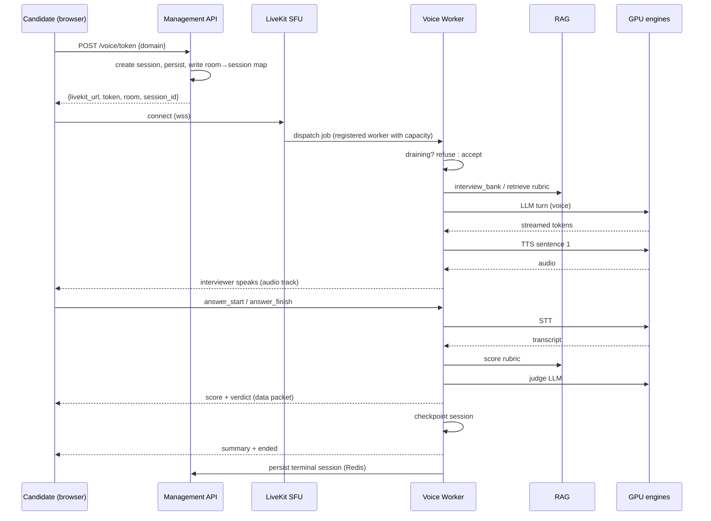
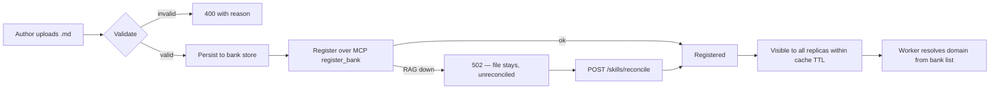
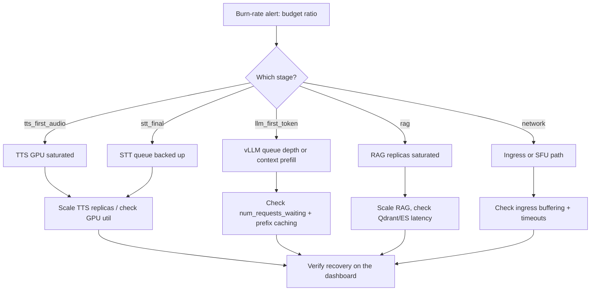

> **Lens:** BA · **Engagement:** Brownfield/Partial · **Defines:** UC-01…UC-11, WF-01…WF-03

# Use Cases & Workflows — ai-mock-interviewer Autoscaling

## Actor Coverage

| Actor | Use cases |
|---|---|
| Candidate | UC-01, UC-02, UC-07 |
| Skill author / Admin | UC-03, UC-04 |
| Platform operator | UC-05, UC-06, UC-08 |
| On-call engineer | UC-09, UC-10 |
| System / Agent | UC-11 |

Every actor has at least one use case. The 14 scenario rows are the same taxonomy throughout: happy, partial, failure, recovery, concurrency, timeout, empty, permission, scale, degraded-dependency, retry, idempotency, observability, cleanup.

## UC-01 — Take a voice interview

**Actors:** Candidate (primary), System/Agent
**Preconditions:** A registered voice worker exists; a bank is registered for the chosen domain; LiveKit reachable over `wss://`; GPU engines healthy.
**Postconditions:** Interview reaches `wrap`; summary and per-question scores persisted; `GET /sessions/{id}` returns the result; candidate audio buffer released.
**Main Flow:** Candidate picks a domain → `POST /voice/token` mints a JWT and creates the room → SFU dispatches the agent → worker runs the FSM (greeting → ask → listen → evaluate → score → wrap) → sentence-level TTS streams replies → scores and summary published as LiveKit data packets → results persisted.

**Scenario Coverage**

| Scenario | Covered | Notes |
|---|---|---|
| Happy path | Yes | 3 questions, follow-ups, wrap with scores |
| Partial data | Yes | No answer → one re-prompt, then scored unanswered (`brain.py:263-288`) |
| Failure | Yes | STT/TTS engine error → typed notice, interview continues or ends with reason |
| Recovery | Yes | Interrupted interview reported as `interrupted`, fresh session offered — not resumed |
| Concurrency | Yes | Candidate speaks while interviewer speaks → barge-in stops playback |
| Timeout | Yes | `answer_timeout_s` (60 s) per answer; review gate 90 s auto-advances |
| Empty | Yes | Bank with zero questions → typed `EmptyBankError`, no zero-question interview |
| Permission | Yes | Room-scoped JWT grants: `room_join`, publish, subscribe only |
| Scale | Yes | Third candidate while two workers hold jobs → new replica boots and registers before the room times out |
| Degraded dependency | Yes | RAG down mid-interview → continues on last known rubric, never hangs |
| Retry | Yes | STT/LLM transient failure retried once with a bounded timeout |
| Idempotency | Yes | Duplicate `answer_finish` ignored; candidate turns deduplicated via `is_page_event` |
| Observability | Yes | Per-hop `timings_ms`, `voice_budget_bar`, session id on every log line |
| Cleanup | Yes | Audio buffer freed, playout task cancelled, session TTL 24 h |

## UC-02 — Take a text interview

**Actors:** Candidate (primary)
**Preconditions:** LLM and RAG reachable; a bank registered for the domain.
**Postconditions:** Transcript, scores, and summary recorded.
**Main Flow:** Text candidate answers are supplied as strings → the same `LLMInterviewer` FSM drives the interview → judge scores each answer → wrap summary.

**Scenario Coverage**

| Scenario | Covered | Notes |
|---|---|---|
| Happy path | Yes | Same FSM as voice, no audio path |
| Partial data | Yes | Empty/whitespace answer treated as unanswered |
| Failure | Yes | LLM error surfaces as a typed error, session marked failed |
| Recovery | Yes | Re-runnable from the CLI after a failure |
| Concurrency | Yes | Independent sessions share the process safely |
| Timeout | Yes | Bounded by `answer_timeout_s` |
| Empty | Yes | `EmptyBankError` on an unregistered bank |
| Permission | Yes | No auth today — recorded as the `BRD-17` gap |
| Scale | Yes | Runs in the CLI/CI, not on the serving path — no scaling requirement |
| Degraded dependency | Yes | Keyword-only retrieval if the vector leg is down |
| Retry | Yes | One retrieval retry |
| Idempotency | Yes | Same answer resubmitted does not double-score |
| Observability | Yes | `scripts/run_gate.py` aggregates per-session metrics |
| Cleanup | Yes | Session store entry expires by TTL |

## UC-03 — Upload a new skill bank

**Actors:** Skill author / Admin (primary)
**Preconditions:** Admin can reach the Skill Update page; RAG reachable with the `register_bank` tool.
**Postconditions:** Bank persisted in the configured store **and** registered on RAG; immediately usable by every replica and every worker without a restart.
**Main Flow:** Upload `.md` → validate name/size/UTF-8/shape/convention → persist to the bank store → register over MCP `register_bank` → respond with section and chunk counts.

**Scenario Coverage**

| Scenario | Covered | Notes |
|---|---|---|
| Happy path | Yes | New bank registered and queryable without a RAG restart |
| Partial data | Yes | Bank missing "Expected points" → 400 with the convention explained |
| Failure | Yes | RAG unavailable → 502; file already persisted, repaired by reconcile |
| Recovery | Yes | `POST /skills/reconcile` registers anything present but unregistered |
| Concurrency | Yes | Two admins upload the same bank to different replicas → object-store last-write-wins, documented not accidental |
| Timeout | Yes | `register_bank` uses a 120 s budget, not the 30 s default |
| Empty | Yes | Zero-heading file rejected at validation |
| Permission | Yes | No auth today — `BRD-17` gap; RAG side requires `rag:write` |
| Scale | Yes | Upload visible to all replicas within the cache TTL, no restart |
| Degraded dependency | Yes | Probes all banks before writing so an outage fails clean with no partial registration |
| Retry | Yes | Idempotent re-upload replaces rather than duplicates |
| Idempotency | Yes | Re-upload of an identical bank is a no-op replace |
| Observability | Yes | Section/chunk counts returned and logged |
| Cleanup | Yes | Path traversal refused; no orphan temp files |

## UC-04 — Reconcile unregistered banks

**Actors:** Skill author / Admin (primary)
**Preconditions:** Banks exist in the store; RAG reachable.
**Postconditions:** Every discoverable bank is registered, or a per-bank error is reported.
**Main Flow:** List banks → probe each against RAG → register those with zero questions → report registered / already-present / errors.

**Scenario Coverage**

| Scenario | Covered | Notes |
|---|---|---|
| Happy path | Yes | Missing banks registered, present ones skipped |
| Partial data | Yes | Unreadable or malformed bank reported per-bank, others proceed |
| Failure | Yes | RAG unreachable → 502 before any write |
| Recovery | Yes | Re-runnable; safe after a partial failure |
| Concurrency | Yes | Concurrent reconcile runs are idempotent |
| Timeout | Yes | Per-bank 120 s registration budget |
| Empty | Yes | No banks → empty result, not an error |
| Permission | Yes | Same `BRD-17` gap as upload |
| Scale | Yes | Probe-then-write ordering keeps replicas consistent |
| Degraded dependency | Yes | Probes all banks first so an outage causes no partial registration |
| Retry | Yes | Safe to retry wholesale |
| Idempotency | Yes | Already-registered banks are skipped, never duplicated |
| Observability | Yes | Per-bank outcome reported and logged |
| Cleanup | Yes | No partial writes on failure |

## UC-05 — Deploy or upgrade the platform

**Actors:** Platform operator (primary)
**Preconditions:** Cluster reachable; images published; secrets present.
**Postconditions:** New version serving; no interview interrupted; previous version available for rollback.
**Main Flow:** Build and push images → render manifests → apply → roll out API then worker with `maxUnavailable: 0` → verify readiness and smoke test.

**Scenario Coverage**

| Scenario | Covered | Notes |
|---|---|---|
| Happy path | Yes | Rolling update, all replicas healthy |
| Partial data | Yes | Missing optional config falls back to documented defaults |
| Failure | Yes | Failed rollout halts and can be rolled back |
| Recovery | Yes | `kubectl rollout undo` restores the previous ReplicaSet |
| Concurrency | Yes | A deploy during live interviews drains rather than cuts |
| Timeout | Yes | Rollout bounded by readiness probes and `progressDeadlineSeconds` |
| Empty | Yes | First install from an empty namespace |
| Permission | Yes | RBAC scoped; app pods need no Kubernetes API access |
| Scale | Yes | Deploy scales cleanly with replica count |
| Degraded dependency | Yes | Deploy proceeds if RAG is briefly unavailable; readiness reflects it |
| Retry | Yes | Re-apply is idempotent |
| Idempotency | Yes | `kubectl apply` is declarative and repeatable |
| Observability | Yes | Rollout status, events, and readiness visible |
| Cleanup | Yes | Old ReplicaSets retained for rollback, then garbage-collected |

## UC-06 — Scale down without killing interviews

**Actors:** Platform operator (primary), System
**Preconditions:** Workers running interviews; a scale-down is triggered by the autoscaler or an operator.
**Postconditions:** Terminated workers had zero in-flight interviews; any cut interview is recorded `interrupted`.
**Main Flow:** Scaler reduces replicas → `preStop` sets draining → SFU stops dispatching → worker waits for active jobs to reach zero → exits → kubelet terminates.

**Scenario Coverage**

| Scenario | Covered | Notes |
|---|---|---|
| Happy path | Yes | Drain completes, pod exits cleanly, no interview affected |
| Partial data | Yes | Drain state reflects jobs that ended between polls |
| Failure | Yes | Drain exceeds the grace period → kubelet kills; session recorded `interrupted` |
| Recovery | Yes | Interrupted sessions reconciled to `abandoned` by a CronJob |
| Concurrency | Yes | Multiple workers draining simultaneously |
| Timeout | Yes | `INTERVIEW_DRAIN_MAX_S` bounds the wait, trading interviews for speed |
| Empty | Yes | Worker with no jobs exits immediately |
| Permission | Yes | Drain endpoint is cluster-internal only |
| Scale | Yes | Works at any replica count; `maxUnavailable: 0` keeps a serving floor |
| Degraded dependency | Yes | Drain proceeds even if Redis is unreachable — best-effort write |
| Retry | Yes | Repeated drain calls are idempotent |
| Idempotency | Yes | Setting draining twice is a no-op |
| Observability | Yes | `interviewer_worker_draining` gauge and drain logs |
| Cleanup | Yes | Registration withdrawn from the SFU before exit |

## UC-07 — Resume after an interrupted interview

**Actors:** Candidate (primary)
**Preconditions:** A prior interview ended `interrupted`.
**Postconditions:** Candidate is told plainly what happened and offered a fresh session.
**Main Flow:** Candidate returns → the interrupted session is visible with reason → a new session is created on request.

**Scenario Coverage**

| Scenario | Covered | Notes |
|---|---|---|
| Happy path | Yes | Interrupted session shown with reason; fresh session starts cleanly |
| Partial data | Yes | Partial transcript and completed-question scores preserved |
| Failure | Yes | Result unavailable → generic apology, fresh session still offered |
| Recovery | Yes | The only recovery offered — **resumption is an explicit non-goal** |
| Concurrency | Yes | Two browsers for one candidate are independent sessions |
| Timeout | Yes | No time limit on returning |
| Empty | Yes | No prior session → normal new-interview flow |
| Permission | Yes | Session ids are unguessable after hardening (`BRD-17`) |
| Scale | Yes | Read from shared store, so any replica answers |
| Degraded dependency | Yes | Store unavailable → fresh session offered |
| Retry | Yes | Repeated lookups safe |
| Idempotency | Yes | Creating a replacement does not mutate the original |
| Observability | Yes | Interrupted sessions counted by reason |
| Cleanup | Yes | Original expires by TTL |

## UC-08 — Rotate LiveKit keys or secrets

**Actors:** Platform operator (primary)
**Preconditions:** Cluster access; secret store reachable.
**Postconditions:** SFU and API agree on new credentials; existing rooms unaffected until they close.
**Main Flow:** Write new keys to the secret store → restart the SFU and API deployments → verify token issuance works end to end.

**Scenario Coverage**

| Scenario | Covered | Notes |
|---|---|---|
| Happy path | Yes | New keys live; a fresh interview connects |
| Partial data | Yes | One of key/secret missing → startup assertion fails loudly |
| Failure | Yes | SFU and API disagreeing produces an opaque "invalid token" — pre-empted by a shared secret and a startup check |
| Recovery | Yes | Roll back the secret and restart |
| Concurrency | Yes | Rotation during live interviews does not disturb existing rooms |
| Timeout | Yes | Restart bounded by readiness probes |
| Empty | Yes | Absent secret → fail fast, never fall back to `devkey` in a cluster |
| Permission | Yes | Secret access scoped to the two consuming workloads |
| Scale | Yes | All replicas pick up the new secret on restart |
| Degraded dependency | Yes | Secret store down → existing pods keep serving |
| Retry | Yes | Rotation is repeatable |
| Idempotency | Yes | Re-applying the same secret is a no-op |
| Observability | Yes | Startup assertion and readiness check surface a mismatch |
| Cleanup | Yes | Old key revoked once no room depends on it |

## UC-09 — Investigate a latency-budget breach

**Actors:** On-call engineer (primary)
**Preconditions:** Metrics and dashboards available; a burn-rate alert fired.
**Postconditions:** The offending hop is identified and attributed to a named engine.
**Main Flow:** Open the budget dashboard → read the 5-stage breakdown → compare against stage budgets → identify which engine is slow → scale or investigate that tier.

**Scenario Coverage**

| Scenario | Covered | Notes |
|---|---|---|
| Happy path | Yes | Breach attributed to a hop in one dashboard read |
| Partial data | Yes | Missing stage samples → dashboard shows coverage, not a false zero |
| Failure | Yes | Metrics pipeline down → fall back to the `voice_budget_bar` log-based signal |
| Recovery | Yes | Breach clears; burn rate returns to normal |
| Concurrency | Yes | Breaches under load distinguished from steady-state |
| Timeout | Yes | Multi-window burn rate avoids single-spike noise |
| Empty | Yes | No interviews → no data, dashboard says so explicitly |
| Permission | Yes | Dashboards are read-only for on-call |
| Scale | Yes | Histograms aggregate across replicas |
| Degraded dependency | Yes | Scrape target down → surface as a gap, not health |
| Retry | Yes | N/A — read path |
| Idempotency | Yes | N/A — read path |
| Observability | Yes | This use case *is* the observability surface |
| Cleanup | Yes | Alerts resolve automatically on recovery |

## UC-10 — Diagnose a worker that never registered

**Actors:** On-call engineer (primary), System
**Preconditions:** The scaler added a worker replica; no job was dispatched to it.
**Postconditions:** Cause identified; the worker either registers or is visibly removed from the serving set.
**Main Flow:** Check readiness → readiness fails until SFU registration → inspect worker logs → confirm the SFU sees the worker → fix or restart.

**Scenario Coverage**

| Scenario | Covered | Notes |
|---|---|---|
| Happy path | Yes | Readiness reports registered; normal dispatch |
| Partial data | Yes | Registered but not dispatchable → separate signal from readiness |
| Failure | Yes | Never registers → readiness stays false so the scaler sees a non-serving replica, not a black hole |
| Recovery | Yes | Supervisor restarts the worker; it re-registers |
| Concurrency | Yes | Several workers registering at once |
| Timeout | Yes | Registration has a bounded timeout and is retried |
| Empty | Yes | Zero workers → readiness of the serving set alarms rather than silently serving nothing |
| Permission | Yes | Internal metrics and control port only, not internet-exposed |
| Scale | Yes | Distinguishes "scaled but not registered" from "not scaled" |
| Degraded dependency | Yes | SFU briefly unreachable → worker retries rather than exiting |
| Retry | Yes | Registration retried with backoff |
| Idempotency | Yes | Re-registration is safe |
| Observability | Yes | `livekit_worker_registered` gauge is the primary signal |
| Cleanup | Yes | Deregistration on drain and shutdown |

## UC-11 — Register and dispatch an agent into a room

**Actors:** System / Agent (primary)
**Preconditions:** A worker is registered with the SFU; a room was created with agent dispatch.
**Postconditions:** Exactly one agent runs per room; the interview completes or is reported interrupted.
**Main Flow:** Room created with `RoomAgentDispatch` → SFU selects a registered worker with capacity → worker accepts and runs `run_agent` → interview executes.

**Scenario Coverage**

| Scenario | Covered | Notes |
|---|---|---|
| Happy path | Yes | One agent per room, interview completes |
| Partial data | Yes | Room name without a valid domain falls back to `system-design` |
| Failure | Yes | No worker available → room times out; candidate sees an honest wait state |
| Recovery | Yes | New worker registration makes subsequent rooms dispatchable |
| Concurrency | Yes | Two rooms dispatched concurrently to two workers |
| Timeout | Yes | Dispatch has a bounded wait before the room gives up |
| Empty | Yes | Zero registered workers → dispatch fails cleanly, not silently |
| Permission | Yes | Worker authenticates to the SFU with real keys |
| Scale | Yes | Dispatch spreads across replicas by load |
| Degraded dependency | Yes | One worker unreachable → the SFU prefers another |
| Retry | Yes | Dispatch retried while capacity exists |
| Idempotency | Yes | A room never gets two agents |
| Observability | Yes | Job accept/refuse and refusal reason logged |
| Cleanup | Yes | Agent disconnects and deregisters when the room ends |

## WF-01 — Voice interview lifecycle

**Failure drill.** If the worker dies at any point after dispatch, the room persists but no agent owns it. The interview cannot be resumed (`DAT-07`: the audio buffer and suspended coroutines lived only in that process). The design response: checkpoint each hop so completed questions and scores survive, write an `interrupted` snapshot from the shutdown hook, and let a reconcile CronJob mark stale sessions `abandoned`. The candidate is shown an honest ending, never dead air.

**Partial-completion matrix.**

| Stopped after | Transcript | Scores | Recoverable | Candidate experience |
|---|---|---|---|---|
| Token issued, no dispatch | None | None | N/A | Room times out; no interview began |
| Greeting | Partial | None | No | Interrupted, fresh session offered |
| Question n asked | Partial | n−1 questions | No | Interrupted, partial scores preserved |
| Answer transcribed | Partial | n−1 | No | Interrupted, the in-flight answer is lost |
| Scored, before wrap | Full | All questions | No | Interrupted, all scores preserved |
| After wrap | Full | All | N/A | Completed normally |

## WF-02 — Skill lifecycle

**Failure drill.** The dangerous state is *persisted locally but not registered* — the bank exists but yields zero questions. This is deliberately not fixed by a transaction: `POST /skills/reconcile` already exists and is the right repair tool, probing all banks before writing anything so an outage fails clean with no partial registrations.

**Partial-completion matrix.**

| Stage reached | File stored | Registered | Interview usable | Repair |
|---|---|---|---|---|
| Validation failed | No | No | No | Re-upload a valid file |
| Stored, RAG unreachable | Yes | No | No | `/skills/reconcile` |
| Registered on one replica only | Yes | Yes | Yes, within TTL | Cache TTL converges |
| Fully registered | Yes | Yes | Yes | None needed |

## WF-03 — Incident response for a latency breach

**Failure drill.** If the metrics pipeline itself is down, the breach signal disappears while the product is still slow — the worst failure mode, because silence looks like health. Fallback: every session summary already carries `voice_budget_bar` as a log line, so a log-based metric reproduces the ratio without Prometheus.

**Partial-completion matrix.**

| Signal available | Diagnosis possible | Fallback |
|---|---|---|
| Full metrics + dashboards | Yes, per stage | — |
| Metrics but no dashboards | Yes, via queries | Rebuild panel |
| Logs only | Coarse | `voice_budget_bar` log metric |
| Logs not shipping | No | Treat as blind; restore shipping first |
