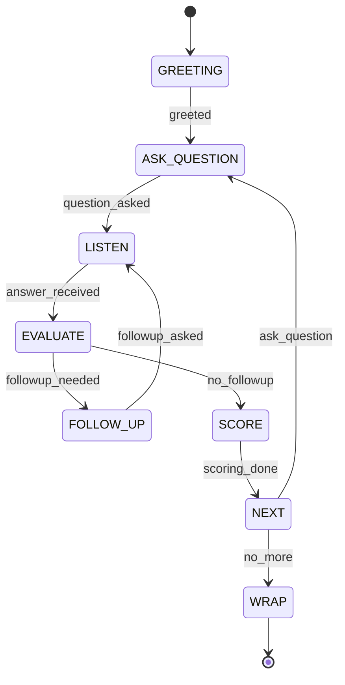
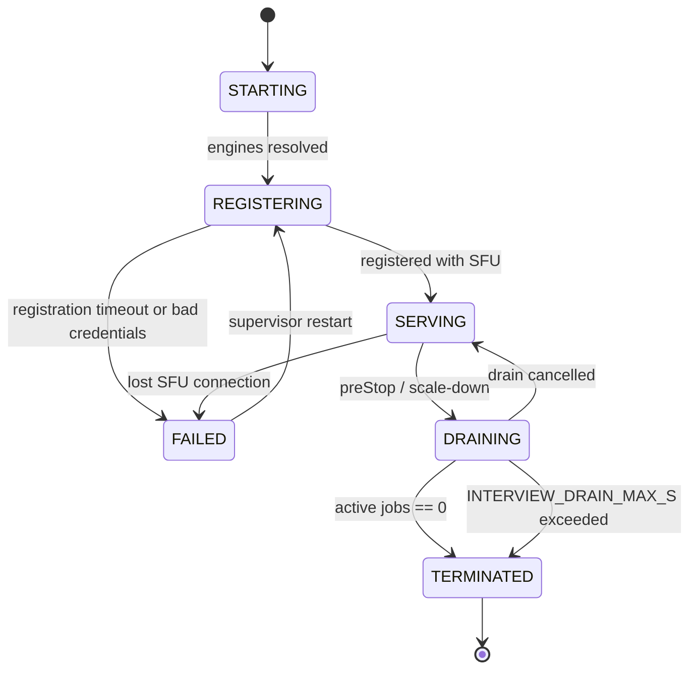
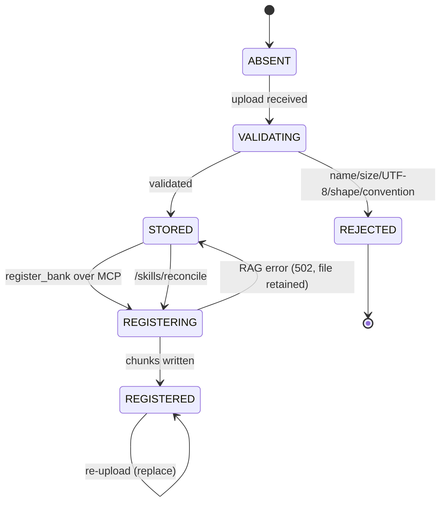

> **Lens:** BA + TPO · **Engagement:** Brownfield/Partial · **Defines:** DAT-01…DAT-07, DG-01…DG-04, SM-01…SM-03

# Data & State Analysis — ai-mock-interviewer Autoscaling

## Data Inventory

| ID | Asset | Today | Authority after | Volume & velocity | Consistency requirement |
|---|---|---|---|---|---|
| DAT-01 | Session — FSM state, turns, score ledger | Process-local `dict` behind a lock (`server.py:48`) | **Redis** via the existing `RedisSessionStore` | 1 write per turn; ~12 turns/interview | Strong per session; read-your-writes within an interview |
| DAT-02 | Interview summary + latency ledger | Logged only, never stored (`agent.py:281`) | Redis, normalized shape | 1 per interview | Eventual; must survive worker death |
| DAT-03 | Question bank — 9 `.md` files, 26,710 B | Local folder, globbed per request | **Pluggable store**: local FS / S3 / cloud | Read-heavy; writes rare (admin uploads) | Bounded staleness (~10 s TTL) acceptable |
| DAT-04 | RAG chunks + vectors | Chroma on local disk (`config.py:171`) | **Qdrant** (adapter exists) | Written on bank registration; read per retrieval | Strong for the vector leg |
| DAT-05 | BM25 keyword index | **In RAM**, warmed only at boot | **Elasticsearch** (adapter exists) | Same write profile as DAT-04 | Strong; must be shared across replicas |
| DAT-06 | GPU model weights | Downloaded per replica into `~/.cache` | PVC + prewarm Job, `HF_HUB_OFFLINE=1` | Tens of GB, written once per model | Immutable once warm |
| DAT-07 | Candidate audio buffer | Worker RAM, `bytearray`, ~3.8 MB/room | **Unchanged — deliberately** | Up to 120 s per answer | **None possible — process-local by nature** |

**Lineage.** `DAT-03` → registered via MCP → `DAT-04` + `DAT-05` → retrieved per turn → scored → `DAT-01` → summarized into `DAT-02` → read by `GET /sessions/{id}`.

**The one asset that is not externalizable.** `DAT-07` is the candidate's raw microphone audio held in a `bytearray` for the duration of an answer, alongside suspended coroutines mid-`await`. Neither can be serialized into a store. This is the root of the accepted gap on in-flight interview loss, and it is why `BRD-16` asks for honest reporting rather than resumption.

## Data Gap Decisions

| ID | Asset | Gap | Options considered | Decision | Rationale |
|---|---|---|---|---|---|
| DG-01 | DAT-03 Question banks | Uploads land on one replica's disk; every request re-globs that folder, so replicas diverge | RWX PVC · S3-compatible object storage · move ownership into RAG | **Pluggable `BankStore`** (local / S3 / cloud) with a ~10 s materialized cache | RWX needs NFS/CephFS/EFS per environment — the least portable thing in Kubernetes — and would put a cloud-specific dependency in the base, failing the cloud-agnostic + on-prem constraint. The S3 API is the portable abstraction: MinIO on-prem, any cloud store in the overlay, local FS for single-node. Keeping the filesystem API in front of the cache means `skills.py` call sites are unchanged. |
| DG-02 | DAT-01 Sessions | `RedisSessionStore` exists but is dead on the serving path, and it crashes on a real `Session` (`json.dumps` on an enum and dataclasses) | New store · external DB · reuse + serialize | **Reuse the existing store; add `Session.to_dict()` / `from_dict()`** | The store's protocol is already exactly what `GET /sessions/{id}` needs, so a new abstraction would be pure waste. The serializer is missing only because nothing ever called `save()` with a real `Session` — `state_machine.py`'s docstring already promises it. |
| DG-03 | DAT-04, DAT-05 RAG backends | BM25 lives in RAM and vectors on local disk, so replicas disagree | Keep single-replica · move to shared backends · rebuild the keyword leg | **Qdrant + Elasticsearch in base; Chroma + BM25 in the local overlay** | Both adapters already exist and are tested, so this is config rather than code. Elasticsearch is genuinely heavy for a 26 KB corpus, so the local overlay keeps the light path for developers — the honest split rather than pretending one size fits both. |
| DG-04 | DAT-06 GPU weights | Model downloads on first use make pods slow to become ready and re-download per replica | Bake into images · initContainer · PVC + prewarm Job | **PVC + prewarm Job**, offline once warm | Baking a 15–30 GB layer wrecks registry pulls and layer caching; an initContainer re-verifies on every start and blocks readiness. A prewarmed PVC gives fast, deterministic starts without bloating the image. Small artifacts (the ~100 MB reranker) are the exception and are baked at build time. |

## State Machines

### SM-01 — Interview FSM

Already implemented as `interviewer/state_machine.py` — 8 states, transitions as a plain dict, an illegal `(state, event)` pair raising `InvalidTransition`. This is a brownfield win: the state model is done, tested, and free of I/O, so nothing in this plan needs to redesign it.

### SM-02 — Worker lifecycle

New. This is the state machine that open item P2 lives in, and the one the drain design depends on.

**Readiness contract:** the worker reports ready only in `SERVING`. During `REGISTERING` it must report *not ready* so a scaler or operator sees a pod that cannot serve — never a silent black hole that accepts dispatch it cannot fulfil.

### SM-03 — Skill registration

## Load & Capacity Model

> **Status: parametrized — the honest gap.** Peak concurrency and sessions/day were not provided (`AS-03`). `C` below is concurrent voice interviews. Every figure is `Derived` from the code, not measured.

| Flow | Peak | Peak:Avg | Driven by | Notes |
|---|---|---|---|---|
| Voice interviews | `C` concurrent | ~5:1 `Assumed` | Worker replicas, **1:1** | The scoping unit for the whole system |
| LLM turns (voice) | ~4 × C per interview | Steady | vLLM voice queue depth | 3 questions + follow-ups + wrap |
| Judge LLM calls | ~1 × C per question | Bursty per answer | vLLM judge queue depth | Off the hot path; may scale to zero |
| STT calls | ~C per turn | Bursty | Whisper in-flight requests | One final per answer |
| TTS calls | ~C per sentence | **Highest call rate in the system** | Kokoro in-flight requests | Sentence-level streaming multiplies calls |
| RAG retrievals | ~2 × C per turn | Steady | RAG replica CPU | Cache-gated |
| Bank reads | Low | — | `BankStore` cache | Served from the materialized cache |
| Session writes | ~12 × C per interview | Steady | Redis | Small values, 24 h TTL |

**The cost consequence, stated plainly.** Three GPU deployments at `minReplicas: 1` is three GPUs running 24/7 regardless of traffic — plausibly 10–50× all CPU tiers combined. That floor is not a preference: a cold GPU node plus weight load takes up to ~10 minutes (2–6 min node provisioning, 1–5 min model load), which is fatal for a product whose whole claim is a sub-1.5 s turn. **So for GPU, elasticity means "grow beyond the floor," not "zero to N."**

**Validation plan** (`AS-03` → PO): instrument arrivals, run one week of real traffic, then re-size `minReplicas` and the KEDA targets against measured `C` and peak:average. Until then the floor is a parametrized assumption with a re-size checkpoint, not a settled number.

**Growth headroom.** The design scales workers and GPU replicas independently, so the ceiling is set by GPU supply and the SFU's dispatch capacity, not by any component in this plan.
