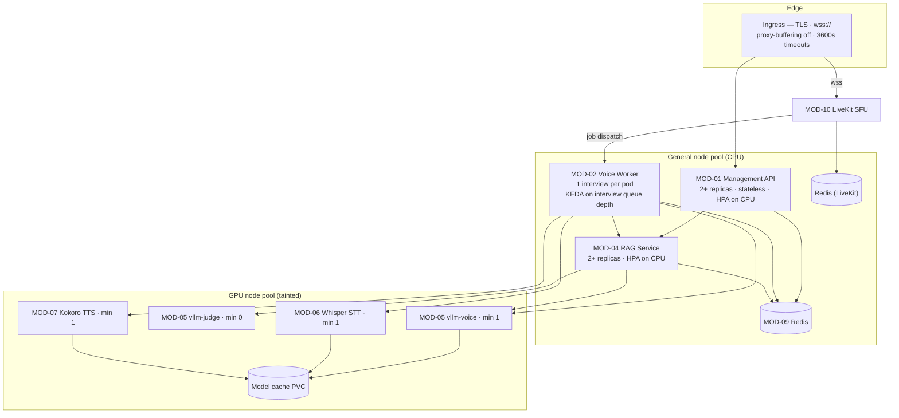
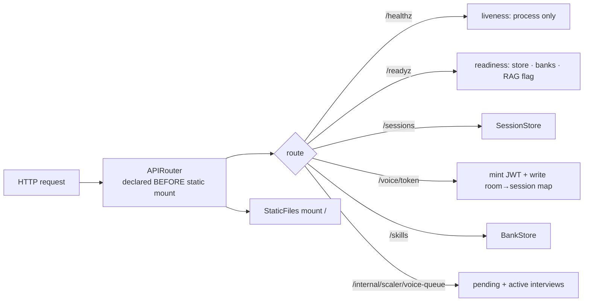
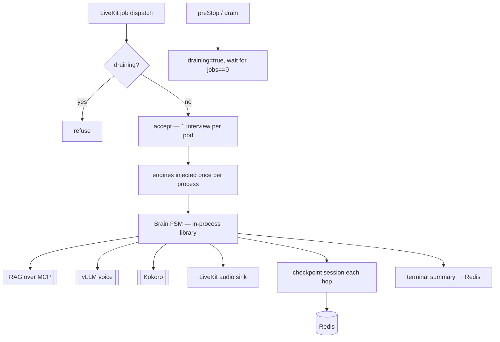
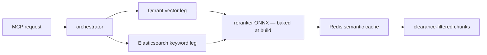
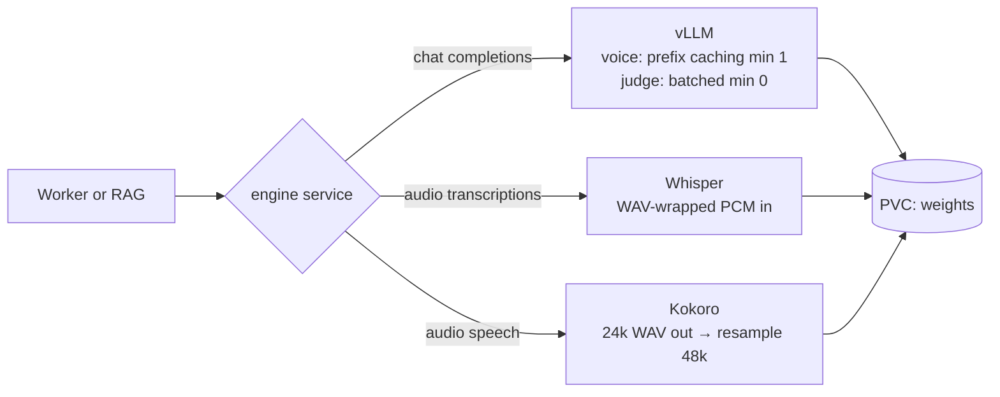
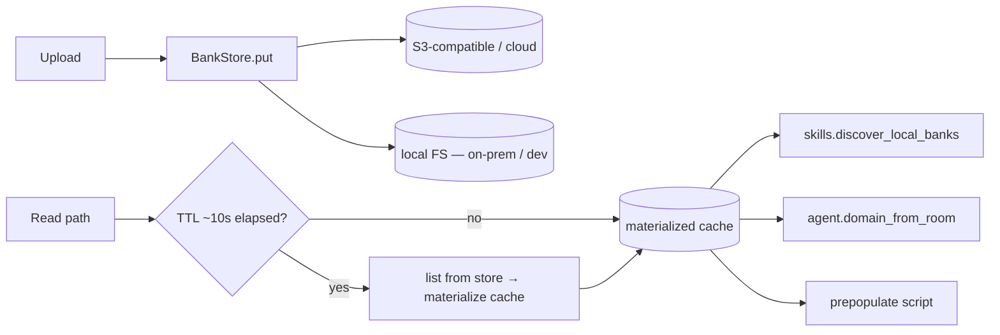

> **Lens:** Architect + TPO · **Engagement:** Brownfield/Partial · **Depends on:** the Stage 5 freeze in `04-coverage-gap-analysis.md`

# Architecture & Orchestration — ai-mock-interviewer Autoscaling

## System Architecture

**The two-plane split is preserved and extended.** The existing architecture already separates the management plane (`MOD-01`, request/response, never touches audio) from the voice hot path (`MOD-02`) and retrieval (`MOD-04`, over MCP). This plan does not disturb that — it adds a third plane, the GPU inference tier, and makes each plane scale on its own axis.

**The pivotal change is at `MOD-02`.** Moving STT, TTS, and LLM out of the worker into GPU services does three things at once: it removes 3.6 s of CPU TTS and 1.0 s of CPU STT from the critical path, it makes the worker image small enough for a sub-2 s cold start (no `ctranslate2`, no `kokoro_onnx`, no model weights), and — the part that is easy to miss — **it makes the worker I/O-bound, which makes its CPU-load dispatch gate accurate again.** That last effect is what unblocks correct multi-replica dispatch, which is why the engine extraction and the autoscaling design are one decision rather than two.

## Per-Module Component Flows

### Management API (MOD-01)

The route-ordering constraint is structural, not stylistic: the `StaticFiles` catch-all at `/` shadows anything declared after it, and this codebase has already hit a comparable shadowing bug. Route extraction into an `APIRouter` removes the footgun permanently and is covered by a regression test.

### Voice Worker (MOD-02)

### RAG Service (MOD-04)

### GPU inference (MOD-05, MOD-06, MOD-07)

Two format contracts the implementer must respect, both handled by helpers that already exist or belong beside them: raw 16 kHz PCM must be **WAV-wrapped** for the transcription endpoint, and Kokoro's native 24 kHz output must be **resampled to 48 kHz mono s16le** to satisfy the `TTSEngine` contract. The resampler already exists and is tested.

### Bank Store (MOD-08)

The three consumers reading through one cache is a correctness requirement, not an optimization: all three currently glob independently, and the documented no-restart promise depends on them converging.

## Orchestration Strategy

**Pattern chosen from the matrix: choreography with queue-based dispatch.** Not central orchestration, and not a message broker.

**Why this pattern:**
1. **The work queue already exists.** LiveKit's SFU dispatches jobs to registered workers — that *is* the queue. Introducing a separate broker would duplicate a mechanism the transport already provides.
2. **The interview is a long-lived bidirectional session.** A central orchestrator would sit on the realtime path between the SFU and the agent, making it a single point of failure for the one flow that must never be interrupted. Choreography keeps the interview inside one process.
3. **Coordination is stateless.** The only cross-service coordination is token issuance and session persistence, both ordinary request/response against Redis — no distributed transaction exists to orchestrate, which is why no saga or event bus is proposed.

**The one deliberate exception:** the `/internal/scaler/voice-queue` endpoint. It is a control-plane *read* — KEDA asks how much work is pending — not a data-path hop, so it does not violate the pattern. It also consolidates three consumers onto one computation: the scaler, the readiness check, and the active-interviews gauge all derive from the same number.

**Rejected:** an orchestrator service (single point of failure on the realtime path) · a message broker (duplicates the SFU's dispatch) · a saga layer (no distributed transaction).

## Build vs Buy

| Component | Decision | Rationale |
|---|---|---|
| MOD-10 LiveKit SFU | **Buy** — official Helm chart | Version-sensitive RTC/TURN/node-IP config; upstream-maintained; cloud-agnostic |
| MOD-05/06/07 GPU servers | **Buy** — upstream images | vLLM, Whisper, and Kokoro servers are maintained and publish CPU variants that make local dev a faithful mirror |
| Redis, Qdrant, Elasticsearch | **Buy** — StatefulSets | Commodity; the adapters already exist |
| MOD-01, MOD-02 | **Build** | The product itself; no off-the-shelf substitute |
| MOD-03 brain | **Build, in-process** | The FSM is the product (`docs/CLAUDE.md`) |
| MOD-08 BankStore | **Build** | Thin; three backends behind one protocol |
| MOD-13 manifests | **Build** | Kustomize base + overlays |

## Scale & Bottleneck Analysis

| MOD | Scale unit | Scale profile | Saturation limit | Scaling signal | Bottleneck at 10× | Degradation mode |
|---|---|---|---|---|---|---|
| MOD-01 | Replica | Horizontal, stateless | Redis connections and ingress throughput | HPA on CPU (fair: short uniform requests) | Redis connection count | Serve reads from cache; shed skills writes with 503 |
| MOD-02 | **1 interview = 1 pod** | KEDA on pending + active interviews, target 1 | SFU registration rate and available nodes | Custom metric via `/internal/scaler/voice-queue` | Pod boot plus SFU registration latency | Queue candidates in the room with an honest wait state |
| MOD-03 | Library — scales with MOD-02 | In-process, no independent scaling | Python GIL per room | N/A (library) | CPU spent on VAD and JSON handling | Already I/O-bound once engines are remote |
| MOD-04 | Replica | Horizontal, HPA on CPU | Qdrant and Elasticsearch connection limits | HPA on CPU (fair: 200–360 ms uniform work) | Vector query latency under concurrency | Keyword-only retrieval on the Elasticsearch leg |
| MOD-05 | GPU replica | KEDA on `vllm:num_requests_waiting` | KV-cache capacity and GPU memory | Queue depth plus KV utilization | Model load time on a cold GPU node | Longer first token; shorter spoken answers |
| MOD-06 | GPU replica | KEDA on in-flight transcription requests | GPU VRAM and queue wait | In-flight gauge, DCGM as fallback | Queue wait behind bursty answer submissions | Fall back to slower CPU transcription — correct but slower |
| MOD-07 | GPU replica | KEDA on in-flight synthesis requests | GPU VRAM | In-flight gauge | **Highest call rate in the system** — one call per spoken sentence | Longer first audio; strictly worse than the 200 ms stage budget |
| MOD-08 | Library — cache TTL bounded | No independent scaling | Object-store request rate | N/A (library, cache-fronted) | Cache stampede at TTL expiry across replicas | Serve the stale bank and log the refresh failure |
| MOD-09 | 1 replica (stateful) | Vertical only | Memory and single-thread throughput | None — a scale event is an outage | Persistence write pressure | **No graceful degradation — outage.** Reason enough to give LiveKit its own instance |
| MOD-10 | Replica (chart-managed) | LiveKit-native scaling | SFU bandwidth and CPU | Chart/cloud-provided | Media bandwidth per node | TCP-only path over `wss://` |
| MOD-11 | Static asset — ships in MOD-01 | Scales with MOD-01 | None | N/A (static files) | None — served from the same pods | None needed |
| MOD-12 | Library | In-process | Scrape interval volume | N/A (library) | Cardinality growth from per-session labels | Sample or aggregate high-cardinality series |
| MOD-13 | Configuration | Not a runtime component | Cluster capacity and GPU supply | Cluster Autoscaler on node pools | GPU node provisioning time (2–6 min) | Hold at the GPU floor; queue rather than fail |

Every module carries a named bottleneck at 10× and a designed degradation mode, and none degrades to silent failure — the two that cannot degrade gracefully (`MOD-09`) are called out as such rather than given a comforting answer.

## Failure Paths

| Failure | State machine | Behaviour |
|---|---|---|
| Worker dies mid-interview | SM-02 `SERVING → FAILED`, SM-01 forced to `WRAP{interrupted}` | Session recorded `interrupted` with reason; candidate told plainly; fresh session offered. **Not resumed** — the audio buffer and coroutines are gone |
| Drain exceeds the grace period | SM-02 `DRAINING → TERMINATED` | Interview cut; the interrupted snapshot is the safety net |
| Worker registers but is never dispatched | SM-02 stays `REGISTERING` | Readiness false, so the scaler and operator see a non-serving pod rather than a black hole |
| RAG unavailable at interview start | SM-01 proceeds | Interview degrades to last-known rubric; readiness does not gate on RAG |
| Bank stored but not registered | SM-03 `STORED` | Repaired idempotently by the existing reconcile endpoint |
| GPU node unavailable | — | Pod stays pending; Cluster Autoscaler provisions. `minReplicas ≥ 1` keeps a serving floor so the common case never waits |
