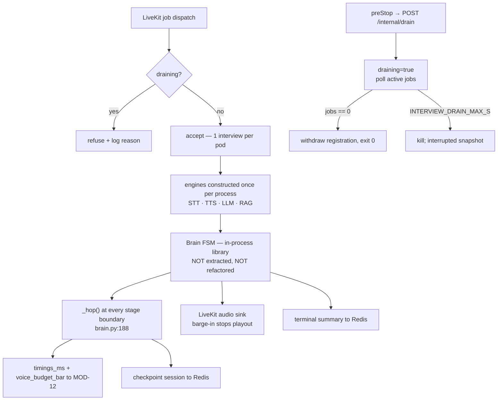

# Voice Agent Worker — Module Doc

> **Module:** MOD-02 · **Form:** Service (existing) · **Defines:** TRD-02
> **Engagement:** Brownfield/Partial · **Lenses:** BA (BRD half) + TPO/Architect (TRD half)
> **Source of truth for IDs:** `01-brd.md`, `02-use-cases-workflows.md`, `03-data-state-analysis.md`, `04-coverage-gap-analysis.md`, `05-modularization.md`, `06-architecture.md`, `07-brownfield-reconciliation.md`
> **Code under design:** `interviewer/voice/{worker,agent,interviewer,budget,protocols}.py`, `interviewer/brain.py`, `interviewer/state_machine.py`

## BRD Half — Business Requirements (BA Lens)

### Purpose

The worker *is* the interview. One LiveKit job equals one candidate equals one process for the whole session: it joins the room, runs the FSM (greeting → ask → listen → evaluate → follow-up → score → next → wrap), streams the interviewer's voice, transcribes the candidate's answers, scores them, and persists the result.

It is the only stateful, long-lived, latency-critical component in the system, and the only one where the correct scaling unit is **a whole interview** rather than a request. That single fact drives every design decision below: how it scales, how it drains, what it may and may not hold in memory, and what it does when the platform takes its pod away mid-sentence.

### Business Requirements Served

| Requirement | Statement (abbreviated) | How MOD-02 satisfies it |
|---|---|---|
| BRD-05 — Durable voice sessions | Voice results persisted; `GET /sessions/{id}` returns them | The summary is written to MOD-09 at wrap instead of only being logged at `agent.py:281-286`; checkpoints at each hop make partial results survive a death |
| BRD-06 — Scale-down drains, never kills | Removing a replica stops new dispatch and waits for in-flight interviews | `preStop` sets `draining=true`; the job-accept gate refuses new rooms; the process exits only when active jobs reach zero, bounded by `INTERVIEW_DRAIN_MAX_S` |
| BRD-07 — Worker replicas follow queue depth | Replica count tracks pending + active interviews, not CPU | KEDA reads MOD-01's `/internal/scaler/voice-queue` with a target of **1** pending+active interview per replica |
| BRD-08 — AI engines as independent GPU services | STT, TTS, LLM served remotely; worker becomes CPU-only | Engines are constructed once per process behind the *already network-shaped* protocols in `voice/protocols.py` (REC-02); `ctranslate2`, `kokoro_onnx` and all weights leave the image |
| BRD-09 — Measurable voice latency | Per-hop latency recorded and exported against the 1500 ms budget | `brain.py:188`'s `_hop()` is the single choke point; per-turn `timings_ms` and `voice_budget_bar` are exported through MOD-12 |
| BRD-11 — Production LiveKit | Real credentials, `wss://`, multi-node | The worker registers with a real SFU using injected keys and treats registration as its readiness condition |
| BRD-13 — Observability | Metrics, structured logs, SLO | `livekit_worker_registered`, `interviewer_worker_draining`, active-interviews gauge, latency histograms |
| BRD-16 — Interrupted interviews reported | A killed interview is recorded `interrupted` with a reason | The shutdown hook writes an interrupted snapshot; a reconcile CronJob marks stale in-progress sessions `abandoned` |
| BRD-14 — Cloud-agnostic | One base, thin overlays | The worker consumes only env vars and standard services; no cloud SDK is imported |

### Actors & Use Cases

| Use case | Actor | Interaction with this module |
|---|---|---|
| UC-01 — Take a voice interview | Candidate (primary) | **This module is the interview.** Every happy-path row of that use case executes here |
| UC-06 — Scale down without killing interviews | Platform operator, System | The drain state machine (`SM-02`) is implemented here; `preStop` is the trigger |
| UC-07 — Resume after an interrupted interview | Candidate | Supplies the `interrupted` record with a reason that UC-07 displays |
| UC-09 — Investigate a latency-breach | On-call engineer | Emits the per-hop ledger the dashboard reads, attributed by stage |
| UC-10 — Diagnose a worker that never registered | On-call engineer, System | Readiness reflects **SFU registration**, so a non-serving pod is visible rather than a black hole |
| UC-11 — Register and dispatch an agent into a room | System / Agent | Exactly one agent per room; the accept/refuse decision and its reason are logged |

### Business Acceptance Criteria

1. A candidate who connects to a room on a worker that is draining is **refused dispatch**, not half-served. Verified by the drain scenario in UC-06.
2. Deleting a worker pod mid-interview does not cut the interview: the pod stays alive until its active job count is zero. Deleting the pod **while its grace period is artificially short** produces an `interrupted` session with a reason, not a 404. Verified by US-014.
3. A completed voice interview is retrievable via `GET /sessions/{id}` with its transcript, per-question scores, and summary. Verified by the `scripts/e2e_voice_client.py` smoke test followed by the API read (US-012, US-013).
4. With STT, TTS and LLM all remote, the worker's measured voice round-trip improves from 6.5–8.4 s toward the 1500 ms budget, and every turn reports its per-hop breakdown. Verified by US-011 and US-015.
5. A third candidate arriving while two workers hold jobs causes a third replica to boot and register before the room times out. Verified by UC-01's scale row and US-018.
6. Killing the RAG service mid-interview does not hang the turn: the interview continues on the last known rubric. Verified by UC-01's degraded-dependency row.

## TRD-02 — Technical Requirements (TPO / Architect Lens)

### Non-Functional Requirements

| # | Requirement | Target | Measured today | Notes |
|---|---|---|---|---|
| NFR-1 | Voice round-trip, utterance-end → first audio | **≤ 1500 ms** (`BUDGET_MS`) | **6.5–8.4 s** | The North Star metric. Violated 4–6×; `CV-03` asks whether the target is firm |
| NFR-2 | Stage: STT final transcription | ≤ 300 ms | ~1.0–1.1 s (CPU CTranslate2) | Removed from the critical path by MOD-06 |
| NFR-3 | Stage: RAG retrieval | ≤ 150 ms | ~200–360 ms | Already over budget before any GPU work; MOD-04 owns it |
| NFR-4 | Stage: LLM first token | ≤ 500 ms | ~280–800 ms | Prefill-dominated; prefix caching matters more than model size |
| NFR-5 | Stage: TTS first audio | ≤ 200 ms | **~3.6 s (CPU)** | The single largest breach; removed by MOD-07 |
| NFR-6 | Concurrent interviews per pod | **exactly 1** | 1 | The work unit is pinned to the process for its lifetime |
| NFR-7 | Cold start (process → registered) | ≤ 2 s process start; ≤ 5 s to registered | n/a (models loaded in-process today) | Achieved by shipping no models: no `ctranslate2`, no `kokoro_onnx`, no weight files |
| NFR-8 | CPU per interview | ≤ 0.5 vCPU steady state (I/O-bound) | ~1.0–1.5 vCPU (engines in-process) | The point of BRD-08: makes the CPU-load dispatch gate accurate again |
| NFR-9 | Memory per pod | ≤ 1 GiB request; ≤ 3.8 MB per active audio buffer | ~3.8 MB/room buffer + model RAM | `cap` is 120 s × 32 KB/s ≈ 3.8 MB (`agent.py:137-138`) |
| NFR-10 | Termination grace | **900 s** | n/a | Matches the 900 s worst-case interview; `INTERVIEW_DRAIN_MAX_S` bounds the voluntary wait below it |
| NFR-11 | Job-accept load threshold | **0.95** (was `inf` at `worker.py:62`) | `inf` — always accept | Safe only once the worker is I/O-bound; see the coupling note below |
| NFR-12 | Scale target | KEDA `metrics-api` on `/internal/scaler/voice-queue`, target **1** | n/a | `CV-01`: if KEDA is refused, HPA-on-CPU is the fallback and is the *wrong* metric |
| NFR-13 | Readiness = SFU registration | `livekit_worker_registered == 1` before ready | not measured | Open item P2: a dev-mode worker drops after ~20 s idle and does not reliably re-register |
| NFR-14 | Rollout disruption | `maxUnavailable: 0` | n/a | No scale-down or rollout may reduce serving capacity below the current demand |
| NFR-15 | LLM call timeout on the voice path | ≤ 8 s per hop | **300 s** (`LLMConfig.timeout`) | A 300 s timeout on a realtime turn is functionally "hang forever" |

**The ordering constraint that makes all of this work (`CV-02`).** `LLMMetrics` at `llm.py:31-33,87,115` mutates instance state per call, so it is not concurrency-safe. Constructing engines once per process — which is the entire point of the extraction — is only correct **after** metrics are passed per call. Shipping per-process engines first silently misattributes `llm_first_token_ms` to the wrong hop and corrupts the exact data the SLO is built on. Metrics-per-call ships in the same wave, before the injection change.

### Interfaces Exposed

The worker is not an HTTP service, but it exposes a control surface on a cluster-internal port. It is deliberately small: the interview itself runs over the LiveKit data channel, not over HTTP.

| Method | Path | Purpose | Notes |
|---|---|---|---|
| GET | `/healthz` | Process liveness | No I/O. A worker deep in an interview is *healthy* |
| GET | `/readyz` | `SERVING` **and** registered with the SFU | Mirrors `SM-02`: false during `REGISTERING`, so the scaler sees a non-serving pod, never a silent black hole |
| POST | `/internal/drain` | Enter `DRAINING`; refuse new dispatch | Idempotent; called by the `preStop` hook. Returns the current active-job count |
| GET | `/metrics` | Prometheus scrape | `livekit_worker_registered`, `interviewer_worker_draining`, `interviewer_active_interviews`, latency histograms |

### Interfaces Consumed

| Dependency | Module | Protocol | Contract | Budget |
|---|---|---|---|---|
| LiveKit SFU | MOD-10 | WebSocket + WebRTC | Job dispatch; audio tracks; data packets | Registration retried with backoff; the worker retries rather than exiting |
| STT | MOD-06 | HTTP, OpenAI-compatible `/v1/audio/transcriptions` | `STTEngine.transcribe(bytes) -> str` | 300 ms stage budget; 1 retry |
| TTS | MOD-07 | HTTP, OpenAI-compatible `/v1/audio/speech` | `TTSEngine.synthesize(text) -> bytes`, **48 kHz mono s16le PCM** | 200 ms first-audio stage budget |
| LLM | MOD-05 | HTTPS SSE, OpenAI-compatible `/chat/completions` | `LLMEngine.respond_stream` / `respond` | ≤ 500 ms first token; hop deadline ≤ 8 s |
| RAG | MOD-04 | MCP over HTTP `:8031` | `interview_bank`, `interview_question`, `interview_followup`, `execute_agent_context` | 150 ms stage budget; degrade to last-known rubric |
| Session store | MOD-09 | Redis | Checkpoint at each hop; terminal summary at wrap | 250 ms; best-effort on the drain path |
| Bank store | MOD-08 | `BankStore` protocol | `domain_from_room` resolves the domain from the bank list | Served from the materialized cache |

**Engines are injected once per process.** `voice/interviewer.py:49` resolves an STT engine that is then discarded — `brain.py:124-135` takes no `stt` parameter at all. That dead resolution is deleted (REC-03), and the real engines are constructed in `run_agent`'s entry path and handed to the FSM. The `worker.py:65-78` monkey-patch of the private `server._is_available` is removed in the same change (REC-06); a private-attribute patch becomes an import-time crash on any upstream rename and is replaced by a supported load callback guarded with `try/except`.

### Data Model

| Asset | Role in this module | Notes |
|---|---|---|
| DAT-01 — Session (FSM state, turns, scores) | **Written** at every hop checkpoint and at wrap | The checkpoint callback is the only structural addition to `brain.py` (REC-08) |
| DAT-02 — Summary + latency ledger | **Written** once at wrap; this is the fix for `agent.py:281-286`, which only logs | Must survive worker death, hence a checkpoint rather than a final write only |
| DAT-03 — Question banks | **Read** via `agent.domain_from_room` to pick the domain | One of the three glob consumers that must read through MOD-08's cache |
| DAT-07 — Candidate audio buffer | **Held in RAM, deliberately unchanged** | `cap` grows to 120 s × 32 KB/s ≈ 3.8 MB per room. `CV-04` records the accepted gap: this plus suspended coroutines cannot be externalized, which is why resumption is a non-goal and BRD-16 exists |
| DAT-06 — Model weights | **Removed from this module** | Post-extraction the worker ships no weights at all |

**Session identity.** `agent.py:97` sets `session_id = ctx.room.name`, which does not match the 12-hex id `POST /voice/token` stores. The worker resolves the true id from the room→session map that MOD-01 writes at token time. Fixing the join on the read side keeps `run_agent`'s structure intact.

### Stack Choices & Rationale

| Choice | Alternative rejected | Why |
|---|---|---|
| Keep `livekit-agents` + `agents.cli.run_app`, pinned to a minor | Hand-rolled SFU client | The agent framework implements job lifecycle, room I/O and data packets against a version-sensitive API. Pinning to a minor plus `try/except` around any private access contains the upgrade risk (Discovery Challenge #9) |
| KEDA `metrics-api` scaler on an endpoint we compute | LiveKit's native pending-job metric | Gap 6: the metric's availability is unverified. Computing pending+active ourselves works whether or not the SFU exposes it, and consolidates the scaler, readiness and the gauge onto one number |
| `load_threshold: 0.95` | Leaving `float("inf")` | `inf` was a workaround for CPU-bound engines, not a design. Post-extraction the worker is I/O-bound, so a finite threshold is *accurate* — this is `CV-05`, and it is why the extraction and the autoscaling design are one decision, not two |
| `preStop` drain + 900 s grace + `maxUnavailable: 0` | A PodDisruptionBudget as the protection | **A PDB does not protect against KEDA scale-down.** KEDA scales via the scale subresource, which bypasses the eviction API entirely. PDBs cover node drains and upgrades only. `preStop` plus a long grace period is the actual protection (Discovery Challenge #13) |
| One interview per pod | Multiple concurrent interviews per pod | The FSM, the audio buffer and the suspended coroutines are single-interview state. Packing two rooms into one process risks both to a single crash and breaks the drain count |
| Supervisor treated as required, not optional | Relying on the process not to die | Gap 7: a dev-mode worker drops after ~20 s idle and does not reliably re-register. The supervisor is a designed component, not a safety net |

### Failure & Degradation Behaviour

| Failure | State machine | Behaviour | Candidate sees |
|---|---|---|---|
| Worker dies mid-interview | `SM-02 SERVING → FAILED`; forced `WRAP{interrupted}` | Interrupted snapshot written; reconcile CronJob later marks stale sessions `abandoned` | An honest ending with a reason, and a fresh session offered. **Never resumed** — the audio buffer and coroutines are gone |
| Drain exceeds `INTERVIEW_DRAIN_MAX_S` | `DRAINING → TERMINATED` | The interview is cut; the interrupted snapshot is the safety net | Interrupted, partial scores preserved |
| Registration never completes | `REGISTERING → FAILED` | Readiness stays **false**; supervisor restarts with backoff | Nothing — dispatch goes to a worker that is actually serving |
| SFU connection lost mid-interview | `SERVING → FAILED` | Session marked interrupted; registration withdrawn | Interrupted, fresh session offered |
| STT fails on an answer | Turn-level | One bounded retry, then a typed notice; the answer is scored unanswered and the FSM advances | A visible "I didn't catch that", never dead air |
| TTS fails on a sentence | Turn-level | The turn still completes; the text is delivered over the data channel and the session is flagged degraded | Reads the question instead of hearing it |
| LLM first token exceeds 8 s | Hop deadline | One retry; on second failure the turn is completed from the question bank text (voice-optimized prompts are short, so this is a graceful path) | The question is still asked |
| RAG unavailable mid-interview | FSM proceeds | Continues on the last known rubric, never hangs | Unchanged |
| Redis unavailable at checkpoint | Best-effort | The interview continues; checkpoints are dropped and logged. The terminal write is attempted once more | Unchanged during, "results unavailable" after — the honest failure |
| Barge-in: candidate speaks while the interviewer speaks | Playout control | Playout task cancelled immediately; the partial utterance is discarded | Interrupting works, as a human would |

**Scale-out latency is the real risk.** A worker is added when the queue says so, but the pod must boot (≤ 2 s post-extraction), register with the SFU, and be dispatched. Until the new replica is registered the candidate waits in the room. The design response is an honest wait state, not a promise — and `minReplicas ≥ 1` on the GPU tier (MOD-13) keeps the common case off that path entirely.

### Open Items & Risks

| # | Item | Type | Owner |
|---|---|---|---|
| 1 | LiveKit worker re-registration reliability (P2) | Feasibility gap | TPO — made observable via readiness + `livekit_worker_registered`; supervisor required |
| 2 | KEDA refused as a cluster dependency (AS-02, CV-01) | Feasibility gap | TPO / platform owner — fallback HPA-on-CPU is the wrong metric |
| 3 | Whether 1500 ms is achievable even with all engines remote (CV-03) | Feasibility gap | Architect — benchmark first-token for the real voice prompt shape before committing GPU spend |
| 4 | Grading `livekit-agents` minor upgrades | Maintenance | Pin to a minor; `try/except` around any private surface |
