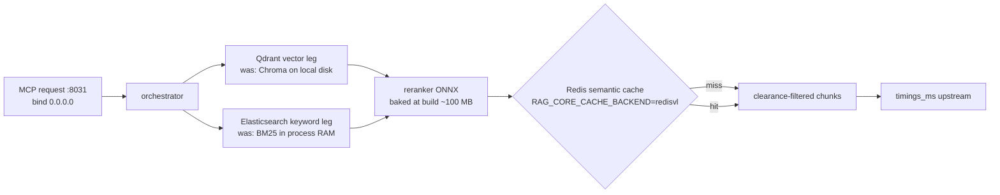

# RAG Service — Module Doc

> **Module:** MOD-04 · **Form:** Service (separate repo, existing) · **Defines:** TRD-03
> **Engagement:** Brownfield/Partial · **Lenses:** BA (BRD half) + TPO/Architect (TRD half)
> **Source of truth for IDs:** `01-brd.md`, `02-use-cases-workflows.md`, `03-data-state-analysis.md`, `04-coverage-gap-analysis.md`, `05-modularization.md`, `06-architecture.md`, `07-brownfield-reconciliation.md`
> **Code under design:** `../enterprise-rag-core/` — `adapters/bm25_memory.py`, `adapters/`, `config.py`, the MCP server

## BRD Half — Business Requirements (BA Lens)

### Purpose

The RAG service is the interviewer's memory. It owns the question banks, the chunks and vectors derived from them, hybrid retrieval (keyword + vector), reranking, and a semantic cache that keeps repeat rubrics off the expensive path. It is consumed by the voice worker and the text path **over MCP**, never by import — this repo never touches a vector store directly.

Its business role is narrow but load-bearing: it decides *what the interviewer asks next* and *what a good answer looks like*. Everything the LLM judge compares against comes from here.

### Business Requirements Served

| Requirement | Statement (abbreviated) | How MOD-04 satisfies it |
|---|---|---|
| BRD-10 — Horizontally scalable RAG service | More than one replica; a bank registered on replica A is visible to replica B | The BM25 index moves out of process RAM (`bm25_memory.py:27-31`) into Elasticsearch; vectors move off local disk (`config.py:171-175`) into Qdrant. Both adapters already exist and are tested (DG-03) |
| BRD-04 — Pluggable bank storage | Bank storage selectable across local FS / S3 / cloud | The RAG service is the *registration* half of `POST /skills`; it indexes whatever MOD-08 persisted, and is agnostic to where it was persisted |
| BRD-02 — Real readiness probes | RAG availability gates the API's readiness behind a flag defaulting off | The RAG service exposes its own health; the API consumes it as a *degradable* dependency |
| BRD-09 — Measurable voice latency | Per-hop latency against the 1500 ms budget | Retrieval carries a 150 ms stage budget and reports its own `timings_ms` upstream |
| BRD-13 — Observability | Metrics, structured logs | Cache hit rate and per-leg retrieval latency become the primary tuning signals |
| BRD-14 — Cloud-agnostic and on-prem | One base, thin overlays | Qdrant and Elasticsearch are both self-hostable and both available as managed services; the choice is a config value, not a code path |
| BRD-17 — Auth model decided | **Deferred — PO owner** | `RAG_MCP_TOKEN` unset means **no auth mode**. That default is convenient on a laptop and unacceptable in a cluster; it is flagged here as a real gap, not a configuration detail |

### Actors & Use Cases

| Use case | Actor | Interaction with this module |
|---|---|---|
| UC-01 — Take a voice interview | Candidate | Retrieval per turn; cache-gated rubric lookups; degraded-dependency row depends on this module failing softly |
| UC-02 — Take a text interview | Candidate | Same retrieval path; the "keyword-only retrieval if the vector leg is down" row is a MOD-04 behaviour |
| UC-03 — Upload a new skill bank | Skill author / Admin | `register_bank` over MCP with a 120 s budget; the bank must be queryable without a restart |
| UC-04 — Reconcile unregistered banks | Skill author / Admin | The probe side of reconcile: zero questions returned means unregistered |
| UC-05 — Deploy or upgrade the platform | Platform operator | Independent replica count; readiness reflects the indexing backend |
| UC-11 — Register and dispatch an agent into a room | System / Agent | Domain resolution and bank lookup at interview start |

### Business Acceptance Criteria

1. Two RAG replicas both serve a bank registered on either one, with no restart and no manual index copy. Verified by US-017.
2. A newly registered bank is queryable immediately after `register_bank` returns — the promise `docs/CLAUDE.md` already makes.
3. Retrieval stays within the 150 ms stage budget at the design concurrency, or the measured value and its cause are published. The honest statement today: **measured 200–360 ms against a 150 ms budget**, so this criterion is currently unmet and is recorded as such.
4. A repeat rubric lookup is served from the semantic cache, and the cache hit rate is a published metric. `RAG_CORE_CACHE_BACKEND=redisvl` is why the measured `cache_hit_rate` was **0.0** — unset means no shared cache.
5. With the vector leg down, retrieval degrades to keyword-only and the interview continues. With the RAG service entirely down, the interview continues on the last known rubric.
6. `register_bank` under load does not blow its 120 s budget. The default is 30 s, which a bank of 26,710 B across 9 files can exceed at cold index; the interview grading budget is deliberately different from the registration budget.

## TRD-03 — Technical Requirements (TPO / Architect Lens)

### Non-Functional Requirements

| # | Requirement | Target | Measured today | Notes |
|---|---|---|---|---|
| NFR-1 | Retrieval latency (hybrid, reranked) | ≤ 150 ms stage budget | **200–360 ms** | Over budget before any autoscaling work; reported honestly rather than rounded down |
| NFR-2 | Replicas | ≥ 2 | 1 effective (multi-replica is unsafe today) | HPA on CPU is a fair signal: work is short and uniform (200–360 ms) |
| NFR-3 | Shared keyword index | Elasticsearch, strong consistency | In-process RAM, warmed only at boot | Multi-replica correctness, not performance |
| NFR-4 | Shared vector store | Qdrant | Chroma on local disk (`config.py:171-175`) | Same reasoning |
| NFR-5 | Semantic cache backend | `RAG_CORE_CACHE_BACKEND=redisvl`, shared across replicas | unset → per-process only → **0.0 measured hit rate** | Restoring the cache is a config change and a measurable win |
| NFR-6 | Corpus scale | 9 banks, 26,710 B, ~hundreds of chunks | same | Small enough that Elasticsearch is heavy — which is exactly why it belongs in the base and not in the developer's laptop |
| NFR-7 | Bind address | **0.0.0.0** | loopback-bound | A pod bound to `127.0.0.1` is unreachable from the Service VIP. This is a one-line change with an outage-shaped failure mode if missed |
| NFR-8 | Registration budget | 120 s for `register_bank` | 120 s already configured | The 30 s default is for retrieval calls |
| NFR-9 | Reranker artifact | Baked into the image at build time | same | ~100 MB ONNX; the exception to the PVC rule (DG-04) |
| NFR-10 | Startup | Ready once the index backend is reachable and the bank list is enumerable | boot-time RAM warm | The boot warm disappears with the RAM index — a cold replica no longer needs a warm-up phase |
| NFR-11 | Auth | `rag:write` for write tools, `rag:read` for retrieval | **none when `RAG_MCP_TOKEN` is unset** | Recorded as a real gap, owned by the auth decision (BRD-17) |
| NFR-12 | Cache TTL convergence for new banks | A newly registered bank is visible without cache invalidation races | n/a | Registration must invalidate or version the semantic cache entry for that domain |

### Interfaces Exposed

MCP over HTTP on `:8031`. Every tool below is already implemented; the work in this plan is storage backend and deployment shape, not new surface.

| Tool | Kind | Input | Output | Budget |
|---|---|---|---|---|
| `retrieve_context` | read | query, domain, top_k | clearance-filtered chunks | 150 ms |
| `execute_agent_context` | read | question/answer pair | rubric context + `hit_source` for cache attribution | 150 ms |
| `interview_bank` | read | domain | bank metadata + question list | 150 ms |
| `interview_question` | read | domain, index | one question | 150 ms |
| `interview_followup` | read | domain, question, answer | follow-up question | 150 ms |
| `register_bank` | **write** | bank name, markdown, department | section and chunk counts | **120 s** |
| health | read | — | per-dependency status: vector leg, keyword leg, cache | 250 ms |

### Interfaces Consumed

| Dependency | Module | Protocol | Contract | Notes |
|---|---|---|---|---|
| Qdrant | — | HTTP/gRPC `:6333`/`:6334` | collection per domain; upsert on registration, search per retrieval | Adapter exists and is tested — this is a config switch (DG-03) |
| Elasticsearch | — | HTTP `:9200` | index per domain; bulk index on registration | Adapter exists and is tested; genuinely heavy for 26 KB, which is why it stays out of the local overlay |
| Redis | MOD-09 (separate logical DB) | RESP | semantic cache entries keyed by rubric hash | Shared across replicas; its absence is the 0.0 hit-rate cause |
| Embeddings | MOD-05 | OpenAI-compatible `/v1/embeddings` | Vector per chunk | Only when embeddings are self-hosted; a hosted embedder is equally valid and stays a config value |
| Bank source | MOD-08 | `BankStore` protocol | `get`/`list` for reconcile and repopulation | The filesystem remains the source of truth for content; RAG holds the derived index |

**Consumers.** MOD-02 (voice) and MOD-03 (the in-process brain, for both voice and text turns) call these tools through `interviewer/rag_client.py`. That client's per-call `httpx.AsyncClient` construction and per-call MCP `initialize()` handshake are a **client-side** defect (`rag_client.py:88`): each MCP call currently pays a full handshake. Fixing it belongs to the caller, but it is called out here because it inflates every measured RAG hop and will be mistaken for service latency if it is not fixed before the numbers are used to size replicas.

### Data Model

| Asset | Today | After | Authority |
|---|---|---|---|
| DAT-04 — RAG chunks + vectors | Chroma on local disk (`config.py:171-175`) | **Qdrant** | Derived from DAT-03; rebuilt by re-registration |
| DAT-05 — BM25 keyword index | **In process RAM**, warmed only at boot (`bm25_memory.py:27-31`) | **Elasticsearch** | Derived from DAT-03 |
| DAT-03 — Question banks (9 files, 26,710 B) | Local folder (the consumer side) | `BankStore` (MOD-08) | **The content source of truth** — RAG holds only derived state |

**Lineage.** DAT-03 → validated and persisted by MOD-01 → registered over MCP `register_bank` → DAT-04 + DAT-05 → retrieved per turn → scored → DAT-01 → summarized into DAT-02. RAG owns the middle of that chain and nothing at either end.

**What is deliberately *not* stored here.** Candidate audio (DAT-07) and session state (DAT-01) never reach this service. Retrieval requests carry a query string and a domain, not a transcript archive — which keeps the RAG tier outside the retention question that BRD-18 must still answer for the rest of the system.

### Stack Choices & Rationale

| Choice | Alternative rejected | Why |
|---|---|---|
| Elasticsearch for the keyword leg | Keep BM25 in process RAM; rebuild per replica | An in-RAM index warmed only at boot makes replica B's view of a bank uploaded to replica A permanently stale until restart. Elasticsearch is the only way the keyword leg satisfies BRD-10 |
| Qdrant for vectors | Keep Chroma on local disk | Same reasoning; and the adapter already exists and is tested, so this is **config, not code** (DG-03). Choosing an unproven store would have been gratuitous |
| Chroma + `bm25_memory` retained in the **local overlay only** | Removing them entirely | A developer must be able to run the stack with no search cluster. The local overlay keeps the light path; the base gets the shared one. This is an honest split rather than pretending one size fits both |
| `redisvl` cache backend in the base | Leaving the cache backend unset | Unset is why measured `cache_hit_rate` was 0.0 — every rubric recomputed. The semantic cache is the single largest cheap win available on this tier |
| Reranker ONNX baked into the image | PVC or initContainer | ~100 MB is small enough to bake; a PVC would add a storage dependency for a static artifact and an initContainer would block readiness on every start (DG-04's stated exception) |
| Auth mode defaulting to none | Requiring a token by default | Recorded as a **gap, not a design** — see open items. A silent no-auth default is exactly the failure mode this document exists to surface |

### Failure & Degradation Behaviour

| Failure | Detected by | Behaviour | Caller sees |
|---|---|---|---|
| Elasticsearch down | Health check; keyword leg errors | **Vector-only retrieval.** Recall degrades, ranking stays usable | Slightly worse context, correct answers. Never a hang |
| Qdrant down | Health check; vector leg errors | **Keyword-only retrieval.** The UC-02 doc already commits to this behaviour | Correct-but-narrower context |
| Redis cache down | Cache read errors | Bypass the cache and compute; `cache_hit_rate` reported as *unavailable*, not as `0` | Slower effective rubric lookups; latency budget under pressure |
| Whole RAG service down | MOD-01 `/readyz` reports it (`READINESS_REQUIRES_RAG=false` → stays ready) | MOD-02 continues on the last known rubric; the interview never hangs | Unchanged during; the interview completes with reduced context |
| Registration exceeds 120 s | Deadline | Write fails with a typed error; the bank file is already persisted by MOD-08 | Admin sees the failure; `/skills/reconcile` repairs it (WF-02) |
| Bank registered but index write partially failed | Zero questions returned on probe | SM-03 `STORED` state; reconcile re-registers idempotently | Admin-visible, self-healing |
| Two admins register the same bank concurrently | — | Object-store last-write-wins; registration is an idempotent replace | Documented, not accidental (Discovery Challenge #6) |
| Backend unreachable at pod start | Readiness | Not ready → removed from the Service; the API's readiness is **not** affected because RAG is degatable | No candidate impact |
| Replica count at 10× | — | Qdrant/Elasticsearch connection limits are the named saturation point | Retrieval latency grows; the worker's degraded path absorbs it |

### Open Items & Risks

| # | Item | Type | Owner |
|---|---|---|---|
| 1 | **Auth defaults to none when `RAG_MCP_TOKEN` is unset** — including the `register_bank` write tool | Security gap | PO (BRD-17). Until decided, NetworkPolicy restricting `:8031` to MOD-01 and MOD-02 pods is the compensating control |
| 2 | Retrieval is 200–360 ms against a 150 ms stage budget | Performance gap | Architect — compound of cache miss, rerank cost, and the caller's per-call MCP handshake. Fix the caller first, then re-measure before scaling replicas |
| 3 | Re-measure `cache_hit_rate` after `redisvl` is enabled | Validation | On-call — a hit rate of 0.0 was the symptom; a measured improvement is the proof |
| 4 | Elasticsearch is operationally heavy for a 26,710 B corpus | Cost | Accepted: correctness across replicas outweighs the footprint. Revisit only if the corpus stays this small *and* single-replica RAG becomes acceptable |
| 5 | `register_bank` invalidation of the semantic cache for a re-uploaded bank | Correctness | Engineer — a stale rubric served from cache after a deliberate re-upload would be a silent quality regression |
