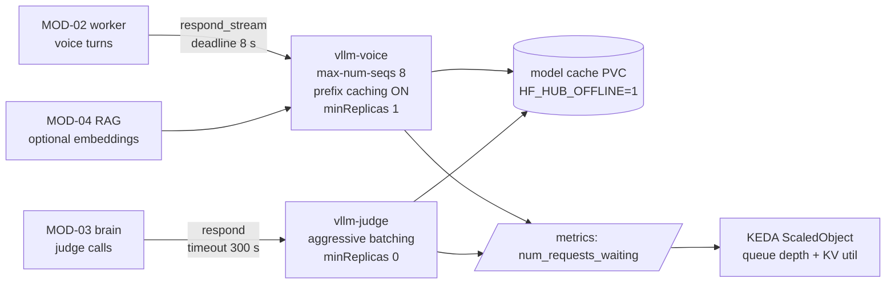

# LLM Inference (vLLM) — Module Doc

> **Module:** MOD-05 · **Form:** Service, GPU (new) · **Defines:** TRD-04
> **Engagement:** Brownfield/Partial · **Lenses:** BA (BRD half) + TPO/Architect (TRD half)
> **Source of truth for IDs:** `01-brd.md`, `02-use-cases-workflows.md`, `03-data-state-analysis.md`, `04-coverage-gap-analysis.md`, `05-modularization.md`, `06-architecture.md`, `07-brownfield-reconciliation.md`
> **Code under design:** `interviewer/llm.py`, `interviewer/config.py`, `interviewer/brain.py`, `interviewer/scoring.py`

## BRD Half — Business Requirements (BA Lens)

### Purpose

Two different customers, two different jobs, one model family. The **voice** LLM writes what the interviewer says next — short, spoken, one question per turn, streamed token by token into TTS. The **judge** LLM reads a candidate's answer against a rubric and produces a structured 1–5 score plus a follow-up decision.

They are deployed as **two separate vLLM deployments of the same model**, because their requirements are opposites: the voice path must be fast for one user at a time, while the judge path can be slow for many users at once and sits entirely off the realtime path.

### Business Requirements Served

| Requirement | Statement (abbreviated) | How MOD-05 satisfies it |
|---|---|---|
| BRD-08 — AI engines as independent GPU services | STT, TTS, LLM served by separate GPU services behind existing protocols; worker becomes CPU-only | vLLM serves an OpenAI-compatible `/chat/completions`; the worker talks to it over `LLMEngine.respond_stream`, an interface that is *already* network-shaped (REC-02). No code change to the protocol, only to the base URL and the client lifetime |
| BRD-09 — Measurable voice latency | Per-hop latency recorded against the 1500 ms budget | LLM first token carries a **500 ms** stage budget; `llm_first_token_ms` and `llm_total_ms` are exported. This is only meaningful once the `LLMMetrics` concurrency defect is fixed (`CV-02`) |
| BRD-13 — Observability with the budget as an SLO | Metrics, structured logs, burn-rate alerting | vLLM's own Prometheus metrics (`num_requests_waiting`, `gpu_cache_usage_perc`, `time_to_first_token_seconds`) become both the scaling signal and the diagnosis surface for a breach |
| BRD-14 — Cloud-agnostic and on-prem from one base | One base, thin overlays | vLLM is an upstream image with no cloud coupling; weights come from a PVC, and the GPU node pool is a tolerated taint, not a vendor feature |
| BRD-12 — No secrets in images | Credentials injected per environment | Only needed if a hosted LLM endpoint is used instead; the base deployment needs none |
| BRD-17 — Auth decided | **Deferred — PO owner** | vLLM ships with no API key by default. The endpoint is cluster-internal (NetworkPolicy), and `--api-key` is available if the auth decision requires it |

### Actors & Use Cases

| Use case | Actor | Interaction with this module |
|---|---|---|
| UC-01 — Take a voice interview | Candidate | Every interviewer utterance and every follow-up decision is generated here |
| UC-02 — Take a text interview | Candidate | Same FSM, same voice-tuned client, no audio |
| UC-09 — Investigate a latency-breach | On-call engineer | `llm_first_token_ms` is one of the five stages the dashboard splits on; the runbook branch is "check `num_requests_waiting` and prefix caching" |
| UC-11 — Register and dispatch an agent into a room | System / Agent | Off the dispatch path; consumed once the interview starts |

### Business Acceptance Criteria

1. With vLLM serving the voice model on GPU, first-token latency for the real voice prompt shape (short system prompt + rubric context + one question) is measured and published, not assumed. The `llm-bench` skill exists to produce this number before GPU spend is committed (CV-03, Gap 5).
2. The voice path never queues behind judge traffic. A batch of judge calls submitted during a live interview must not raise that interview's first-token latency. This is the whole reason for two deployments.
3. A cold `vllm-judge` scale-from-zero does not affect a live interview, because it is off the hot path and bounded by `answer_timeout_s` (60 s).
4. A candidate never experiences a hang because a model was loading. See NFR-7: a model load must never be interpreted as a failure.
5. Every voice turn's first-token latency is attributable to this hop specifically, not to a neighbouring one. Verified by the `CV-02` ordering constraint.

## TRD-04 — Technical Requirements (TPO / Architect Lens)

### Non-Functional Requirements

| # | Requirement | Target | Measured today | Notes |
|---|---|---|---|---|
| NFR-1 | LLM first token (voice) | **≤ 500 ms** stage budget | **~280–800 ms** | Already at or over budget on the current MLX server; the spread matters as much as the median |
| NFR-2 | Voice hop deadline | ≤ 8 s per call | **300 s** (`LLMConfig.timeout`, `llm.py:27`) | A 300 s timeout on a realtime turn is functionally "hang forever". It exists because the same client serves the judge, whose calls *are* legitimately long |
| NFR-3 | Deployments | **2** — `vllm-voice` and `vllm-judge` | 1 shared endpoint | Independent scaling axes and independent QoS |
| NFR-4 | `vllm-voice` concurrency | `--max-num-seqs 8`, `--enable-prefix-caching`, `minReplicas: 1` | n/a | Low sequence count keeps per-request latency stable; prefix caching attacks prefill, which dominates |
| NFR-5 | `vllm-judge` concurrency | Aggressive batching (`--max-num-seqs` 64–128), `minReplicas: 0` | n/a | Off the hot path; bounded by `answer_timeout_s = 60 s` per answer |
| NFR-6 | Scaling signal | `vllm:num_requests_waiting` (voice target ~4, judge higher) plus `vllm:gpu_cache_usage_perc` (target 80%) | n/a | Queue depth, not CPU — a GPU pod at 100% CPU with an empty queue is idle |
| NFR-7 | Startup probe | `failureThreshold: 120`, `periodSeconds: 10` → **20 min** allowance | n/a | A model load looks exactly like a hang |
| NFR-8 | Liveness probe | **None short.** No liveness during the load window | n/a | See the rationale below — this is the highest-consequence setting in the module |
| NFR-9 | Voice output length | ≤ ~600 spoken characters (`MAX_SPOKEN_CHARS`) | enforced | Bounds generation time and keeps a turn inside the budget |
| NFR-10 | Judge output | Structured `Correctness:/Depth:/Communication:` 1–5 + `FOLLOW_UP:` | enforced by `scoring.py` | ~200 output tokens; parse failures are a typed error, never a silent zero |
| NFR-11 | Weight delivery | PVC + prewarm Job, `HF_HUB_OFFLINE=1` | downloaded per replica into `~/.cache` | A cold replica must not re-download tens of GB (DG-04) |
| NFR-12 | GPU request | 1 GPU per replica; no GPU limit below the request | n/a | Requests and limits both `nvidia.com/gpu: 1`; GPU is not a compressible resource |
| NFR-13 | Cold node + load worst case | ~10 min (2–6 min node provision + 1–5 min load) | n/a | The number that forces `minReplicas ≥ 1` on the voice deployment |

**Why there is no short liveness probe.** During a cold start, vLLM holds GPU memory, prints progress, and serves nothing for one to five minutes. A liveness probe with the usual 3×10 s budget kills the container, which restarts the load, which is killed again — a restart loop that **can never converge**, because each attempt is killed before it can finish. The startup probe is therefore generous (20 min) and the liveness probe is either absent or given a threshold longer than any plausible load, with readiness — not liveness — doing the gating.

**Why the 300 s timeout must be split.** `LLMConfig.timeout = 300.0` is right for the judge, whose call is bounded by a 60 s answer window and may wait behind a batch, and catastrophically wrong for a voice turn. The fix is two client configurations (or a per-call timeout parameter), not a global retune — a global retune to 8 s would make judge calls fail spuriously under batch pressure.

### Interfaces Exposed

| Method | Path | Purpose | Notes |
|---|---|---|---|
| POST | `/v1/chat/completions` | OpenAI-compatible chat, streaming SSE | The only endpoint the application uses |
| POST | `/v1/completions` | Raw completion | Unused; present in the upstream image |
| GET | `/v1/models` | Model identity | Used by a startup assertion so a base-URL typo fails loudly |
| GET | `/health` | Process health | Used by the **startup** probe only |
| GET | `/metrics` | Prometheus | `vllm:num_requests_waiting`, `vllm:gpu_cache_usage_perc`, `vllm:time_to_first_token_seconds`, `vllm:kv_cache_usage_perc` |

**The two-deployment decision, stated plainly.** Continuous batching is a throughput optimization that **adds latency** under concurrency: more sequences in flight means more interleaving and a longer time-to-first-token for each. That is a good trade for the judge — it is off the hot path, it is bounded by a 60 s window, and its throughput determines cost. It is a hostile trade for the voice path, where the entire product claim is a sub-1.5 s turn. Running one deployment for both would let a burst of judge calls raise a live candidate's first-token latency, which is precisely the failure the product cannot have. `config.py` already separates the voice and judge models and base URLs, so this is a values change, not a code change.

**Why prefix caching matters more than model size.** First-token latency is dominated by **prefill** of the rubric context, not by the number of parameters. The voice turn is short (≤ 600 spoken chars out) but its prompt carries the domain rubric and the question context, most of which is identical across turns in one interview. `--enable-prefix-caching` lets vLLM reuse that computation, which is a larger, more reliable win than swapping to a smaller model — and it does not cost answer quality. The `llm-bench` skill should measure both before either is committed to.

### Interfaces Consumed

| Dependency | Module | Protocol | Contract | Notes |
|---|---|---|---|---|
| Weight storage | MOD-13 | PVC (ReadWriteOnce per replica) | Model snapshot, prewarmed by a Job, mounted read-only | `HF_HUB_OFFLINE=1` makes a missing weight a loud startup failure rather than a silent download |
| GPU | MOD-13 | Device plugin | `nvidia.com/gpu: 1` | Tolerates the `nvidia.com/gpu=present:NoSchedule` taint |
| Scaler | MOD-13 | KEDA `ScaledObject` | Prometheus scaler on the vLLM metrics | **One ScaledObject per Deployment**; a plain HPA on the same Deployment would conflict |
| Callers | MOD-02, MOD-03 | HTTPS SSE | `LLMEngine.respond_stream` / `respond` | Client-side: one pooled `httpx.AsyncClient` per process, not per call |

**The client-side defect this module cannot fix alone.** `llm.py:88,116` constructs a new `httpx.AsyncClient` on every call, so every turn pays a TCP handshake (and TLS, if terminated) before the model sees a token — directly inside the 500 ms stage budget. `self.metrics` is also mutated per call (`llm.py:31-33,87,115`), which is not concurrency-safe; with engines constructed once per process this becomes a data race rather than a theoretical concern, which is the `CV-02` ordering constraint: **metrics-per-call ships before per-process engines.** Getting this backwards silently attributes first-token latency to the wrong hop and corrupts the SLO's own data.

### Data Model

| Asset | Role | Notes |
|---|---|---|
| DAT-06 — GPU model weights | **Stored here** | Tens of GB; written once per model; immutable once warm. PVC + prewarm Job per DG-04. The ~100 MB reranker is the documented exception and is baked at build time |
| DAT-01 — Session state | **Not stored here** | The LLM service is stateless with respect to interviews; conversation history is replayed in the prompt by MOD-03 |
| DAT-02 — Latency ledger | **Emits into it** | `llm_first_token_ms`, `llm_total_ms` per call, attributed by the caller |
| DAT-03 — Question banks | **Not stored here** | Reaching the model only as prompt text assembled by MOD-03 |

**No prompt or transcript is persisted by this module.** vLLM holds an in-memory KV cache that is discarded when the request completes. That is a real property worth stating for the BRD-18 retention decision: the inference tier keeps no durable copy of anything a candidate said.

### Stack Choices & Rationale

| Choice | Alternative rejected | Why |
|---|---|---|
| vLLM, upstream image | Building our own inference server | Upstream images are maintained, publish CPU variants that make local development a faithful mirror of the cluster, and expose the metrics this module scales on. Building one would be sustained work with no product differentiation |
| **Two deployments of the same model** | One deployment serving both voice and judge | Continuous batching trades latency for throughput. Voice needs the opposite trade from the judge, and a shared deployment would let judge load degrade a live interview. This is the module's defining decision |
| `--enable-prefix-caching` on voice | A smaller model | Prefill of the shared rubric dominates first-token latency; caching removes it without costing answer quality |
| `minReplicas: 1` on voice, `0` on judge | Both at 0, or both at 1 | Voice can never wait ~10 minutes for a cold GPU node; the judge can afford to. The asymmetry is the cost optimization, and it is deliberate |
| Generous startup probe, no short liveness | Conventional 3×10 s liveness | A model load is indistinguishable from a hang, and a liveness kill produces a restart loop that can never converge (NFR-7, NFR-8) |
| Keep the hand-rolled SSE client | Switch to the `openai` SDK | The existing client already parses SSE, carries per-call metrics, and is covered by tests. The defects are client lifetime and metrics mutability, both of which are fixes to existing code, not reasons to swap libraries mid-migration |
| Queue depth as the scaling signal | GPU utilization | Utilization stays high while a pod is saturated and also while it is doing useful work; queue depth answers the question the scaler actually has — "is anyone waiting?" |

### Failure & Degradation Behaviour

| Failure | Detected by | Behaviour | Candidate sees |
|---|---|---|---|
| Model still loading (cold start) | Startup probe not yet passing | Pod not ready; **no traffic is routed to it and it is not killed** | Nothing — the other replica or a warm instance serves |
| Voice first token exceeds 8 s | Hop deadline | One retry, then the turn is completed from the bank question text | The question is still asked |
| Voice queue depth rises | `num_requests_waiting` > target | KEDA adds a replica (bounded by the GPU node pool) | Gradually longer first token |
| KV cache saturated | `gpu_cache_usage_perc` > 80% | KEDA adds a replica; vLLM preempts/queues internally | Longer first token, never an error |
| GPU node unavailable | Pod `Pending` | Cluster Autoscaler provisions; `minReplicas ≥ 1` means the common case never waits | Nothing, until the floor itself is unschedulable |
| Judge queue deep at answer time | `answer_timeout_s` (60 s) | The answer is recorded as **unscored with a reason**, not as a zero | The interview continues; one score is missing and labelled |
| Judge returns unparseable output | `scoring.py` parse failure | Typed error, retry once, then unscored | As above — never a fabricated score |
| vLLM replica dies mid-interview | Caller's retry | One bounded retry against the remaining replicas | Nothing, if the retry lands; otherwise the turn degrades |
| Base URL misconfigured | `/v1/models` startup assertion | Pod fails fast at boot | Nothing — caught before serving |

**Degradation ladder for the voice path,** in the order the system applies it: more replicas → longer first token → shorter spoken answers (the FSM can truncate further) → the turn falls back to the bank text → a typed turn error with the interview continuing. There is no rung at which the interview silently ends.

### Open Items & Risks

| # | Item | Type | Owner |
|---|---|---|---|
| 1 | Whether 1500 ms is achievable with self-hosted GPU inference (CV-03) | Feasibility gap | Architect — measure first-token latency for the real voice prompt shape with the `llm-bench` skill before committing GPU spend (Gap 5) |
| 2 | LLM first token already spans 280–800 ms, a 2.9× spread, on one shared endpoint | Performance | Engineer — split the endpoint and re-measure; the spread is consistent with batching contention, which the split directly addresses |
| 3 | The 300 s voice timeout must be split from the judge timeout | Correctness | Engineer — ships with the client-lifetime fix |
| 4 | `LLMMetrics` mutability must be fixed **before** per-process engines (`CV-02`) | Ordering constraint | Engineer — hard dependency, not a nice-to-have |
| 5 | GPU floor cost (three GPU deployments at `minReplicas: 1`) dominates the entire bill | Cost | PO — re-size after one week of measured arrivals (AS-03) |
| 6 | No API key on the vLLM endpoint by default | Security | PO (BRD-17); NetworkPolicy is the compensating control |
