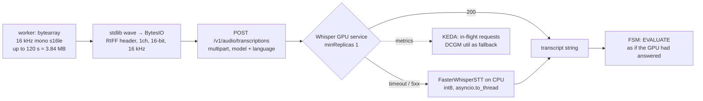

# STT Inference (Whisper) — Module Doc

> **Module:** MOD-06 · **Form:** Service, GPU (new) · **Defines:** TRD-05
> **Engagement:** Brownfield/Partial · **Lenses:** BA (BRD half) + TPO/Architect (TRD half)
> **Source of truth for IDs:** `01-brd.md`, `02-use-cases-workflows.md`, `03-data-state-analysis.md`, `04-coverage-gap-analysis.md`, `05-modularization.md`, `06-architecture.md`, `07-brownfield-reconciliation.md`
> **Code under design:** `interviewer/voice/stt.py`, `interviewer/voice/protocols.py`, `interviewer/voice/agent.py`

## BRD Half — Business Requirements (BA Lens)

### Purpose

Speech-to-text turns a candidate's spoken answer into the string the FSM scores. It is the front door of the interview: if this hop is slow, the candidate finishes speaking and then waits in silence; if it is wrong, the judge scores an answer the candidate did not give.

Today it runs in the worker process as `FasterWhisperSTT` — CTranslate2 on CPU, roughly **1.0–1.1 s** per final transcription against a **300 ms** stage budget. Extracting it to a GPU service is most of what makes the 1500 ms round-trip reachable at all.

### Business Requirements Served

| Requirement | Statement (abbreviated) | How MOD-06 satisfies it |
|---|---|---|
| BRD-08 — AI engines as independent GPU services | STT, TTS, LLM served separately; worker becomes CPU-only | Whisper is served by an upstream GPU image behind the **existing** `STTEngine.transcribe(bytes) -> str` protocol. The worker drops `ctranslate2` and the model weights entirely |
| BRD-09 — Measurable voice latency | Per-hop latency against the 1500 ms budget | The STT hop carries a **300 ms** stage budget; the measured ~1.0–1.1 s is removed from the critical path and the new number is reported per turn |
| BRD-14 — Cloud-agnostic and on-prem | One base, thin overlays | Whisper runs on any conformant GPU node; the transport is plain HTTP with no vendor SDK |
| BRD-13 — Observability | Metrics, structured logs | In-flight request gauge plus stage latency histogram, both per-hop |
| BRD-18 — Retention and privacy | **Deferred — PO owner** | Worth stating explicitly: today candidate audio never leaves the worker process. Extracting STT means **raw candidate speech crosses the network** to this service. This is a real change in privacy surface and is recorded rather than assumed benign |

### Actors & Use Cases

| Use case | Actor | Interaction with this module |
|---|---|---|
| UC-01 — Take a voice interview | Candidate | One final transcription per answer; the "STT/TTS engine error → typed notice" failure row is implemented here |
| UC-09 — Investigate a latency-breach | On-call engineer | `stt_final` is one of the five dashboard stages; the runbook branch is "STT queue backed up → scale TTS/STT replicas, check GPU util" |
| UC-11 — Register and dispatch an agent into a room | System / Agent | Not on the dispatch path; consumed after the candidate connects |

### Business Acceptance Criteria

1. A candidate's spoken answer is transcribed and scored within the turn budget in the common case, with the measured latency published rather than assumed.
2. When the GPU STT service is unavailable, the interview **continues on CPU transcription** — slower but correct. A degraded answer beat is acceptable; a lost answer is not.
3. No candidate utterance is silently dropped. A failed transcription produces a typed notice and a scored-as-unanswered turn, and the FSM advances.
4. The audio the candidate actually spoke is what is transcribed — no truncation, no format loss. Verified by the WAV-wrapping contract test.
5. The natural-voice policy is unaffected: this module handles inbound audio only and never produces a voice.

## TRD-05 — Technical Requirements (TPO / Architect Lens)

### Non-Functional Requirements

| # | Requirement | Target | Measured today | Notes |
|---|---|---|---|---|
| NFR-1 | Final transcription latency | **≤ 300 ms** stage budget | **~1.0–1.1 s** (CPU CTranslate2) | The hop being removed from the critical path |
| NFR-2 | Engine call timeout | ≤ 2 s hard, 1 retry | unbounded within the turn | A 120 s answer must not become a 120 s wait |
| NFR-3 | Audio input format | Raw **16 kHz mono s16le PCM**, no container | same | See the WAV-wrap contract below — this is the module's most likely integration bug |
| NFR-4 | Upload size ceiling | ≤ 3.84 MB per request (120 s × 32 KB/s) | same | Matches `agent.py:137-138`'s buffer cap exactly; the ingress and the endpoint must both allow it |
| NFR-5 | Replicas | `minReplicas: 1` GPU | 0 (runs in-process) | GPU floor is a requirement, not a tuning preference (cold node ≈ 10 min) |
| NFR-6 | Scaling signal | In-flight transcription requests; DCGM GPU utilization as fallback | n/a | Bursty: one final per answer, ~C per turn |
| NFR-7 | VRAM | ≤ 8 GiB for the chosen model | n/a | `whisper-large-v3-turbo` (~1.5–3 GB) leaves headroom for concurrent requests; `large-v3` (~10 GB) does not fit the same sizing |
| NFR-8 | Weight delivery | PVC + prewarm Job, `HF_HUB_OFFLINE=1` | lazy download into `~/.cache`, per replica | Must not re-download per replica (DG-04) |
| NFR-9 | Readiness | Model loaded **and** a warm transcription succeeded | n/a | A pod that is up but has never transcribed is not ready |
| NFR-10 | CPU fallback path | Kept functional, not deleted | the current default | The degradation mode is code that must still exist and still be tested |
| NFR-11 | Worker-side artifacts removed | No `ctranslate2`, no Whisper weights in the worker image | present today | This is what makes the worker's sub-2 s cold start possible |

**The WAV-wrapping contract.** `STTEngine.transcribe(bytes)` hands over **raw 16 kHz mono s16le PCM with no container**. The OpenAI-compatible transcription endpoint expects a *file*. Uploading headerless PCM produces either a 400 or, worse, a confidently wrong transcript of the audio bytes reinterpreted as a container header. The fix is small and must be exact: build a WAV container in memory with the **stdlib `wave` module writing into a `BytesIO`** — 44-byte RIFF header, `nchannels=1`, `sampwidth=2`, `framerate=16000` — then upload those bytes as the multipart file part with a `.wav` filename. No new dependency, no numeric conversion path, and the header describes exactly the bytes the worker already has.

### Interfaces Exposed

| Method | Path | Purpose | Notes |
|---|---|---|---|
| POST | `/v1/audio/transcriptions` | OpenAI-compatible transcription | Multipart: `file` (WAV), `model`, `language`, optional `response_format` |
| GET | `/health` | Process health | Startup probe only; a model load must never be read as a hang |
| GET | `/v1/models` | Model identity | Startup assertion so a wrong model name fails at boot |
| GET | `/metrics` | Prometheus | In-flight requests; DCGM GPU utilization scraped separately as the fallback signal |

Served by the upstream Speaches/Whisper image — **not built by us** (Build vs Buy, `06-architecture.md`). Local development uses the CPU variant of the same image, which is what makes a laptop a faithful mirror of the cluster.

### Interfaces Consumed

| Dependency | Module | Protocol | Contract | Notes |
|---|---|---|---|---|
| Audio source | MOD-02 | In-cluster HTTP | Raw PCM in, transcript out | The worker's in-RAM `bytearray` is copied into the request body and released after |
| Weight storage | MOD-13 | PVC | Read-only model snapshot | `HF_HUB_OFFLINE=1` |
| GPU | MOD-13 | Device plugin | `nvidia.com/gpu: 1` | Tolerates the GPU node-pool taint |
| Scaler | MOD-13 | KEDA `ScaledObject` | In-flight gauge, DCGM fallback | One ScaledObject per Deployment |
| Fallback engine | MOD-02 in-process | `STTEngine` | `FasterWhisperSTT`, CUDA→CPU int8 | **Retained on purpose** — the degradation path is a product requirement |

**Client-side note.** `stt.py:36` constructs a new `httpx.AsyncClient` per call, as it does for LLM and TTS. Inside a 300 ms budget, a TCP handshake is not negligible. The remote adapter must hold one pooled client created once per worker process, alongside the engines — and the workers already resolve STT per room at `agent.py:132`, which should resolve to a *single shared* remote engine instance rather than a fresh one per room.

### Adapter Design — the remote STT engine

The remote engine is a **new implementation of an existing protocol**, sitting beside `DeepgramSTT` and `FasterWhisperSTT`. Nothing above it changes.

| Aspect | Behaviour |
|---|---|
| Protocol | `STTEngine.transcribe(audio: bytes) -> str` — unchanged, already network-shaped (REC-02) |
| Construction | **Once per worker process**, not once per room. `agent.py:132` resolves STT per room today; post-extraction it resolves to a single shared instance injected at startup |
| Client | One pooled `httpx.AsyncClient` held for the process lifetime (today: a new client per call, `stt.py:36`) |
| Encoding step | Raw PCM in → `wave`-wrapped WAV in a `BytesIO` → multipart upload |
| Retry | One retry on a transport error or 5xx; **no retry on 4xx** — a malformed request will not fix itself, and retrying it burns the turn budget |
| Timeout | 2 s hard per attempt |
| Fallback | On exhausted retries, delegate to the in-process `FasterWhisperSTT` |
| Selection | `INTERVIEW_STT_PROVIDER` gains a `remote` value; the existing cloud and local values keep working unchanged |

`FasterWhisperSTT` already runs its model call in `asyncio.to_thread` with a lazy instance-cached model and a CUDA→CPU int8 fallback. That is exactly the shape a remote adapter needs in its fallback slot: the degradation engine is already non-blocking, so the path that rescues the event loop does not itself stall the event loop.

### Data Model

| Asset | Role here | Notes |
|---|---|---|
| DAT-07 — Candidate audio buffer | **Passed through, never stored** | The service transcribes and discards. No audio is written to disk by this module, and none is retained after the response |
| DAT-06 — Model weights | **Stored here** | PVC + prewarm Job; immutable once warm |
| DAT-01 — Session state | **Not stored here** | The transcript returns to the worker, which owns the turn |
| DAT-02 — Latency ledger | **Emits into it** | The STT hop's elapsed time is recorded by `_hop()` on the worker (`brain.py:188`) |

**The privacy consequence, stated once and plainly.** Before extraction, the candidate's microphone audio never left the worker process. After extraction it is transmitted to MOD-06 over the cluster network, in-cluster and unencrypted by default (no mesh, no mTLS in the base). That is a genuine change in the system's data-flow surface, it is invisible in the latency numbers, and it belongs in the BRD-18 retention discussion rather than only in this document.

### Stack Choices & Rationale

| Choice | Alternative rejected | Why |
|---|---|---|
| Speaches / Whisper, upstream image | Building a Whisper server | The OpenAI-compatible transcription API is a de-facto standard; the upstream image is maintained and publishes a CPU variant that mirrors production locally. Nothing about this is product-differentiating |
| `whisper-large-v3-turbo`-class model | `large-v3` | Turbo fits comfortably in 8 GiB alongside concurrent requests at near-identical accuracy; `large-v3` roughly triples VRAM for a marginal WER gain that a mock-interview transcript does not need |
| **WAV-wrap with the stdlib `wave` module** | Sending raw PCM; hand-rolling a header; converting to another sample rate | The bytes are already exactly what a WAV header describes; `wave` is in the standard library, and a hand-written 44-byte header is a place to get endianness and chunk sizes wrong. Crucially, it adds **no numeric conversion path** — the sample rate, channel count and sample width are unchanged |
| In-flight requests as the scaling signal | CPU utilization | The service is GPU-bound and bursty; CPU would scale on request *parsing*, not on work. DCGM utilization is the fallback because it is available even when the app's own gauge is not scraped |
| Keep `FasterWhisperSTT` in the image | Delete it with the other extractions | The CPU path is the designed degradation mode (NFR-10). Deleting it would turn a slow answer into a failed answer, which is a worse product |
| Keep `DeepgramSTT` as a configured option | Remove cloud STT | It is an existing, working implementation behind the same protocol. Keeping it costs nothing and preserves a cloud option for deployments without GPU nodes |

### Failure & Degradation Behaviour

| Failure | Detected by | Behaviour | Candidate sees |
|---|---|---|---|
| GPU STT unavailable or over timeout | Client timeout (2 s) | **Fall back to `FasterWhisperSTT` on CPU** (~1.0–1.1 s). The interview continues | A noticeably longer pause, then the interview proceeds — never a lost answer |
| Transcription returns empty | Empty string from the engine | Treated as an unanswered turn: one re-prompt, then scored unanswered (`brain.py:263-288`) | "I didn't catch that — could you repeat it?" |
| Upload rejected (413 / format) | HTTP 4xx | Logged with the byte length and the header fields; fallback to CPU transcription, which does **not** need the wrapper | Nothing beyond the delay. The log is the signal that the WAV contract broke |
| Model still loading at boot | Startup probe | Not ready; no traffic routed; **not killed** | Nothing — the other replica serves |
| GPU node unavailable | Pod `Pending` | Cluster Autoscaler provisions; `minReplicas: 1` keeps a warm floor | Nothing, until the floor itself is unschedulable |
| Queue backed up behind answer bursts | In-flight gauge above target | KEDA adds a replica | Longer pause before the transcript returns |
| VRAM exhausted under concurrency | Engine 5xx | One retry, then CPU fallback | A longer pause, correct transcript |
| Audio longer than the ceiling | Size check before upload | The buffer cap is 120 s by construction, so this is a defensive check that should never fire in production; it fires loudly if it does | Never triggered; a fired check indicates an upstream regression |

**Why the fallback is CPU and not "fail the turn."** The two failure modes are not symmetric. A CPU transcription costs the candidate a second of silence and produces a correct transcript. A failed transcription costs the candidate their answer and forces a re-prompt, which in a scored interview is worse than a pause. The design therefore spends latency to protect correctness, and the latency cost is visible in the budget dashboard rather than hidden.

### Open Items & Risks

| # | Item | Type | Owner |
|---|---|---|---|
| 1 | Candidate audio now crosses the cluster network | Privacy | PO (BRD-18) — recorded as a change in surface, not assumed benign |
| 2 | The CPU fallback path must stay tested after extraction | Regression risk | Engineer — the fallback is easy to let rot once GPU STT works; it is a product requirement, so it needs a test, not just code |
| 3 | Upload size ceiling (3.84 MB) vs any ingress or proxy body-size limit | Integration | MOD-13 — must be verified end to end, not assumed from the defaults |
| 4 | Model choice (turbo vs large-v3) is unbenchmarked for the interview domain | Feasibility | Architect — measure WER and latency on real interview audio before sizing VRAM |
| 5 | In-flight gauge is an application metric; DCGM is the stated fallback | Scaling reliability | Architect — confirm the DCGM exporter is deployable on the target cluster before depending on the fallback |
