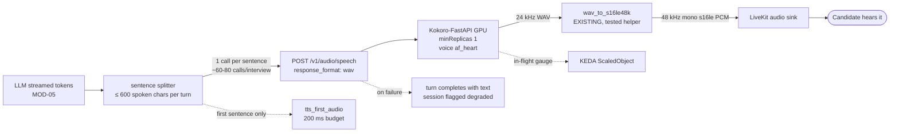

# TTS Inference (Kokoro) — Module Doc

> **Module:** MOD-07 · **Form:** Service, GPU (new) · **Defines:** TRD-06
> **Engagement:** Brownfield/Partial · **Lenses:** BA (BRD half) + TPO/Architect (TRD half)
> **Source of truth for IDs:** `01-brd.md`, `02-use-cases-workflows.md`, `03-data-state-analysis.md`, `04-coverage-gap-analysis.md`, `05-modularization.md`, `06-architecture.md`, `07-brownfield-reconciliation.md`
> **Code under design:** `interviewer/voice/tts.py`, `interviewer/voice/protocols.py`, `interviewer/brain.py`

## BRD Half — Business Requirements (BA Lens)

### Purpose

Text-to-speech is the interviewer's voice. It is the hop the candidate actually experiences as "the AI is talking", and it is the **single largest contributor to the current latency breach**: roughly **3.6 s to first audio on CPU** against a **200 ms** stage budget — an 18× violation on one hop, inside a product whose entire claim is a sub-1.5 s turn.

Two things make this module unusual. First, it has the **highest call rate in the system** — synthesis is per *sentence*, not per turn, because the interviewer streams its reply sentence by sentence. Second, it is a **hosting change, not a vendor change**: the self-hosted Kokoro model is already what the application uses today, so the voice the candidate hears does not change when it moves to the cluster. The natural-voice policy that excludes robotic espeak-class voices carries over verbatim.

### Business Requirements Served

| Requirement | Statement (abbreviated) | How MOD-07 satisfies it |
|---|---|---|
| BRD-08 — AI engines as independent GPU services | STT, TTS, LLM as separate GPU services; worker becomes CPU-only | Kokoro is served by an upstream GPU image behind the existing `TTSEngine.synthesize(text) -> bytes` protocol. The worker drops `kokoro_onnx` and the ~110 MB model footprint |
| BRD-09 — Measurable voice latency | Per-hop latency against the 1500 ms budget | `tts_first_audio` carries a **200 ms** stage budget and is one of the five stages the SLO dashboard splits on. Removing ~3.6 s from one hop is the majority of the improvement |
| BRD-13 — Observability | Metrics, structured logs, burn-rate alerting | In-flight synthesis gauge and first-audio histogram; the runbook branch for `tts_first_audio` is "TTS GPU saturated → scale replicas / check GPU util" |
| BRD-14 — Cloud-agnostic and on-prem | One base, thin overlays | Upstream image, no cloud coupling, self-hostable on-prem |
| BRD-17 — Auth decided | **Deferred — PO owner** | The endpoint is cluster-internal by NetworkPolicy; no application-level auth exists |
| BRD-18 — Retention and privacy | **Deferred — PO owner** | Synthesized speech is not candidate data; this module stores nothing. It is the one GPU service with no privacy surface |

### Actors & Use Cases

| Use case | Actor | Interaction with this module |
|---|---|---|
| UC-01 — Take a voice interview | Candidate | Every spoken sentence of the interview; the barge-in row (candidate speaks while the interviewer speaks) cancels playout that this module fed |
| UC-09 — Investigate a latency-breach | On-call engineer | `tts_first_audio` is the dashboard stage most likely to be the culprit, and the runbook names it first |
| UC-11 — Register and dispatch an agent into a room | System / Agent | Not on the dispatch path |

### Business Acceptance Criteria

1. **The voice does not change.** With `INTERVIEW_KOKORO_VOICE=af_heart` and the natural-voice allowlist intact, a candidate hearing the self-hosted cluster interviewer hears the same voice quality as the Windows single-machine deployment. This is a product requirement, not a technical one — "natural human voice" is a hard requirement in the project's own conventions.
2. First audio returns within the 200 ms stage budget under design concurrency, or the measured number is published with its cause. Today's number is ~3.6 s on CPU and the target is a GPU-hosted improvement of roughly an order of magnitude.
3. A TTS failure never silences the interview. The turn completes with text delivered over the data channel and the session is flagged degraded.
4. Sentence-level streaming is preserved. The interviewer must begin speaking after the first sentence is synthesized, not after the whole reply — collapsing this would add seconds back regardless of how fast the engine is.
5. Robotic voices never ship. The `resolve_tts` allowlist continues to reject espeak-class providers, including any new remote adapter.

## TRD-06 — Technical Requirements (TPO / Architect Lens)

### Non-Functional Requirements

| # | Requirement | Target | Measured today | Notes |
|---|---|---|---|---|
| NFR-1 | TTS first audio | **≤ 200 ms** stage budget | **~3.6 s** (CPU Kokoro) | The largest single breach in the product |
| NFR-2 | Call rate | Highest in the system — one call per **sentence** | same | A turn of ≤ 600 spoken chars splits into roughly 5–7 sentences; at ~12 turns that is **~60–80 synthesis calls per interview** |
| NFR-3 | Output format contract | **48 kHz mono s16le PCM** | same, enforced by `TTSEngine.synthesize` | Non-negotiable: the LiveKit audio sink and the existing tests assume it |
| NFR-4 | Engine-native format | 24 kHz WAV from Kokoro | — | **Must be resampled**, see the contract below |
| NFR-5 | Client lifetime | One pooled `httpx.AsyncClient` per worker process | a new client per sentence (`tts.py:39,68`) | At ~5–7 sentences per turn this is ~5–7 TCP handshakes per turn, all inside the budget |
| NFR-6 | Per-call timeout | ≤ 1.5 s | unbounded within the turn | A slow sentence must degrade, not stall the whole reply |
| NFR-7 | Replicas | `minReplicas: 1` GPU | 0 (in-process) | GPU floor requirement; a cold node is ~10 min |
| NFR-8 | Scaling signal | In-flight synthesis requests | n/a | Highest call rate in the system makes this the most scale-sensitive GPU tier |
| NFR-9 | VRAM | ≤ 2 GiB | n/a | Kokoro-82M is small (~300 MB of weights); the sizing is dominated by concurrent request buffering, not the model |
| NFR-10 | Weight delivery | PVC + prewarm Job, `HF_HUB_OFFLINE=1` | ~110 MB downloaded to `~/.cache/mock-interviewer/kokoro` on first use | Must not download per replica (DG-04) |
| NFR-11 | Readiness | Model loaded and one warm synthesis succeeded | n/a | First-request model load would otherwise land inside a live turn |
| NFR-12 | Natural-voice allowlist | Preserved through the remote adapter | enforced by `resolve_tts` (`tts.py:20`) | The policy is a product requirement and must survive the extraction |

**The resampling contract, and why it uses the existing helper.** Kokoro synthesizes at **24 kHz**; the `TTSEngine` contract requires **48 kHz mono s16le PCM** because that is what the audio sink plays. The correct implementation requests `response_format: "wav"` — so the response arrives as a WAV container with a real sample rate in its header — and then reuses the **existing, already-tested `wav_to_s16le48k` helper**, which parses the header and resamples to the contract format. Two things are being avoided here: adding a second numeric path (a bare 24 kHz byte stream with an assumed rate, which would play back at the wrong pitch and speed), and writing a new resampler when a tested one already exists. Requesting WAV costs 44 bytes; assuming the format costs the product's audio.

### Interfaces Exposed

| Method | Path | Purpose | Notes |
|---|---|---|---|
| POST | `/v1/audio/speech` | OpenAI-compatible synthesis | Body: `{model, voice, input, response_format: "wav"}`. **`response_format` is the integration contract, not a preference** |
| GET | `/v1/audio/voices` | List available voices | Used at startup to assert `INTERVIEW_KOKORO_VOICE` exists, so a typo fails at boot rather than mid-interview |
| GET | `/health` | Process health | Startup probe only |
| GET | `/metrics` | Prometheus | In-flight synthesis requests |

Served by the **Kokoro-FastAPI** upstream image — not built by us. The CPU variant of the same image runs locally, which keeps development faithful to the cluster and is also the fallback if CPU-quality output is ever acceptable for local work.

### Interfaces Consumed

| Dependency | Module | Protocol | Contract | Notes |
|---|---|---|---|---|
| Caller | MOD-02 / MOD-03 | In-cluster HTTP | Text in; 48 kHz mono s16le PCM out | The protocol is unchanged; only the implementation behind it becomes remote (REC-02) |
| Weight storage | MOD-13 | PVC | Read-only Kokoro snapshot | `HF_HUB_OFFLINE=1` |
| GPU | MOD-13 | Device plugin | `nvidia.com/gpu: 1` | Tolerates the GPU pool taint |
| Scaler | MOD-13 | KEDA `ScaledObject` | In-flight gauge | One ScaledObject per Deployment |
| Audio sink | MOD-02 | LiveKit | 48 kHz mono s16le frames | Unchanged; this is why the format contract is fixed |

**Client construction is on the critical path here more than anywhere else.** `tts.py:39,68` builds a new `httpx.AsyncClient` per call, and TTS is called once per sentence. That is 5–7 connection setups per turn, each inside a 200 ms budget for the first sentence. The remote adapter must hold a single pooled client created once per worker process. This is a caller-side fix, but it is listed here because leaving it in place would make the GPU service look slower than it is and misdirect the tuning work.

### Call-Rate Arithmetic

| Quantity | Value | Derivation |
|---|---|---|
| Spoken characters per interviewer turn | ≤ 600 | `MAX_SPOKEN_CHARS`, the voice-prompt convention |
| Sentences per turn | ~5–7 | At roughly 80–120 characters per sentence |
| Turns per interview | ~12 | 3 questions + follow-ups + wrap, per the capacity model |
| **Synthesis calls per interview** | **~60–80** | 12 turns × 5–7 sentences |
| STT calls per interview | ~3–5 | One final transcription per answer |
| LLM calls per interview | ~15–20 | Voice turns, follow-ups, judge |

TTS issues roughly **15–20× more calls than STT** for the same interview. That ratio is why this module scales on in-flight requests rather than on interview count, why per-call client construction hurts here more than anywhere else, and why it is the first place to look when first-audio latency rises. It is also why the GPU floor costs what it does: the highest call rate in the system is not a workload that can wait ten minutes for a node.

**Why the budget is "first audio" and not "full reply".** The 200 ms covers the time from sending the first sentence to having playable audio for it. The remaining sentences synthesize while the first is playing, so the candidate-visible cost of a turn is bounded by one sentence rather than by the whole reply. Any change that batches sentences before speaking would spend seconds rather than milliseconds — and would show up immediately in this metric, which is why the metric is defined this way.

### Data Model

| Asset | Role here | Notes |
|---|---|---|
| DAT-06 — Model weights | **Stored here** | ~110 MB as the app already downloads to `~/.cache/mock-interviewer/kokoro`; a PVC + prewarm Job in the cluster |
| DAT-01 / DAT-02 | **Not stored here** | Stateless with respect to interviews; text in, audio out |
| DAT-07 — Candidate audio | **Never touches this module** | TTS is outbound only. The one GPU service with no candidate-data surface |

### Stack Choices & Rationale

| Choice | Alternative rejected | Why |
|---|---|---|
| **Kokoro**, self-hosted on GPU | Switching to a cloud TTS vendor | The application already uses Kokoro. Moving to a vendor would change the voice, add per-character cost, put a third-party on the realtime path, and break the on-prem requirement. This is a hosting change with zero product delta |
| Kokoro-FastAPI upstream image | Building a synthesis server | OpenAI-compatible speech API, maintained upstream, publishes a CPU variant for local development |
| Request `response_format: "wav"` and reuse `wav_to_s16le48k` | Request raw PCM and resample numerically | The WAV header carries the true sample rate, and the conversion helper already exists and is covered by tests. Adding a second numeric path creates a pitch/speed bug that is audible but silent in logs |
| Keep sentence-level streaming | Synthesize the whole reply, then play | Streaming is what makes a 200 ms first-audio budget meaningful. Synthesizing a full 600-char reply before speaking would add seconds regardless of engine speed — the budget is about the *first* sentence |
| Keep `resolve_tts`'s natural-voice allowlist | Let the remote adapter bypass the policy | The policy ("robotic espeak-class voices never ship") is a product requirement in the project's conventions. A new adapter is exactly where it would be quietly lost |
| Keep `CartesiaTTS` / `ElevenLabsTTS` as configured options | Remove cloud TTS | They already exist behind the same protocol and preserve a path for deployments without GPU nodes. Their per-sentence latency is the reason Kokoro is the cluster default, not a reason to delete them |
| `minReplicas: 1` | Scale to zero | The highest call rate in the system is the worst possible candidate for a ~10-minute cold start |

### Failure & Degradation Behaviour

| Failure | Detected by | Behaviour | Candidate sees |
|---|---|---|---|
| TTS service unavailable | Connection error / 5xx | One bounded retry, then the turn completes with **text delivered over the data channel** and the session flagged degraded | Reads the question instead of hearing it — the interview continues |
| One sentence times out (> 1.5 s) | Per-call timeout | That sentence is dropped from the audio and the remaining sentences continue; the full text is still delivered | A clipped phrase, then the interview proceeds |
| First audio exceeds 200 ms | Stage histogram | KEDA adds a replica; the SLO burn rate reflects it | A longer pause before the interviewer speaks |
| GPU saturated under load | In-flight gauge | Scale out; if the node pool is exhausted, first audio grows | Strictly worse than the 200 ms budget, but never a failure |
| Voice id not found | Startup assertion against `/v1/audio/voices` | Pod fails fast at boot | Nothing — caught before it can reach a candidate |
| Model still loading | Startup probe | Not ready, not killed | Nothing — the warm replica serves |
| Wrong sample rate returned | Resampler produces wrong-length output | Contract test at the adapter boundary fails in CI | Nothing — caught before release. This is the failure mode the "request WAV" decision exists to prevent |
| Barge-in mid-sentence | Playout control (MOD-02) | Playout task cancelled immediately; the in-flight synthesis's result is discarded | Interrupting works, as a human would |

**Why the client pool matters to the failure table.** With a new `AsyncClient` per sentence, the most common "TTS failure" in a real deployment would be TCP setup contention under load — a self-inflicted error that looks like engine saturation. Pooling removes it from the diagnosis entirely, which keeps the burn-rate signal pointing at the real cause.

### Open Items & Risks

| # | Item | Type | Owner |
|---|---|---|---|
| 1 | Whether ~200 ms first audio is achievable for the real sentence lengths | Feasibility | Architect — benchmark the first-sentence path end to end (client pool + GPU) before treating the budget as met |
| 2 | Highest call rate in the system makes this the most scale-sensitive GPU tier | Capacity | TPO — the in-flight target needs tuning against measured arrivals (AS-03) |
| 3 | The CPU fallback (local Kokoro or Piper) is quality-degraded for real use | Product | Accepted: local development only; Piper remains a CPU fallback and never the production voice |
| 4 | `resolve_tts` allowlist must be re-asserted for the remote adapter | Regression risk | Engineer — a test, not a comment |

### Cross-Reference: the Extraction Trio

MOD-05, MOD-06 and MOD-07 are one decision taken three times. Together they remove ~3.6 s (TTS) and ~1.0–1.1 s (STT) of CPU work from the critical path, shrink the worker image so its cold start drops under 2 s, and — the part that is easy to miss — make the worker **I/O-bound**, which is what makes its CPU-load dispatch gate accurate again and unblocks correct multi-replica dispatch (`CV-05`). None of the three is worth doing alone.
