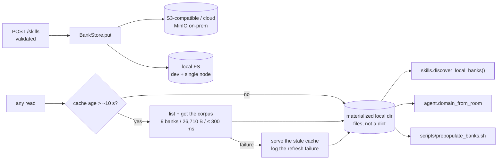

# Bank / Skill Store — Module Doc

> **Module:** MOD-08 · **Form:** Library with service-backed implementations (new) · **Defines:** TRD-07
> **Engagement:** Brownfield/Partial · **Lenses:** BA (BRD half) + TPO/Architect (TRD half)
> **Source of truth for IDs:** `01-brd.md`, `02-use-cases-workflows.md`, `03-data-state-analysis.md`, `04-coverage-gap-analysis.md`, `05-modularization.md`, `06-architecture.md`, `07-brownfield-reconciliation.md`
> **Code under design:** `interviewer/skills.py`, `interviewer/server.py` (skills routes), `interviewer/voice/agent.py`, `scripts/prepopulate_banks.sh`

## BRD Half — Business Requirements (BA Lens)

### Purpose

The bank store is where question banks live. A bank is a markdown file — one `## ` heading per question — and it is the **content source of truth** for the whole product: what the interviewer asks, what the rubric is, and therefore what a candidate is scored against.

Today this is a folder. `POST /skills` writes to the pod's local disk (`server.py:237`) and every request re-globs that folder (`skills.py:39`). On one Windows machine that is a perfectly good design. On two replicas it is a correctness failure: replica B never sees the bank uploaded to replica A. This module makes the storage backend a configuration choice **without changing a single call site**, because three independent consumers glob that folder today and all three must keep working.

### Business Requirements Served

| Requirement | Statement (abbreviated) | How MOD-08 satisfies it |
|---|---|---|
| BRD-04 — Pluggable bank storage with identical semantics | Local FS / S3-compatible / cloud object store behind one protocol, with a bounded staleness window | A `BankStore` protocol (`list`/`get`/`put`/`delete`) with three implementations and a caching decorator. Same semantics everywhere; the staleness window is explicit |
| BRD-14 — Cloud-agnostic and on-prem from one base | One portable base, cloud specifics isolated in overlays | The **S3 API** is the portable abstraction: MinIO on-prem, any cloud object store in the overlay, local filesystem for single-node and developer use. This is the decision that keeps a cloud-specific storage class out of the base |
| BRD-02 — Real readiness probes | Readiness reports per-dependency state | The bank store is a readiness dependency, satisfied by a *warm cache* if the store itself is unreachable — a store outage must not remove serving replicas from the pool |
| BRD-13 — Observability | Metrics and structured logs | Cache age, refresh outcomes and per-consumer read latency become visible; a failed refresh is logged, never silent |

### Actors & Use Cases

| Use case | Actor | Interaction with this module |
|---|---|---|
| UC-03 — Upload a new skill bank | Skill author / Admin | `put` after validation, then registration over MCP. The upload must be visible to **every** replica without a restart — this is the promise the module exists to keep |
| UC-04 — Reconcile unregistered banks | Skill author / Admin | `list` + `get` to enumerate every bank and probe it against RAG |
| UC-01 / UC-02 — Take an interview | Candidate | Indirect: the domain is resolved from the bank list, and the question text is read from the bank |
| UC-05 — Deploy or upgrade the platform | Platform operator | The store backend is an overlay concern; the base must build without a storage cluster |
| UC-11 — Register and dispatch an agent into a room | System / Agent | `agent.domain_from_room` resolves the domain through the cache — one of the three glob consumers |

### Business Acceptance Criteria

1. **The documented no-restart promise holds.** A bank uploaded through replica A is discoverable by replica B, both API and worker, within the staleness window, with no restart and no manual copy. This is not a new promise — it is already documented behaviour that the current single-node design makes true by accident and the multi-replica design would break (US-009, US-010).
2. **A developer on Windows needs no new infrastructure.** The default backend is the local filesystem, byte-for-byte the behaviour of today's folder. Zero delta for the existing dev flow (`AS-05`, `REC-13`).
3. **On-prem is a first-class target, not a compromise.** MinIO over the S3 API is the on-prem story, and it satisfies the same requirement the cloud overlay does.
4. **All three glob consumers read through one cache.** If they do not, a skill uploaded after boot works for one consumer and not another — a regression that would be intermittent and miserable to diagnose (NFR-5).
5. **A store outage does not lose an interview.** With a warm cache, the interview proceeds on the cached banks; the API reports the store as unreachable but stays ready.
6. **An upload that fails registration is repairable, not lost.** The file is present and unregistered; `POST /skills/reconcile` is the repair path (`SM-03`, WF-02).

## TRD-07 — Technical Requirements (TPO / Architect Lens)

### Non-Functional Requirements

| # | Requirement | Target | Measured today | Notes |
|---|---|---|---|---|
| NFR-1 | Cache-hit read latency | ≤ 5 ms (a local file read) | ~1–3 ms (direct glob) | This is why the cache materializes to *files* rather than becoming an in-memory dict — the filesystem API in front of the cache is what keeps call sites unchanged |
| NFR-2 | Cache-miss / refresh latency | ≤ 300 ms for the whole corpus | n/a | The corpus is **9 banks, 26,710 bytes total** — the entire refresh is one small list plus a handful of gets |
| NFR-3 | Staleness window | ~10 s TTL, bounded and documented | 0 (single node, same folder) | A ~10 s window is the price of multi-replica; it is stated in the docs rather than discovered |
| NFR-4 | Refresh failure behaviour | Serve **stale**, log loudly | n/a | Never fail a read because a refresh failed. A stale bank that answers questions beats no bank at all |
| NFR-5 | Consumer convergence | Exactly **3** consumers read through the same cache | 3 independent globs | See the consumer table below — this is a correctness requirement, not an optimization |
| NFR-6 | Write path | `put` then register, ordering preserved | same | Deliberate: a RAG failure leaves the file present and unregistered, which is the reconcilable state |
| NFR-7 | Upload validation limits | name / size / UTF-8 / markdown shape / convention / path traversal | already implemented in `skills.py` | Unchanged — validation happens before `put`, so the store never holds an invalid bank |
| NFR-8 | Concurrency | Last-write-wins, documented | n/a | Two admins uploading the same bank to different replicas is idempotent-by-replace, not a conflict to resolve |
| NFR-9 | Backend parity | All backends pass the same contract test suite | n/a | A backend that passes the suite is a valid backend; there is no "mostly compatible" tier |
| NFR-10 | Default backend | `LocalBankStore` | the current folder | Zero Windows delta (AS-05) |
| NFR-11 | Readiness contribution | Warm cache **or** reachable store | n/a | Both conditions are acceptable; the cache alone is sufficient to serve |

### The Protocol

```
BankStore:
    list()                 -> [BankRef]            # names + metadata
    get(name)              -> bytes                # raw markdown
    put(name, data)        -> BankRef              # idempotent replace
    delete(name)           -> None                 # not exposed via API today
```

Three implementations and one decorator, each earning its place:

| Implementation | Where it runs | Why it exists |
|---|---|---|
| `LocalBankStore` | Default everywhere; the Windows dev flow | Zero-delta default. The folder remains the storage; nothing about the current developer experience changes |
| `S3BankStore` | On-prem (MinIO) and cloud overlays | The portable abstraction. One implementation covers MinIO, AWS S3, GCS's S3-compatible endpoint, and Azure Blob via its S3 gateway — which is what makes "cloud-agnostic" a design property rather than a slogan |
| `CloudBankStore` | Cloud overlays where an S3-compatible endpoint is not the native option | An escape hatch that keeps the base honest: if a provider's native store is materially better, it is added in the overlay, behind the same protocol, and must pass the same contract tests |
| `CachedBankStore` (decorator) | Wraps any of the above | Materializes the corpus into a local directory on a ~10 s TTL, so every consumer reads **files** and the filesystem API is preserved |



### The Three Consumers, and Why Convergence Is a Requirement

| Consumer | Where | What it does today | What it must do |
|---|---|---|---|
| `skills.discover_local_banks()` | `skills.py:39` | Globs `question_banks/*.md` | List via the store, materialized cache read |
| `agent.domain_from_room` | `voice/agent.py` | Globs the folder to resolve a room's domain | Same source, same cache |
| `scripts/prepopulate_banks.sh` | scripts | Globs to enumerate banks for registration | Same source, same cache, via `INTERVIEW_BANK_DIR` |

If these read from different places, an admin uploads a skill, sees it appear on the Skill Update page, and the worker resolves a domain that does not include it — intermittently, depending on which replica handled which request. The symptom is "the new skill doesn't work sometimes", which is among the worst classes of bug to diagnose. One cache, three readers, or the documented promise is a regression.

### Keeping the Call Sites Unchanged

`skills.BANK_DIR` (a module-level constant) becomes `skills.bank_dir()` — a function reading `INTERVIEW_BANK_DIR` and returning the path to the **materialized cache directory**. Existing functions keep their signatures; they simply receive a path that happens to be the cache rather than the canonical store. This is the whole trick: the filesystem API stays, the storage behind it becomes configurable.

### Data Model

| Asset | Role | Notes |
|---|---|---|
| DAT-03 — Question banks (9 files, 26,710 B) | **Authority lives here** | The content source of truth. Everything else in the retrieval chain is derived |
| DAT-04 / DAT-05 — chunks, vectors, keyword index | **Written downstream of this module** | Registration is triggered by the API after `put`; this module never calls RAG |
| DAT-06 — model weights | Not this module | — |

**Lineage.** DAT-03 (here) → validated and persisted → registered over MCP → DAT-04 + DAT-05 → retrieved per turn → scored → DAT-01 → DAT-02.

### Stack Choices & Rationale

| Choice | Alternative rejected | Why |
|---|---|---|
| **S3-compatible object storage** | An **RWX PVC** shared across replicas | This is the decision `DG-01` records, and it is a requirement-level one. RWX requires NFS, CephFS or EFS — meaning a storage-class dependency that differs per environment and is unavailable in the simplest on-prem setups. That would put a cloud-specific dependency **in the base**, failing BRD-14 outright. The S3 API is the portable abstraction: MinIO on-prem, any cloud store in the overlay, local FS for a developer |
| A materialized **file** cache in a local directory | An in-memory dictionary cache | The three consumers glob a filesystem path. Materializing files preserves that API exactly, so `skills.py` call sites do not change. An in-memory dict would force every consumer to be rewritten and would break `prepopulate_banks.sh` entirely |
| `CachedBankStore` as a **decorator** | Baking caching into each store implementation | A decorator composes with any backend, is testable in isolation, and means the cache TTL has exactly one implementation to reason about |
| Keep the **write-then-register** ordering | Wrapping the two steps in a transaction or saga | A RAG failure leaves the file present and unregistered — which is precisely the state `POST /skills/reconcile` already exists to repair. Inventing a transaction would add a distributed-consistency mechanism to fix a problem that already has a simpler, tested tool (WF-02: *"deliberately not fixed by a transaction"*) |
| Local FS as the default | Requiring object storage everywhere | The Windows developer flow must survive (`AS-05`, `REC-13`). A default that requires MinIO on a laptop is a default that gets worked around |
| Keep validation in `skills.py` | Moving validation into the store | Validation is consumer-side policy (naming conventions, markdown shape); the store's job is bytes. Moving it would make every backend reimplement it |

### Failure & Degradation Behaviour

| Failure | Detected by | Behaviour | Admin / candidate sees |
|---|---|---|---|
| Object store unreachable, cache warm | Refresh error | **Serve the stale cache**; log the failure at warning; `/readyz` stays 200 | Nothing. This is the designed behaviour, not a compromise |
| Object store unreachable, cache cold (fresh pod) | Readiness check fails | Pod **not ready** → removed from the Service | Operator sees it in `/readyz`; no candidate is routed to a replica that cannot resolve a domain |
| Refresh slower than its budget | Timeout | Serve stale, log; never block a read on a refresh | Nothing |
| `put` succeeds, `register_bank` fails | MCP error | 502 to the admin; **the file stays**; `SM-03` rests in `STORED` | Admin sees the failure and a repair action; `/skills/reconcile` fixes it without re-upload |
| Invalid upload | Validation (before `put`) | 400 with the convention explained; **nothing is written** | Admin sees exactly what is wrong; the store never holds an invalid bank |
| Path traversal attempt | Validation | Refused; no file outside the bank prefix is ever touched | Admin sees a rejection |
| Two admins upload the same bank concurrently | — | Object-store last-write-wins; registration is an idempotent replace | Documented behaviour, not accidental (UC-03 concurrency row) |
| Cache stampede at TTL expiry across many replicas | — | Bounded by the corpus size: 9 files / 26,710 bytes. A full refresh across every replica at once is still trivial load | Nothing |
| `INTERVIEW_BANK_DIR` unset | Config default | Falls back to the existing `question_banks/` path | Nothing — backwards compatible by construction |

### Open Items & Risks

| # | Item | Type | Owner |
|---|---|---|---|
| 1 | Cache TTL tuning (~10 s) against the documented promise | Correctness vs freshness | Engineer — tune only downward if the churn profile justifies it; the window is a documented contract |
| 2 | `prepopulate_banks.sh` must be repointed at the cache in the same change | Regression risk | Engineer — it is already Linux-portable (`REC-10`), so this is a path change, not a rewrite |
| 3 | Small-object-store cost of the refresh pattern | Cost | Accepted: 26,710 bytes refreshed on a 10 s TTL per replica is negligible; revisit only if the corpus grows by orders of magnitude |
| 4 | No bank versioning or history | Gap | PO-adjacent — a re-upload replaces in place and the previous content is gone. Not in scope for this plan, but it is a product decision rather than an oversight |
| 5 | `delete` exists on the protocol but no route exposes it | Scope | Deliberate — removal is a destructive admin action that belongs with the auth decision (BRD-17) |
