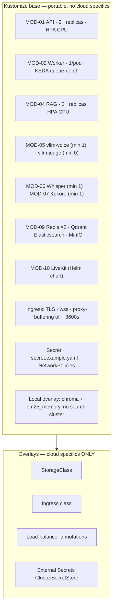

# Platform & Deployment — Module Doc

> **Module:** MOD-13 · **Form:** Configuration (new) · **Defines:** TRD-08
> **Engagement:** Brownfield/Partial · **Lenses:** BA (BRD half) + TPO/Architect (TRD half)
> **Source of truth for IDs:** `01-brd.md`, `02-use-cases-workflows.md`, `03-data-state-analysis.md`, `04-coverage-gap-analysis.md`, `05-modularization.md`, `06-architecture.md`, `07-brownfield-reconciliation.md`
> **Artifacts under design:** `deploy/` (Kustomize base + overlays), `Dockerfile`, CI pipeline, the replacement for `start_services.ps1` (966 lines)

## BRD Half — Business Requirements (BA Lens)

### Purpose

This module is what replaces a 966-line PowerShell script, a specific laptop, and a set of ephemeral tunnel hostnames that re-randomise on every start. It is the deployment plane: the manifests that place every other module, the autoscalers that decide how many replicas exist, the node pools that decide what they run on, the secrets that reach them, and the pipeline that validates all of it before it reaches a cluster.

It has no runtime of its own. Its correctness criterion is unusual and worth stating plainly: **it is correct when the same base deploys to a cloud cluster and to an on-prem cluster, and the differences between them are visible in one small overlay.** Everything below serves that sentence.

### Business Requirements Served

| Requirement | Statement (abbreviated) | How MOD-13 satisfies it |
|---|---|---|
| BRD-14 — Cloud-agnostic and on-prem from one base | A single portable base, cloud specifics isolated in thin overlays | Kustomize base + overlays that contain **only** cloud specifics: StorageClass, ingress class, load-balancer annotations, External Secrets `ClusterSecretStore`. If something is in an overlay that is not cloud-specific, the base is wrong |
| BRD-15 — Continuous integration | Every change is built, tested, and its manifests validated before merge | The first CI this repo has ever had: build, unit tests (121 passing today are the regression floor — `AS-04`), `kustomize build` for base and every overlay, image scan, secret scan |
| BRD-12 — No secrets in images or the repository | Credentials injected per environment | Plain `Secret` + a committed `secret.example.yaml` with placeholder values in the base; External Secrets in cloud overlays. The example file exists so the *shape* is reviewable without the values being present |
| BRD-06 — Scale-down drains, never kills | Removing a replica stops new dispatch and waits | `preStop` on the worker, `terminationGracePeriodSeconds: 900`, `maxUnavailable: 0` — plus the PDB caveat below, which is the part most teams get wrong |
| BRD-07 — Worker replicas follow queue depth | Replica count tracks pending-plus-active interviews | One KEDA `ScaledObject` per worker Deployment, `metrics-api` scaler against MOD-01's `/internal/scaler/voice-queue`, target 1 |
| BRD-11 — Production LiveKit | Real credentials, `wss://`, multi-node | The official LiveKit Helm chart, its own Redis instance, and an ingress configured so it does not destroy the media session |
| BRD-02 — Real probes | Readiness and liveness wired to real endpoints | Probe paths, thresholds and timeouts per workload — with GPU workloads deliberately exempt from a short liveness probe |
| BRD-13 — Observability | Metrics and structured logs | Scrape configuration for every tier; stdout as the only log sink |
| BRD-17 — Auth decided | **Deferred — PO owner** | Compensating control lives here: NetworkPolicy restricting `/internal/scaler/*`, the RAG MCP port, and the engine ports to cluster-internal sources |

### Actors & Use Cases

| Use case | Actor | Interaction with this module |
|---|---|---|
| UC-05 — Deploy or upgrade the platform | Platform operator (primary) | This module **is** that use case: render, apply, roll out, verify, roll back |
| UC-06 — Scale down without killing interviews | Platform operator, System | The manifests specify the drain protocol the operator relies on |
| UC-08 — Rotate LiveKit keys or secrets | Platform operator | Secret shape, injection path, and the restart that consumes them |
| UC-10 — Diagnose a worker that never registered | On-call engineer | Readiness configuration is what makes a non-serving pod visible |

### Business Acceptance Criteria

1. `kustomize build` succeeds for the base and for at least two cloud overlays, and produces valid manifests in each. Verified by US-001 and US-019.
2. The same base deploys on-prem with no manifest edits — only a different overlay, and the on-prem overlay is small enough to read in one sitting.
3. A rolling update never reduces serving capacity below current demand: `maxUnavailable: 0` on the worker, no interview interrupted. Verified by US-014.
4. A candidate never waits on a cold GPU node in the common case. The floor of `minReplicas: 1` on each GPU deployment is a requirement, and the reason is arithmetic, not preference (see NFR-4).
5. No secret value appears in any manifest, image layer, or repository file. Verified by the CI secret scan plus the startup assertion that fails loudly on a missing key rather than falling back to `devkey`.
6. The pipeline is green on a clean checkout, and a broken manifest fails the build rather than the cluster (BRD-15, US-020).
7. An operator can roll back a bad release with one command. Verified by the rollout-undo scenario in UC-05.

## TRD-08 — Technical Requirements (TPO / Architect Lens)

### Non-Functional Requirements

| # | Requirement | Target | Notes |
|---|---|---|---|
| NFR-1 | Overlay thinness | Cloud-specific keys only: StorageClass, ingress class, LB annotations, `ClusterSecretStore` | A fat overlay is the symptom of an unpurified base |
| NFR-2 | Autoscaler composition | **Exactly one `ScaledObject` per Deployment** | A second plain HPA on the same Deployment is a conflict, not a redundancy — two controllers writing `spec.replicas`. CPU tiers get HPA; the worker and GPU tiers get KEDA, never both |
| NFR-3 | GPU node isolation | Pool tainted `nvidia.com/gpu=present:NoSchedule`; tolerations on **GPU Deployments only** | A toleration on a CPU workload is how CPU pods end up occupying GPU nodes |
| NFR-4 | GPU floor | `minReplicas ≥ 1` on `vllm-voice`, Whisper and Kokoro | **Cold GPU node ≈ 2–6 min provision + 1–5 min model load ≈ 10 min worst case.** Node provisioning alone exceeds the product's entire latency claim by two orders of magnitude. For GPU, elasticity means *"grow beyond the floor"*, never *"zero to N"* |
| NFR-5 | Worker CPU limits | **No CPU limit** — requests only | CPU limits cause CFS throttling, which on a realtime audio path appears as latency jitter that is very hard to attribute. Requests reserve capacity; limits would strangle it |
| NFR-6 | Worker disruption budget | `maxUnavailable: 0`; `terminationGracePeriodSeconds: 900`; `preStop` calls `POST /internal/drain` | Matches the 900 s worst-case interview |
| NFR-7 | Filesystem | `readOnlyRootFilesystem: true` on every workload, with `emptyDir` for the bank cache and `/tmp` | The only writable paths are the two that need to be |
| NFR-8 | Kubernetes API access | `automountServiceAccountToken: false` on every application pod | Our pods need **zero** Kubernetes API access. This is the simplest and highest-value hardening available |
| NFR-9 | Ingress for the SFU | `proxy-buffering: "off"`, `proxy-read-timeout: 3600`, `proxy-send-timeout: 3600` | Non-negotiable. An ingress that buffers WebSocket frames destroys a realtime SFU session, and the symptom looks like an application bug |
| NFR-10 | Node priority | `priorityClassName` on voice pods so Cluster Autoscaler preempts for them; a low class on the judge | The judge is the only workload that can safely yield a node |
| NFR-11 | Secret shape | Plain `Secret` + committed `secret.example.yaml` in the base; External Secrets `ClusterSecretStore` in cloud overlays | The example file makes the shape reviewable; the values never exist in the repo |
| NFR-12 | Scrape coverage | Every tier exports `/metrics`; scrape config shipped with the base | An unmonitored tier breaks the burn-rate alerting in BRD-13 |
| NFR-13 | Manifests validated in CI | `kustomize build` for the base and each overlay | A manifest error should fail a pull request, not a cluster |
| NFR-14 | Images | Built by us: MOD-01 and MOD-02 only. Everything else is an upstream image | vLLM, Speaches/Whisper, Kokoro-FastAPI, LiveKit, Redis, Qdrant, Elasticsearch, MinIO |
| NFR-15 | Probe policy for GPU workloads | Generous `startupProbe` (`failureThreshold: 120`, `periodSeconds: 10` → 20 min); **no short `livenessProbe`** | A model load looks exactly like a hang, and a liveness kill creates a restart loop that can never converge |
| NFR-16 | Cold start, CPU tiers | API and worker ≤ 5 s to ready | The worker carries no models post-extraction |
| NFR-17 | Redis topology | **Two instances** — one for sessions, one for LiveKit | MOD-09 has no graceful degradation: a scale event or an outage there is an outage for the API. Keeping LiveKit's Redis separate means an SFU-side incident does not take session state with it |
| NFR-18 | Windows portability | `av==12.3.0` pin becomes platform-conditional | It exists solely because Windows Smart App Control blocks PyAV ≥ 13. Linux must not inherit a Windows workaround (`REC-09`) |

### Base and Overlay Composition

**Why one base and not two.** The user constraint is explicit: the same base must serve cloud and on-prem. The temptation is to fork a "cloud" base and an "on-prem" base early, and that fork is exactly what makes two divergent systems a year later. The base stays pure; overlays carry only what genuinely differs. The `LocalBankStore` default and the local RAG overlay (Chroma + `bm25_memory`) are what make a developer laptop a third, zero-infrastructure target from the same base.

### Autoscaling Composition

| Tier | Controller | Signal | Floor | Ceiling driver |
|---|---|---|---|---|
| MOD-01 API | HPA | CPU (fair: short uniform requests) | 2 | Redis connections, ingress throughput |
| MOD-02 Worker | **KEDA** `metrics-api` | `/internal/scaler/voice-queue`, target **1** pending+active | 1 | SFU registration rate, available nodes |
| MOD-04 RAG | HPA | CPU (fair: 200–360 ms uniform work) | 2 | Qdrant / Elasticsearch connection limits |
| MOD-05 `vllm-voice` | KEDA | `vllm:num_requests_waiting` + `gpu_cache_usage_perc` | **1** | GPU node pool supply |
| MOD-05 `vllm-judge` | KEDA | Queue depth (higher target) | **0** — allowed to scale to zero | GPU node pool supply; off the hot path |
| MOD-06 Whisper | KEDA | In-flight requests; DCGM as fallback | **1** | Bursty answer submissions |
| MOD-07 Kokoro | KEDA | In-flight requests | **1** | Highest call rate in the system |
| Node pools | Cluster Autoscaler | Pending pods | GPU pool ≥ 1 node | Cloud quota |

**The PDB caveat, stated where it matters.** A `PodDisruptionBudget` does **not** protect an interview against a KEDA scale-down. KEDA reduces replicas through the **scale subresource**, which bypasses the eviction API entirely — the API where PDBs are enforced. PDBs cover node drains and cluster upgrades, and they are worth having for exactly those. The actual protection for live interviews is `preStop` + `terminationGracePeriodSeconds: 900` + `maxUnavailable: 0`. A team that ships only a PDB will believe it is protected and will be surprised by a cut interview on a quiet Tuesday afternoon (Discovery Challenge #13).

### Workload Configuration

| Workload | Requests | Limits | Probes | Notes |
|---|---|---|---|---|
| MOD-01 API | 250m / 512Mi | CPU limit omitted above request headroom; memory limited | `/healthz` liveness, `/readyz` readiness | Stateless; safe to restart at will |
| MOD-02 Worker | 500m / 1Gi | **No CPU limit** (NFR-5) | `/healthz` liveness, `/readyz` = SFU-registered | `preStop` drain; 900 s grace; `maxUnavailable: 0`; `priorityClassName` high |
| MOD-04 RAG | 500m / 1Gi | memory limited | `/healthz`, readiness incl. index backends | Boots without the boot-time RAM warm post-extraction |
| MOD-05 `vllm-voice` | `nvidia.com/gpu: 1` | GPU 1 (not compressible) | **startup only**, 20 min allowance | No short liveness; `minReplicas: 1`; tolerates the GPU taint |
| MOD-05 `vllm-judge` | `nvidia.com/gpu: 1` | GPU 1 | startup only | `minReplicas: 0`; **low** `priorityClassName` so it yields nodes |
| MOD-06 Whisper | `nvidia.com/gpu: 1` | GPU 1 | startup only | `minReplicas: 1` |
| MOD-07 Kokoro | `nvidia.com/gpu: 1` | GPU 1 | startup + a warm synthesis check | `minReplicas: 1` |
| Stateful services | per-component | — | — | Redis ×2, Qdrant, Elasticsearch, MinIO |
| MOD-10 LiveKit | chart defaults | — | chart-provided | Official Helm chart; its own Redis |

All application pods: `readOnlyRootFilesystem: true`, `automountServiceAccountToken: false`, `emptyDir` for the bank cache and `/tmp`, `runAsNonRoot: true`.

### Secrets

| Layer | Mechanism | Contents |
|---|---|---|
| Base | Plain `Secret` with placeholder values **plus** a committed `secret.example.yaml` | LiveKit key + secret, RAG MCP token (if used), object-store credentials, any hosted-engine keys |
| Cloud overlays | External Secrets `ClusterSecretStore` bound to the cloud's secret manager | The same keys, sourced from the environment's own store |
| On-prem overlay | The plain `Secret`, applied from the operator's own source of truth | Same shape, no external dependency |

The startup assertion is the enforcement point: a missing LiveKit key or secret makes the pod exit at boot with a named error. It must **never** fall back to `devkey`/`secret` in a cluster — an opaque "invalid token" mid-interview is a much worse failure than a pod that refuses to start, and it is the exact failure mode UC-08 exists to prevent.

### Ingress

| Route | Backend | Configuration |
|---|---|---|
| `/` (UI + API) | MOD-01 | TLS-terminated; standard read/send timeouts |
| `/rtc`, `/twirp`, WebSocket paths | MOD-10 LiveKit | **`proxy-buffering: "off"`; `proxy-read-timeout: 3600`; `proxy-send-timeout: 3600`**; `proxy-body-size` ≥ 4 MB for STT uploads |
| `/internal/*` | **Not routed** | Cluster-internal only; NetworkPolicy-restricted. The scaler endpoint must never be internet-exposed |

`proxy-buffering: off` is the single most commonly missed setting in this deployment and has the largest blast radius: a buffering ingress accumulates WebSocket frames and delivers them late, which for a realtime SFU session means broken audio, not slow audio. Combined with the default 60 s proxy timeouts, a long interview is silently killed by the ingress while every application metric reports healthy.

### Failure & Degradation Behaviour

| Failure | Detected by | Behaviour | Operator sees |
|---|---|---|---|
| Failed rollout | `progressDeadlineSeconds` exceeded | Rollout halts; the previous ReplicaSet stays available | `kubectl rollout undo` restores it (UC-05 recovery row) |
| A manifest renders invalid | **CI**, not the cluster | Pull request fails | An error before merge (NFR-13) |
| GPU nodes exhausted | Pods `Pending` | Cluster Autoscaler provisions; `minReplicas ≥ 1` means the floor keeps serving meanwhile | Pending pods and autoscaler events |
| `vllm-judge` scaled to zero, judge call arrives | KEDA | Cold start; the call is bounded by `answer_timeout_s` (60 s) | A slower score, not a failed interview |
| Secret missing or rotated badly | Startup assertion | Pod exits at boot with a named error; never falls back to `devkey` | A crashloop with an obvious cause, instead of intermittent token failures |
| Node drain or upgrade | PDB | Eviction is rate-limited; the worker drains interviews before terminating | No candidate impact |
| **KEDA scale-down** | — | **PDB does not apply.** `preStop` drain is the protection | No candidate impact, *because* preStop exists — not because a PDB was added |
| Ingress buffers WebSocket frames | Broken audio | Nothing in the application can detect it; it must be configured correctly | Corrupted realtime session if `proxy-buffering` is left on |
| Redis (session) down | Readiness | MOD-09 has **no graceful degradation** — this is an outage for session routes | `/readyz` red; the static UI and `/healthz` still serve |
| Cluster Autoscaler needs a node for voice | `priorityClassName` | Preempts lower-priority pods, starting with the judge | Voice capacity restored ahead of batch capacity |

### Stack Choices & Rationale

| Choice | Alternative rejected | Why |
|---|---|---|
| **Kustomize** base + thin overlays | Helm charts of our own; one manifest set per cloud | Helm's templating would put conditional cloud logic *inside* the base — the opposite of the requirement. Kustomize keeps the base pure and makes each overlay a reviewable diff. It is also in-cluster-native (`kubectl apply -k`) with no tooling to install |
| KEDA for queue-depth tiers, HPA for CPU tiers | HPA everywhere; KEDA everywhere | The worker's correct signal is interview count, not CPU (BRD-07). The API and RAG have genuinely short uniform requests, for which CPU is a fair proxy and KEDA adds a dependency for nothing (`CV-01`: if KEDA is refused, the fallback is documented and is materially worse) |
| Cluster Autoscaler | Fixed node pools | The GPU floor is fixed; the *ceiling* must respond. This is the module where `minReplicas ≥ 1` and node autoscaling are two halves of one decision |
| One `ScaledObject` per Deployment | ScaledObject plus HPA as a belt-and-braces measure | Two controllers writing `spec.replicas` is a conflict that produces fighting scale events and unloggable replica counts (NFR-2) |
| Upstream images for all AI engines | Building our own | Upstream images are maintained, publish CPU variants that make local development faithful, and expose the metrics the scalers read. Building them would be sustained work with no product differentiation |
| LiveKit via its official Helm chart | Hand-rolled SFU manifests | RTC port ranges, TURN, node-IP advertisement, multi-node Redis and key format all change between versions. This is a maintenance liability with no upside (MOD-10, Buy) |
| Two Redis instances | One shared instance | MOD-09 cannot degrade; isolating LiveKit's Redis means an SFU-side incident does not become a session-state outage (NFR-17) |
| Plain `Secret` + example file in the base | External Secrets everywhere | On-prem installs frequently have no external secret manager. Requiring one would fail the on-prem half of BRD-14 — so it lives in the overlay, where it belongs |
| `automountServiceAccountToken: false` | Default token mounting | Our pods never call the Kubernetes API. Removing the token removes an entire class of lateral-movement path at zero cost |
| Platform-conditional `av` pin | Keeping `av==12.3.0` globally | The pin is a Windows Smart App Control workaround (`REC-09`). Linux images must not carry it; the first Phase 0 gate is verifying `import av` works in the Linux image |

### Open Items & Risks

| # | Item | Type | Owner |
|---|---|---|---|
| 1 | KEDA acceptance as a cluster dependency (AS-02, CV-01) | Feasibility gap | TPO / platform owner — fallback HPA-on-CPU is the wrong metric for the worker |
| 2 | Peak concurrency unknown (AS-03), so KEDA targets and the GPU floor are parametrized | Capacity | PO — instrument arrivals, re-size after one week of real traffic |
| 3 | GPU floor cost (three deployments at `minReplicas: 1`) dominates the bill | Cost | PO — the floor is justified only if `CV-03` (is 1500 ms firm?) is answered yes |
| 4 | `BRD-15` CI does not exist yet; it is the first artifact this module needs | Delivery | Engineer — nothing else in this module can be trusted without it |
| 5 | No auth on any route; `/internal/*` is protected only by NetworkPolicy | Security | PO (BRD-17) — compensating control documented, not a solution |
| 6 | Cloud overlays are validated in CI but not deployed from CI | Delivery | Engineer — deployment automation is out of scope for this plan, and should be a deliberate next step |
