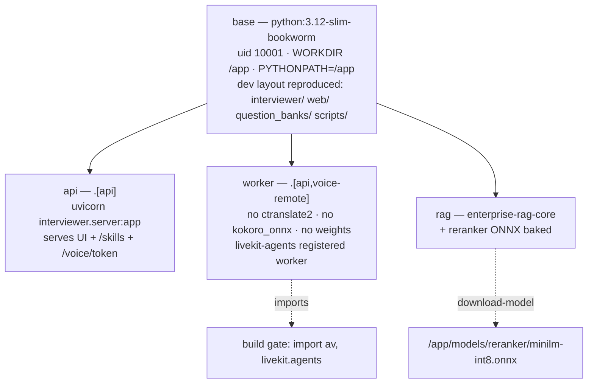

## US-001 — Multi-target container images

> **Epic:** Phase 0 — Containerization · **Primary module:** MOD-13 · **Depends on:** nothing · **Blocks:** US-002, US-006, US-008

**Story statement:** As a platform operator, I want one root `Dockerfile` with `base → api`, `base → worker`, and `base → rag` targets so that one source tree produces every image the cluster runs and CI cannot drift from what a developer builds on a laptop.

**Business value.** Nothing else in the plan can land until a runnable image exists. This story is also where the two silent footguns are removed: the relative-path resolution that makes the static UI and the question banks vanish without an error under a normal `pip install`, and the Windows-only `av` pin that would otherwise poison a Linux build. It is deliberately scoped to *our* images — the GPU tier (vLLM, Whisper, Kokoro) uses upstream images, which is the single largest scope reduction in the plan.

## Acceptance Criteria

### Scenario 1 — All three targets build from one file
**Given** a clean checkout of the repository root
**When** `docker build --target api .`, `--target worker .`, and `--target rag .` are run
**Then** each build exits 0
**And** the three images share the `base` layer digest, so the common runtime is built once

### Scenario 2 — The dev layout is reproduced at `/app`, loudly
**Given** the built `api` image
**When** `docker run --rm  python -c "from interviewer import skills, server; print(skills.BANK_DIR, server._web_dir)"` runs
**Then** both paths print under `/app` (`/app/question_banks` and `/app/web`)
**And** `docker run --rm  python -c "import pathlib,interviewer; p=pathlib.Path(interviewer.__file__).resolve(); assert str(p).startswith('/app/'), p"`
**And** the build itself fails if either directory is missing — the `is_dir()` guard in `server.py` must never be the thing that decides

### Scenario 3 — The containerization unknown is tested at build time, not at deploy time
**Given** the `worker` target
**When** the build reaches its import gate
**Then** `python -c "import av, livekit.agents"` runs inside the image and the build fails if it raises
**And** this gate runs in the `base`-derived dependency layer, so it is the **earliest** signal in the pipeline

### Scenario 4 — The worker image carries no model weights
**Given** the built `worker` image
**When** `python -c "import ctranslate2"` and `python -c "import kokoro_onnx"` are run inside it
**Then** both raise `ModuleNotFoundError`
**And** `docker image inspect` reports a compressed size small enough for a sub-2 s cold start (target ≤ 400 MB)

### Scenario 5 — The `av` pin is platform-conditional
**Given** `pyproject.toml`
**When** the `voice` and `voice-remote` extras are inspected
**Then** they declare `av==12.3.0; sys_platform == 'win32'` and `av>=13,<16; sys_platform != 'win32'`
**And** the Linux image resolves a PyAV ≥ 13 wheel while the Windows dev venv still resolves 12.3.0 (`AS-05` preserved)

### Scenario 6 — `readOnlyRootFilesystem` turns a missed model download into a deploy-time failure
**Given** a pod spec with `readOnlyRootFilesystem: true`
**When** a process tries to write into a path that should have been populated at build time
**Then** the pod fails immediately and visibly, rather than serving with a degraded model
**And** every path the app legitimately writes to (`/tmp`, the bank cache dir) is an explicit writable volume

### Scenario 7 — Small models are baked, large weights are not
**Given** the `rag` target
**When** the image is built
**Then** the INT8 MiniLM reranker ONNX is present at `/app/models/reranker/minilm-int8.onnx` (produced by `enterprise-rag-core download-model` during the build)
**And** no vLLM/Whisper/Kokoro weights are present in any image — those arrive via the model-cache PVC and prewarm Job

### Scenario 8 — Failure is loud, and empty inputs still build
**Given** an empty `question_banks/` directory or an unreadable `web/` directory
**When** the image is built
**Then** the build fails with a message naming the missing path
**And** a build with the nine shipped banks present succeeds and `GET /skills` inside a container reports nine entries

### Scenario 9 — Non-root and idempotent
**Given** the built images
**When** `id` is run inside each
**Then** uid and gid are `10001`
**And** rebuilding the same commit with warm layers produces identical image digests for the `base` and dependency layers

## HLD

The image strategy is *one base, three thin targets*, and the reason the base exists at all is the path-resolution constraint — not layer caching.



**Why the dev layout, not a normal install.** `server.py:317` resolves the static UI as `Path(__file__).resolve().parent.parent / "web"` and `skills.py:22` resolves the banks the same way. Under a plain `pip install .` into site-packages those resolve to `site-packages/web` and `site-packages/question_banks`, the `is_dir()` guard fails **silently**, and the app serves a JSON 404 at `/` with no error anywhere. The image therefore installs the package for its dependencies *and* keeps the source tree at `/app` with `PYTHONPATH=/app` so `interviewer.__file__` is `/app/interviewer/server.py`. The same class of bug exists on the RAG side (`RAG_CORE_RERANK_MODEL_PATH` defaults to a repo-relative `models/reranker/…`), which is why the `rag` target sets it explicitly rather than relying on the layout.

**Why Python 3.12.** The Windows venv is 3.11, which forced a `numpy` pin; 3.12 sidesteps that and has the best `av` / `ctranslate2` / `onnxruntime` wheel coverage. `requires-python = ">=3.11,<3.14"` already admits it.

**Why no GPU images.** vLLM, Whisper, and Kokoro all publish maintained upstream images *and* CPU variants, which is what makes US-002's laptop topology faithful to the cluster. Building our own would be a second, worse maintenance surface for zero benefit.

**How this meets the cloud-agnostic requirement (`BRD-14`).** The Dockerfile contains no registry hostname, no cloud SDK, and no storage-class assumption. Where images are published is an overlay concern.

## LLD

**Files changed**

| Path | Change |
|---|---|
| `Dockerfile` (new, repo root) | `base`, `api`, `worker`, `rag` targets |
| `.dockerignore` (new) | exclude `.venv/`, `.git/`, `__pycache__/`, `.pytest_cache/`, `*.egg-info/`, `enterprise-rag-core/.venv/`, `enterprise-rag-core/chroma_data/`, `.tools/`, `*.wav` |
| `pyproject.toml` | platform-conditional `av`; new `voice-remote` extra |
| `scripts/verify_images.sh` (new) | runs every Scenario 2–5 check against built images; the CI entry point |

**Dockerfile shape** (concrete, not illustrative):

```dockerfile
FROM python:3.12-slim-bookworm AS base
RUN groupadd -g 10001 app && useradd -u 10001 -g 10001 -m app
WORKDIR /app
ENV PYTHONPATH=/app PYTHONUNBUFFERED=1 PIP_NO_CACHE_DIR=1
COPY pyproject.toml README.md ./
COPY interviewer/ ./interviewer/
COPY web/ ./web/
COPY question_banks/ ./question_banks/
COPY scripts/ ./scripts/
RUN pip install --upgrade pip

FROM base AS api
RUN pip install ".[api]"
RUN python -c "import pathlib,interviewer,sys; p=pathlib.Path(interviewer.__file__).resolve(); \
    sys.exit(0 if str(p).startswith('/app/') else f'wrong import root: {p}')" \
 && test -d /app/web && test -d /app/question_banks
USER 10001:10001
EXPOSE 8010
CMD ["uvicorn", "interviewer.server:app", "--host", "0.0.0.0", "--port", "8010"]

FROM base AS worker
RUN pip install ".[api,voice-remote]"
# The one genuine unknown in containerization — fail the build, not the deploy.
RUN python -c "import av, livekit.agents; print(av.__version__)"
USER 10001:10001
CMD ["python", "-m", "interviewer.voice.worker", "start"]

FROM base AS rag
# Companion repo: docker build --target rag --build-context rag=../enterprise-rag-core .
COPY --from=rag . /app/erc
RUN pip install /app/erc && enterprise-rag-core download-model \
 && test -f /app/models/reranker/minilm-int8.onnx
ENV RAG_CORE_RERANK_MODEL_PATH=/app/models/reranker/minilm-int8.onnx
USER 10001:10001
CMD ["enterprise-rag-core", "serve", "--host", "0.0.0.0"]
```

**`pyproject.toml` extras.** `[voice]` stays exactly as it is today so the Windows dev flow (`AS-05`) and every existing doc keep working. The worker image takes a *narrow* extra instead:

```toml
voice-remote = [
    "livekit-agents>=1", "livekit-api>=1", "livekit-plugins-silero>=1", "numpy>=2",
    "av==12.3.0; sys_platform == 'win32'",
    "av>=13,<16; sys_platform != 'win32'",
]
voice = [ ...existing... , "av==12.3.0; sys_platform == 'win32'", "av>=13,<16; sys_platform != 'win32'" ]
```

After the engine extraction (BRD-08) `faster-whisper` and `kokoro-onnx` leave `voice-remote` entirely — they are in-process CPU engines and nothing in the worker image should be able to import them. A test asserts `voice-remote`'s names are a subset of `voice`'s, so the two lists cannot silently drift.

**Edge cases.** `PYTHONPATH=/app` must win over site-packages — verify with the assertion above, not by inspection. `readOnlyRootFilesystem: true` (the pod spec default this plan adopts) means `/tmp` and the materialized bank cache are `emptyDir` volumes, not image paths. `pip install ".[api]"` installs `python-multipart`, without which `POST /skills` fails at request time rather than build time. The `rag` target's `--build-context` is required because the RAG service is a separate repo; a single-context build is not possible.

**Test scenarios**

| # | Scenario | Check | Where |
|---|---|---|---|
| 1 | Three targets build | build exits 0 for each | `scripts/verify_images.sh` (CI) |
| 2 | Import root is `/app` | assertion in the `api` target + verify script | Dockerfile `RUN`, verify script |
| 3 | `av` + `livekit.agents` import | build gate in `worker` | Dockerfile `RUN` |
| 4 | No local engines in the worker | `import ctranslate2` / `kokoro_onnx` raise | verify script |
| 5 | Platform markers | `pip install --dry-run .` on Linux resolves `av>=13` | CI job on `ubuntu-latest` |
| 6 | Non-root | `id -u` == 10001, `id -g` == 10001 | verify script |
| 7 | Reranker baked | `/app/models/reranker/minilm-int8.onnx` exists, `RAG_CORE_RERANK_MODEL_PATH` set | verify script |
| 8 | Extras subset | `voice-remote` names ⊆ `voice` names | new `tests/test_packaging.py` |
| 9 | Live API in a container | `docker run -p 8010:8010 <api>` then `GET /health` == 200 and `GET /skills` returns JSON | verify script |

## Traceability

| Upstream | Reference | How this story serves it |
|---|---|---|
| Module | MOD-13 (Platform & Deployment) | One portable manifest base; the image is the artifact the base deploys |
| Requirement | BRD-14 — cloud-agnostic and on-prem deployable from one base | No registry, cloud SDK, or storage class in the Dockerfile |
| Requirement | BRD-15 — continuous integration | `scripts/verify_images.sh` is the CI entry point; builds are the first gate |
| Assumption | AS-05 — the Windows dev flow keeps working | `[voice]` unchanged; `av==12.3.0` still resolves on `win32` |
| Reconciliation | REC-09 — the Windows-only pin with global effect | Refactored to platform markers, verified by the in-image import gate |
| Reconciliation | REC-03 — dead STT engine resolution | `voice-remote` cannot carry the local engines it resolved |
| Decision | DG-04 — GPU weights | Reranker baked (small, deterministic); vLLM weights on a PVC |

**Test files:** `scripts/verify_images.sh` (new), `tests/test_packaging.py` (new), `tests/test_skills.py::test_discover_local_banks_matches_real_folder_shape` (must keep passing inside the image).
