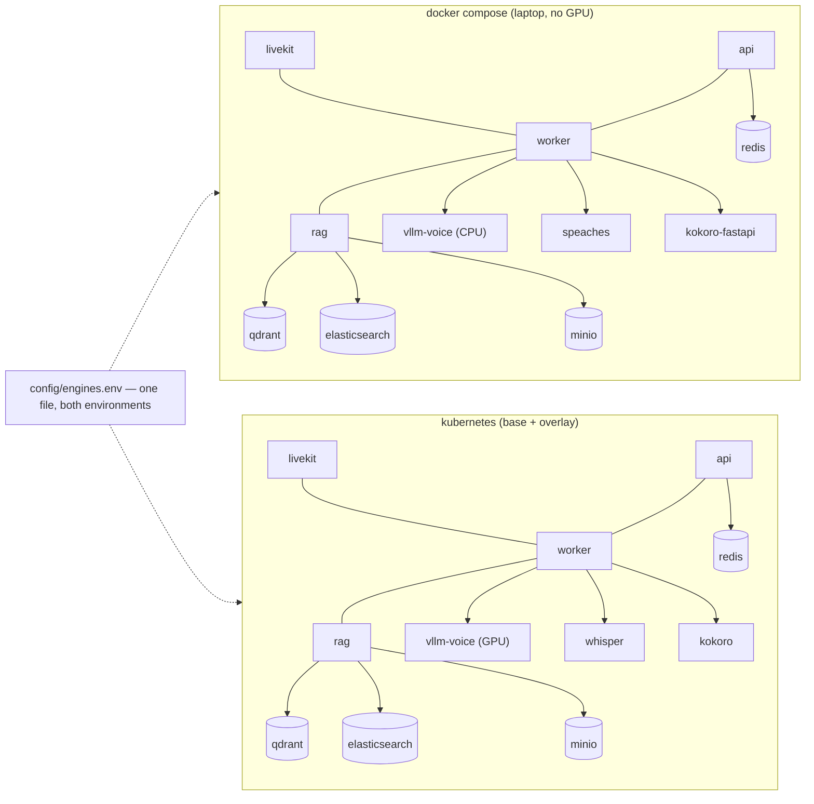

## US-002 — Local Compose stack mirroring the cluster

> **Epic:** Phase 0 — Containerization · **Primary module:** MOD-13 · **Depends on:** US-001 · **Blocks:** the engine-extraction exit criteria (BRD-08)

**Story statement:** As a developer, I want a `docker-compose.yml` at the repo root that runs the same services, with the same names and the same configuration keys as the cluster, so that I can validate the engine extraction and the multi-replica behaviour on a laptop with no GPU.

**Business value.** The engine extraction (BRD-08) changes the worker from CPU-bound to I/O-bound and is the precondition for correct multi-replica dispatch. Its exit criteria cannot be validated on a cluster that only exists in a cloud account the team may not have. Compose makes the whole topology runnable from one command with CPU variants of the *same* engines, which turns a several-week feedback loop into a several-minute one. It also supersedes the 966-line PowerShell launcher as the recommended cross-platform loop **without deleting it** (`AS-05`).

## Acceptance Criteria

### Scenario 1 — One command brings the mirror up
**Given** a machine with Docker and no GPU
**When** `docker compose up -d` runs at the repo root
**Then** redis, minio, livekit, api, worker, rag, and the CPU engine services are running
**And** `docker compose ps` reports every service healthy within 120 s
**And** `curl -s localhost:8010/healthz` returns 200

### Scenario 2 — Compose and the cluster differ only in hostnames, structurally
**Given** `config/engines.env` (checked in, `KEY=value` per line)
**When** the compose file consumes it via `env_file:` and Kustomize consumes the same file via `configMapGenerator.envs:`
**Then** no engine URL is written twice anywhere in the repo
**And** every hostname in the file is simultaneously a compose **service name** and a Kubernetes **Service name** in the base, so the values are byte-identical in both environments

### Scenario 3 — A CPU-only developer exercises the real topology
**Given** the default profile (no GPU)
**When** the stack starts
**Then** `vllm-voice` is replaced by a CPU OpenAI-compatible server and TTS/STT are the upstream CPU images `kokoro-fastapi` and `speaches`
**And** `INTERVIEW_TTS_PROVIDER=kokoro` and `INTERVIEW_STT_PROVIDER=faster-whisper` are unchanged from the cluster values
**And** the interview is slower but reaches `state=wrap`

### Scenario 4 — The e2e smoke test passes against the laptop stack
**Given** the stack is up with all engines healthy
**When** `python scripts/e2e_voice_client.py --url http://localhost:8010` runs
**Then** it POSTs `/voice/token`, joins the LiveKit room, drives `answer_start` / `answer_finish` / `next`, and asserts `state=wrap`
**And** it exits 0 — this is the Phase 0 acceptance gate

### Scenario 5 — Engine extraction is falsifiable on a laptop
**Given** the worker container
**When** a full interview runs
**Then** the worker process holds no `ctranslate2` or `kokoro_onnx` import, and its CPU profile is I/O-bound (median CPU < 25 % over the interview)
**And** `REC-05`'s finite `load_threshold` accepts jobs correctly now that TTS/STT bursts no longer run in-process

### Scenario 6 — Streamlit is present but not in the default path
**Given** the repository
**When** `docker compose up -d` runs *without* `--profile legacy`
**Then** no Streamlit container starts
**And** `docker compose --profile legacy up -d streamlit` starts `web/streamlit_app.py` on `:8501` for the text-mode flow
**And** the `web/` directory and `[web]` extra remain in the repo — Streamlit is dropped from the *cluster*, not from the codebase

### Scenario 7 — `start_services.ps1` still works, unchanged
**Given** a Windows developer
**When** `start_services.ps1` runs
**Then** it launches the six bare processes exactly as before, with no dependency on Docker
**And** no file it reads is modified by this story

### Scenario 8 — Degraded and empty states behave like the cluster
**Given** the RAG service stopped mid-stack
**When** `GET /skills` is called
**Then** it returns 200 with `rag_ok=false` (never a 500), matching in-cluster behaviour
**And** `GET /readyz` reports the RAG leg unhealthy while `GET /healthz` stays 200
**Given** an empty bank cache at first start
**When** the prepopulate step runs
**Then** the nine shipped banks are registered and `GET /skills` reports nine entries

### Scenario 9 — Teardown is complete and repeatable
**Given** a running stack
**When** `docker compose down -v` then `up -d` runs again
**Then** the stack returns to the same healthy state with no manual cleanup
**And** named volumes for redis, minio, qdrant, and the model cache are recreated empty and re-seeded

## HLD

Compose is not a mock of the cluster — it is the *same naming* applied to a different scheduler. That is what makes its results transferable.



**The parity mechanism.** `config/engines.env` is checked in and holds `INTERVIEW_VOICE_LLM_BASE_URL=http://vllm-voice:8000/v1`, `INTERVIEW_LLM_BASE_URL=http://vllm-judge:8000/v1`, `INTERVIEW_STT_PROVIDER=faster-whisper`, `INTERVIEW_TTS_PROVIDER=kokoro`, `RAG_MCP_URL=http://rag:8000/mcp`, `INTERVIEW_REDIS_URL=redis://redis:6379`, `INTERVIEW_BANK_STORE=s3`, `INTERVIEW_BANK_S3_ENDPOINT=http://minio:9000`, and so on. Compose names its services `vllm-voice`, `rag`, `redis`, `minio`, `speaches`, `kokoro-fastapi`, `livekit`; the Kustomize base names its Services the identical strings. Compose reads the file with `env_file:`; Kustomize reads the same file with `configMapGenerator: envs:`. A developer therefore debugs the *same* configuration the cluster runs, and a value that works locally cannot fail in the cluster for a naming reason.

**GPU vs CPU without a fork.** The GPU tier is the only difference, and it is expressed as profiles: `vllm-voice` (GPU, `profiles: [gpu]`) versus a CPU OpenAI-compatible server (default), `whisper`/`kokoro` (GPU) versus `speaches`/`kokoro-fastapi` (default). Because the CPU images are upstream and speak the same HTTP contracts, the engine protocols (`STTEngine.transcribe(bytes) -> str`, `TTSEngine.synthesize(text) -> bytes`) are exercised identically — only the wall-clock changes. That is the point: the *interfaces* are validated on the laptop, the *latency* on the cluster.

**Streamlit.** `web/streamlit_app.py` moves behind `profiles: [legacy]`. It stays in the repository and in the `[web]` extra (it is the text-mode UI and the `demo.py` consumer of `SessionStore`), but it is not part of the default stack and never deployed to the cluster — matching the scope decision in `01-brd.md`.

## LLD

**Files added**

| Path | Purpose |
|---|---|
| `docker-compose.yml` (repo root) | The mirror stack |
| `config/engines.env` (new) | The single source of engine configuration for compose **and** Kustomize |
| `.env.example` (new) | Non-secret placeholders; `.env` stays gitignored |
| `scripts/compose_smoke.sh` (new) | Up → wait healthy → prepopulate → e2e client → down |
| `tests/test_compose_parity.py` (new) | Asserts every host in `engines.env` is a declared compose service |

**The parity mechanism, concretely.** `config/engines.env`:

```bash
# The single source of engine configuration. Consumed by docker-compose
# (env_file:) AND by Kustomize (configMapGenerator.envs:). Every host below is
# both a compose service name and a Kubernetes Service name, so the values are
# byte-identical in both environments.
INTERVIEW_VOICE_LLM_BASE_URL=http://vllm-voice:8000/v1
INTERVIEW_VOICE_LLM_MODEL=qwen2.5-14b-instruct
INTERVIEW_LLM_BASE_URL=http://vllm-judge:8000/v1
INTERVIEW_STT_PROVIDER=faster-whisper
INTERVIEW_TTS_PROVIDER=kokoro
INTERVIEW_REDIS_URL=redis://redis:6379
INTERVIEW_SESSION_STORE=redis
INTERVIEW_BANK_STORE=s3
INTERVIEW_BANK_S3_ENDPOINT=http://minio:9000
INTERVIEW_BANK_S3_BUCKET=interviewer-banks
RAG_MCP_URL=http://rag:8000/mcp
INTERVIEW_READY_REQUIRES_RAG=false
```

and `docker-compose.yml`:

```yaml
services:
  api:
    build: { context: ., target: api }
    env_file: [config/engines.env, .env]      # .env holds secrets only, gitignored
    ports: ["8010:8010"]
    healthcheck:
      test: ["CMD", "python", "-c", "import urllib.request;urllib.request.urlopen('http://127.0.0.1:8010/readyz')"]
      interval: 5s
      start_period: 30s
  worker:
    build: { context: ., target: worker }
    env_file: [config/engines.env, .env]
    init: true                                # SIGTERM reaches the drain path
    stop_grace_period: 120s                   # > INTERVIEW_DRAIN_MAX_S
    depends_on:
      livekit: { condition: service_healthy }
  vllm-voice:                                 # GPU overlay only
    image: vllm/vllm-openai:latest
    profiles: [gpu]
    command: ["--model", "Qwen/Qwen2.5-14B-Instruct", "--enable-prefix-caching"]
  llm-cpu:                                    # default profile — the laptop path
    image: ollama/ollama:latest
    command: ["serve"]
  speaches: { image: ghcr.io/speaches-ai/speaches:latest-cpu }
  kokoro-fastapi: { image: ghcr.io/remsky/kokoro-fastapi-cpu:latest }
  streamlit:
    profiles: [legacy]                        # kept in the repo, never deployed
    build: { context: ., target: api }
    command: ["streamlit", "run", "web/streamlit_app.py"]
```

**Service map**

| Compose service | Image | Profile | Cluster equivalent |
|---|---|---|---|
| `api` | built `--target api` | default | MOD-01 Deployment |
| `worker` | built `--target worker` | default | MOD-02 Deployment (KEDA) |
| `rag` | built `--target rag` | default | MOD-04 Deployment |
| `livekit` | `livekit/livekit-server` | default | MOD-10 (Helm) |
| `redis` | `redis:7-alpine` | default | MOD-09 StatefulSet |
| `minio` | `minio/minio` | default | S3-compatible store (overlay) |
| `qdrant`, `elasticsearch` | upstream | default | RAG backends (DG-03) |
| `speaches` | upstream CPU STT | default | MOD-06 Whisper |
| `kokoro-fastapi` | upstream CPU TTS | default | MOD-07 Kokoro |
| `vllm-voice`, `vllm-judge` | upstream vLLM | `gpu` | MOD-05 |
| `streamlit` | built `--target api` + `[web]` | `legacy` | **not deployed** |

**Healthchecks mirror the probes.** Every app service healthchecks against the endpoint US-006 defines: `api` → `GET /readyz`, `worker` → its readiness signal, `rag` → its own health path. Using `/healthz` for `api`'s *liveness* and `/readyz` for *dependency readiness* keeps the compose file honest about which is which.

**Edge cases.** Port collisions with a running `start_services.ps1` (bind `8010`, `7880`, `6379`, `9000`, `6333`, `9200` and document the conflict — `AS-05` means both may be up). `init: true` on `worker` so SIGTERM from `compose down` reaches the drain path rather than killing the process group. `stop_grace_period` on `worker` must exceed `INTERVIEW_DRAIN_MAX_S` or `compose down` cuts interviews — the same trade the cluster makes with `terminationGracePeriodSeconds`. The bank store needs a writable cache volume even though the root filesystem is read-only, mirroring the `emptyDir` in the cluster. `minio` needs its bucket created before the API writes a bank: a one-shot `mc mb` init service, not a race in application code.

**Test scenarios**

| # | Scenario | Check | Where |
|---|---|---|---|
| 1 | Stack comes up healthy | `docker compose up -d --wait` exits 0 | `scripts/compose_smoke.sh` |
| 2 | Config parity | every host in `engines.env` ∈ compose service names | `tests/test_compose_parity.py` |
| 3 | Parity with the cluster | same assertion against the Kustomize base's Service names | `tests/test_compose_parity.py` |
| 4 | Probe endpoints | `/healthz` 200 with redis stopped; `/readyz` 503 | smoke script |
| 5 | RAG outage tolerated | stop `rag` → `GET /skills` 200, `rag_ok=false` | smoke script |
| 6 | End-to-end interview | `scripts/e2e_voice_client.py` asserts `state=wrap` | smoke script, CI |
| 7 | Streamlit excluded by default | `docker compose config --services` omits `streamlit` | `tests/test_compose_parity.py` |
| 8 | Teardown/re-up | `down -v` then `up -d --wait` exits 0 | smoke script |
| 9 | Windows path untouched | `git diff --stat` shows no change under `start_services.ps1` | CI guard |

## Traceability

| Upstream | Reference | How this story serves it |
|---|---|---|
| Module | MOD-13 (Platform & Deployment) | Compose is the local face of the same configuration the base deploys |
| Module | MOD-01, MOD-02, MOD-04 | All three are built and run here as containers |
| Requirement | BRD-14 — cloud-agnostic and on-prem from one base | Compose proves the base has no cloud dependency; the CPU profile is the on-prem story |
| Requirement | BRD-08 — AI engines as independent services | The exit criteria are only *validatable* here, on hardware the team owns |
| Use case | UC-05 — deploy or upgrade the platform | The compose smoke run is the cheap rehearsal of the rollout |
| Use case | UC-03 — upload a new skill bank | Validated against MinIO before it is validated against cloud storage |
| Assumption | AS-05 — Windows dev flow keeps working | `start_services.ps1` is preserved verbatim; both stacks may run |
| Reconciliation | REC-13 — preserve the Windows launcher | Supersede without deleting: compose is recommended, PowerShell is supported |
| Reconciliation | REC-11 — the e2e client as a smoke test | The Phase 0 acceptance gate, run against compose in CI |

**Test files:** `tests/test_compose_parity.py` (new), `scripts/compose_smoke.sh` (new), `scripts/e2e_voice_client.py` (reused, unchanged).
