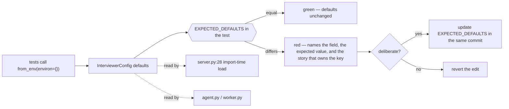

## US-003 — Config-default regression tripwire

> **Epic:** Phase 0 — Refactor safety net · **Primary module:** MOD-01 · **Depends on:** nothing · **Blocks:** US-004, US-006, US-007, US-009, US-010 (each adds config keys)

**Story statement:** As a developer refactoring the platform, I want a test that asserts every `InterviewerConfig` default still equals today's literal value, so that an accidental edit to a default fails the suite instead of silently changing how the Windows dev flow and the existing tests behave.

**Business value.** Every story in this plan touches configuration. `session_store` must stay `memory` (US-004), the CORS origins must stay the four localhost values (US-007), the bank directory must keep resolving locally (US-009), and the voice LLM timeout must change *only* on the voice path (US-008). Each of those is one careless edit away from breaking the Windows dev flow that `AS-05` protects — and the breakage would surface as a confusing runtime symptom a week later, not as a failing test. This is a ~60-line test that converts `AS-05` from a hope into a gate, and it is deliberately the first thing built so that every later story is defended while it lands.

## Acceptance Criteria

### Scenario 1 — Every default is pinned
**Given** `tests/test_config_defaults.py` with an `EXPECTED_DEFAULTS` mapping
**When** the test compares it against `InterviewerConfig.from_env(environ={})`
**Then** every field of `InterviewerConfig` is present in the mapping with an equal value
**And** the field set is derived from `dataclasses.fields(InterviewerConfig)`, never hand-counted

### Scenario 2 — A new field cannot slip in unpinned
**Given** a new field `InterviewerConfig.new_key` with a default
**When** the test runs without an entry for `new_key` in `EXPECTED_DEFAULTS`
**Then** it fails naming the field and its current value
**And** the failure message says the field must be added to the mapping and its default justified in the pull request

### Scenario 3 — A changed default fails loudly
**Given** someone edits `answer_timeout_s: float = 60.0` to `30.0`
**When** the suite runs
**Then** the tripwire fails with `expected 60.0, got 30.0`
**And** the failure is the *first* signal — it precedes any behavioural test that would have gone green by accident

### Scenario 4 — A deliberate change is a one-line act
**Given** a story that intentionally changes a default (US-008's voice LLM timeout)
**When** the developer updates `EXPECTED_DEFAULTS` and the field in the same commit
**Then** the tripwire passes and the diff records the intent
**And** no other test needs to change

### Scenario 5 — Hermetic against the ambient environment
**Given** a developer machine with `INTERVIEW_DOMAIN=ios` and `RAG_MCP_URL` exported
**When** `pytest tests/` runs
**Then** the tripwire still compares against the *code* defaults (`from_env(environ={})`)
**And** the ambient values do not leak into the assertion

### Scenario 6 — Overrides still work, and are not confused with defaults
**Given** `from_env({"INTERVIEW_SESSION_STORE": "redis", "INTERVIEW_TOP_K": "8"})`
**When** the config is read
**Then** those two fields hold the override and every other field holds its pinned default
**And** the assertion covers the override *and* the untouched remainder in one test, so a default that accidentally reads a neighbouring env var is caught

### Scenario 7 — The Windows dev flow's defaults are called out as a group
**Given** the fields the Windows flow depends on — `session_store == "memory"`, `stt_provider == "stub"`, `livekit_url == "http://127.0.0.1:7880"`, `redis_url == "redis://localhost:6379"`, `llm_base_url == "http://127.0.0.1:8000/v1"`
**When** any of them changes
**Then** a test named for the dev flow fails, naming `AS-05` in its message
**And** the developer is told to update `start_services.ps1` in the same commit or revert

### Scenario 8 — Frozen, typed, and empty-safe
**Given** `InterviewerConfig` is a frozen dataclass
**When** a test assigns to a field
**Then** `FrozenInstanceError` is raised
**And** numeric fields stay numeric: `max_questions` is `int`, `answer_timeout_s` is `float` — a refactor that returns a string from `from_env` fails here rather than at request time

## HLD

The tripwire is a pure test artifact: it adds no runtime code and no configuration. Its whole architectural role is to make the refactor waves in this plan *safe to sequence*.



**Why a test and not a schema.** A config schema would validate *shape* (`int`, non-empty, URL-like) and stay green while `session_store` flipped from `memory` to `redis` — the exact accidental change that would break every Windows contributor. The contract here is not "valid" but "unchanged", which only a pinned literal table can express.

**Why it lives beside, not inside, the config.** The expected values are the *plan's* record of current behaviour, not the code's opinion of itself. Keeping them in the test means the mapping is reviewable as a diff against the story that changed it, and `config.py` keeps its single responsibility.

**Relationship to later stories.** US-004 must add a `memory` default for the store selection; US-006 adds the readiness/RAG-gating keys; US-007 adds the CORS keys; US-008 adds the voice LLM timeout; US-009/US-010 add the bank-store keys. Each of those lands *with* its `EXPECTED_DEFAULTS` entry, chosen so the default path is byte-for-byte today's behaviour. The tripwire is therefore the enforcement mechanism for the "defaults preserve the dev flow" clause that recurs in every one of them.

## LLD

**Files added / changed**

| Path | Change |
|---|---|
| `tests/test_config_defaults.py` | New — the tripwire, the dev-flow group, the override test, the frozen/type test |
| `interviewer/config.py` | **Unchanged** by this story (that is the point); later stories add fields here *and* to the mapping |

**Test shape** (concrete):

```python
import dataclasses
from dataclasses import FrozenInstanceError
import pytest
from interviewer.config import InterviewerConfig

# Changing a value here is a deliberate act: pair it with the story that owns
# the key and say so in the PR. Never edit a value to make a refactor pass.
EXPECTED_DEFAULTS = {
    "rag_mcp_url": "http://127.0.0.1:8000/mcp",
    "rag_mcp_token": None,
    "default_domain": "system-design",
    "top_k": 5,
    "tts_provider": "cartesia",
    "tts_voice_id": None,
    "llm_base_url": "http://127.0.0.1:8000/v1",
    "llm_model": None,
    "llm_token": None,
    "session_store": "memory",        # US-004: memory stays the default
    "redis_url": "redis://localhost:6379",
    "stt_provider": "stub",
    "deepgram_api_key": None,
    "whisper_model": "base",
    "whisper_device": "auto",
    "cartesia_api_key": None,
    "elevenlabs_api_key": None,
    "piper_binary": "piper",
    "piper_model": None,
    "kokoro_voice": "af_heart",
    "kokoro_model_dir": None,
    "voice_llm_base_url": None,
    "voice_llm_model": None,
    "livekit_url": "http://127.0.0.1:7880",
    "livekit_api_key": None,
    "livekit_api_secret": None,
    "max_questions": 3,
    "answer_timeout_s": 60.0,
    "judge_model": None,
}

DEV_FLOW_KEYS = ("session_store", "stt_provider", "livekit_url", "redis_url", "llm_base_url")

def test_every_default_is_pinned():
    cfg = InterviewerConfig.from_env(environ={})
    actual = {f.name: getattr(cfg, f.name) for f in dataclasses.fields(cfg)}
    assert set(actual) == set(EXPECTED_DEFAULTS), (
        "a config field is missing from EXPECTED_DEFAULTS — add it and "
        "justify its default in the PR (AS-05 depends on this table)")
    diffs = {k: (EXPECTED_DEFAULTS[k], v) for k, v in actual.items()
             if EXPECTED_DEFAULTS[k] != v}
    assert not diffs, f"config defaults drifted: {diffs}"

def test_dev_flow_defaults_are_pinned(): ...      # names AS-05 in the failure
def test_overrides_do_not_disturb_the_rest(): ...
def test_config_is_frozen_and_correctly_typed(): ...
```

**Edge cases.** `from_env(environ={})` must be used, never `from_env()` — otherwise a developer's exported `INTERVIEW_DOMAIN` turns the suite red for a reason unrelated to the change. `None`-valued fields must be compared with `is None` semantics preserved (an empty string is *not* `None`, and `stt_provider=""` would change the worker's fail-fast check). `dataclasses.fields()` must be called on an *instance* so `field(default_factory=...)` fields are materialised. Float comparison uses exact equality deliberately: these are literals, not computed values, so `60.0 != 60` is a real signal about `int`/`float` drift.

**Test scenarios**

| # | Scenario | Check | Where |
|---|---|---|---|
| 1 | All defaults pinned | field set equality + value equality | `tests/test_config_defaults.py` |
| 2 | New field unpinned | add a field to `config.py` only → test fails naming it | `tests/test_config_defaults.py` |
| 3 | Changed default | flip `answer_timeout_s` → failure shows both values | `tests/test_config_defaults.py` |
| 4 | Deliberate change | flip field **and** mapping → green | `tests/test_config_defaults.py` |
| 5 | Ambient env | run with `INTERVIEW_DOMAIN=ios` exported | `tests/test_config_defaults.py` |
| 6 | Override isolation | `from_env({...})` sets two, rest pinned | `tests/test_config_defaults.py` |
| 7 | Dev-flow group | the five `AS-05` keys in a named test | `tests/test_config_defaults.py` |
| 8 | Frozen + types | assignment raises; `int`/`float` exact | `tests/test_config_defaults.py` |
| 9 | No regression | existing `tests/test_config.py` still passes unchanged | `tests/test_config.py` |

## Traceability

| Upstream | Reference | How this story serves it |
|---|---|---|
| Module | MOD-01 (Management API) | `config.py` is loaded at import in `server.py:28`; every MOD-01 change is a config change |
| Assumption | AS-05 — the Windows dev flow keeps working | The tripwire plus the named dev-flow group is the *mechanism* that guarantees it |
| Assumption | AS-04 — 121 passing tests are the regression floor | The floor is only meaningful if the defaults under it cannot move silently |
| Requirement | BRD-01 — stateless API tier | `session_store` must not flip accidentally while US-004 lands |
| Requirement | BRD-02 — real liveness and readiness | New probe keys must default to today's behaviour |
| Requirement | BRD-03 — configuration-driven CORS | Defaults must be exactly today's four origins |
| Reconciliation | REC-13 — preserve the Windows launcher | Names the launcher in the failure message of the dev-flow test |
| Reconciliation | REC-09 — a Windows-only pin with global effect | Same discipline: an environment-specific default is pinned, not assumed |

**Test files:** `tests/test_config_defaults.py` (new); `tests/test_config.py` (existing, must keep passing unchanged).
