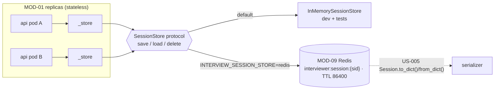

## US-004 — Sessions in a shared store

> **Epic:** Phase 1 — Stateless API tier · **Primary module:** MOD-01 · **Depends on:** US-005 (serializer), US-003 · **Blocks:** US-006, US-007

**Story statement:** As a candidate, I want my interview session to be found by any API replica so that scaling the management plane past one replica does not make `GET /sessions/{id}` fail at random.

**Business value.** `server.py` keeps `_registry: dict[str, Session]` behind a `threading.Lock` (lines 48-49), so with two replicas behind a Service, a session created on pod A is a 404 on pod B roughly half the time. That is not a tuning problem — it is a correctness failure that makes horizontal scaling of the API tier impossible, and it blocks `BRD-01`. `RedisSessionStore` and the `SessionStore` protocol already exist and are already correct; they are simply dead code on the serving path. This story wires what is there, which is why it is small.

## Acceptance Criteria

### Scenario 1 — Create on one replica, read on another
**Given** two `server.app` instances sharing one store
**When** `POST /sessions` is sent to instance A
**Then** `GET /sessions/{id}` on instance B returns 200 with the same body
**And** the response is byte-identical to what instance A returns

### Scenario 2 — The response contract is unchanged
**Given** a session created by `POST /sessions`
**When** `GET /sessions/{session_id}` is called
**Then** the JSON keys are exactly `session_id`, `tenant_id`, `domain`, `state`, `turns`, `scores`
**And** `turns` is a list of `{"role": ..., "text": ...}` and `state` is the enum's value string
**And** the existing tests in `tests/test_skills_api.py` and the OCR/RCA manual flows keep passing

### Scenario 3 — `POST /voice/token` writes through the same store
**Given** `LIVEKIT_API_KEY`/`LIVEKIT_API_SECRET` are set
**When** `POST /voice/token {"domain": "ios"}` is called
**Then** the session is persisted via `store.save(session_id, session.to_dict())` **before** the JWT is returned
**And** `GET /sessions/{session_id}` on another replica finds it
**And** the returned `room` is `interview-ios-<session_id>`, so the room name *is* the room→session mapping — no second key is introduced

### Scenario 4 — `memory` is the default, so nothing changes by default
**Given** no `INTERVIEW_SESSION_STORE` in the environment
**When** the app is imported
**Then** `server._store` is an `InMemorySessionStore`
**And** the whole suite passes with no Redis available (`AS-05`: the Windows flow and existing tests are untouched)
**And** `INTERVIEW_SESSION_STORE=redis` selects `RedisSessionStore(config.redis_url)`

### Scenario 5 — The module-level seam is preserved
**Given** the existing convention that `tests/test_skills_api.py` monkeypatches `server._rag`
**When** a test needs a capturing store
**Then** it does `monkeypatch.setattr(server_mod, "_store", FakeStore(...))` and the app uses it
**And** `_store` is a module-level name assigned at import, exactly like `_rag`

### Scenario 6 — The in-process registry is gone, provably
**Given** the refactored `interviewer/server.py`
**When** its source is inspected
**Then** it contains neither `_registry` nor `threading.Lock`
**And** no module-level mutable dict of sessions exists anywhere in the module
**And** this is asserted by a test, not by review

### Scenario 7 — An unknown or corrupt entry is a 404, not a 500
**Given** a session id that was never created
**When** `GET /sessions/{id}` is called
**Then** 404 with `detail: "unknown session"`
**Given** a store entry whose payload cannot be parsed into a `Session`
**When** `GET /sessions/{id}` is called
**Then** 404 is returned and the failure is logged at ERROR with the session id
**And** no stack trace reaches the client

### Scenario 8 — The store being down does not take the API down
**Given** `INTERVIEW_SESSION_STORE=redis` and Redis unreachable
**When** `GET /healthz` is called
**Then** 200 — liveness checks the process, not its dependencies
**When** `POST /sessions` is called
**Then** 503 with an actionable detail string
**And** `GET /skills` still returns 200 (`BRD-02`: a dependency blip must not remove the whole surface)

### Scenario 9 — Concurrency and idempotency
**Given** 20 concurrent `POST /sessions` requests
**When** all complete
**Then** 20 distinct session ids exist and all 20 are readable
**Given** two `save` calls for the same id
**When** they interleave
**Then** last-write-wins and the store never holds a partially written value (Redis `SET` is atomic; the in-memory store assigns a deep copy as it does today)
**Given** the same session is read repeatedly
**Then** the read is side-effect free and never mutates stored state

### Scenario 10 — TTL and lifecycle
**Given** `RedisSessionStore(ttl_seconds=86400)`
**When** a session is saved
**Then** the key `interviewer:session:{sid}` carries an 86400 s expiry
**And** `store.delete(sid)` removes it (the reconcile path for abandoned sessions uses this)

## HLD

The change is a swap of the storage behind an interface that already exists. The API tier stops owning state; MOD-09 starts holding it.



**Why no new abstraction.** `SessionStore.load` returns exactly what `GET /sessions/{id}` needs and `save` takes exactly what the create path produces. Building anything new would be waste (`REC-01`, `DG-02`). The one genuinely missing piece — turning a `Session` into a JSON-safe dict — is US-005, and it is a hard prerequisite: `RedisSessionStore.save` calls `json.dumps(summary)`, which raises `TypeError` on a real `Session` (it holds an `InterviewerState` enum and a list of `Turn` dataclasses).

**Why `memory` stays the default.** `AS-05` and `AS-04` both depend on it: the Windows dev flow runs without Redis, and 121 existing tests import the app. Flipping the default would make the plan's own refactoring untestable. Redis is opt-in per environment, which is also exactly how the ConfigMap will set it in-cluster.

**Why the room name is the map.** `/voice/token` mints `interview-<domain>-<session_id>`. The worker already derives its domain by parsing that name (`agent.domain_from_room`), so the session id is derivable from the same string (`room.rsplit("-", 1)[-1]`). Adding a second `room→session` key would duplicate state that the naming convention already carries, and would need a store method the protocol does not have. This story therefore changes **no** `SessionStore` methods.

**Concurrency note.** `threading.Lock` was correct for a dict in one process and useless across processes. Removing it is not a loss: the store is the concurrency boundary now, and FastAPI's async handlers never block on it. The only atomicity the app relies on is a single-key `SET`, which Redis provides and `InMemorySessionStore` provides by assigning a deep copy.

## LLD

**Files changed**

| Path | Change |
|---|---|
| `interviewer/server.py` | Delete `_registry`/`_lock` (lines 48-49); add `_store` selection next to `_rag`; rewrite `create_session`, `get_session`, `voice_token` to use it; add a `_session_payload(session) -> dict` helper and a `_load_session(sid) -> Session | None` helper |
| `interviewer/session_store.py` | **Unchanged** — no new protocol methods |
| `interviewer/config.py` | **Unchanged** — `session_store` and `redis_url` already exist |
| `tests/test_sessions_api.py` | New — shared-store, contract, 404/503, concurrency, source-grep tests |
| `tests/test_session_store.py` | Extended with the Redis leg marked `live` |

**Signatures and shapes**

```python
# server.py — module level, beside _rag
_store: SessionStore = (
    RedisSessionStore(config.redis_url)
    if config.session_store == "redis" else InMemorySessionStore()
)

def _session_payload(session: Session) -> dict[str, Any]:
    """The GET /sessions/{id} body — the one place the wire shape is defined."""
    return {"session_id": session.session_id, "tenant_id": session.tenant_id,
            "domain": session.domain, "state": session.state.value,
            "turns": [{"role": t.role, "text": t.text} for t in session.turns],
            "scores": session.scores}

async def _load_session(session_id: str) -> Session | None:
    """store.load + Session.from_dict; None on absent, raises on store failure."""
```

Persisted value (Redis, under `interviewer:session:{sid}`) is `session.to_dict()` per US-005 — the *same* shape `_session_payload` emits, so there is one canonical representation of a session rather than two.

**Error mapping**

| Condition | Status | Detail |
|---|---|---|
| `store.load` returns `None` | 404 | `unknown session` |
| `store.load` returns unparseable payload | 404 + ERROR log | `unknown session` |
| `store.save`/`load` raises (Redis down) | 503 | `session store unavailable: <err>` |
| `POST /voice/token` without LiveKit credentials | 503 | unchanged from today |

**Edge cases.** `POST /voice/token` must save before minting the JWT: a JWT whose session is not yet readable would let a candidate join a room the API cannot describe. A browser reload issues a **new** `POST /voice/token` and therefore a **new** session — no dedupe, unchanged from today, and deliberate. `turns` grows unboundedly during a 900 s interview; the store's value size stays far below Redis' 512 MB limit at three questions plus follow-ups, so no truncation is introduced here. `async` handlers mean `redis.asyncio` binds its connection pool to the running loop — tests must use one `asyncio.run` per Redis client instance (the existing convention in `CLAUDE.md`), and the live-marked test must not share a client across loops.

**Test scenarios**

| # | Scenario | Check | Where |
|---|---|---|---|
| 1 | Cross-replica read | create on A, read on B, bodies equal | `tests/test_sessions_api.py` |
| 2 | Wire contract | exact key set of both endpoints | `tests/test_sessions_api.py` |
| 3 | Token path persists | stub LiveKit, then read the session | `tests/test_sessions_api.py` |
| 4 | Default is memory | import with a clean env | `tests/test_sessions_api.py`, `US-003` tripwire |
| 5 | `_store` seam | monkeypatch `_store`, assert calls recorded | `tests/test_sessions_api.py` |
| 6 | Registry gone | source contains `_registry`/`threading.Lock` → fail | `tests/test_sessions_api.py` |
| 7 | 404 unknown / corrupt | absent id; garbage payload | `tests/test_sessions_api.py` |
| 8 | 503 on store failure | failing fake store; `/healthz` still 200 | `tests/test_sessions_api.py` |
| 9 | 20-way concurrency | 20 distinct ids, all readable | `tests/test_sessions_api.py` |
| 10 | Redis round-trip + TTL | `save`/`load`/`delete`, `TTL` ≈ 86400 | `tests/test_session_store.py::live` |
| 11 | Windows flow unaffected | full suite with `-m "not live"` → 121 passed + new tests | CI |

## Traceability

| Upstream | Reference | How this story serves it |
|---|---|---|
| Module | MOD-01 (Management API) | Removes the module's only in-process state; makes the replica stateless |
| Module | MOD-09 (Session Store) | Promotes the existing Redis store from dead code to the serving path |
| Requirement | BRD-01 — stateless management API tier | The requirement is exactly this swap (`server.py:48` cited as the rationale) |
| Use case | UC-01 — take a voice interview | The session created by `/voice/token` is now readable from anywhere, which the postcondition requires |
| Use case | UC-07 — resume after an interrupted interview | Read from a shared store, so any replica answers — the use case's own "Scale" row |
| Requirement | BRD-02 — real liveness and readiness | Establishes that a store blip yields 503 on the read path while `/healthz` stays 200 |
| Reconciliation | REC-01 — reuse `session_store.py` | The protocol was already right; only the wiring was missing |
| Reconciliation | REC-04 / DG-02 — a serialization promise not kept | US-005 is the companion that makes `save` legal |
| Assumption | AS-05 / AS-04 | `memory` stays the default; the 121-test floor is unchanged |

**Test files:** `tests/test_sessions_api.py` (new), `tests/test_session_store.py` (extended, `live` marker), `tests/test_skills_api.py` (must keep passing — the `_store` seam mirrors its `_rag` seam).
