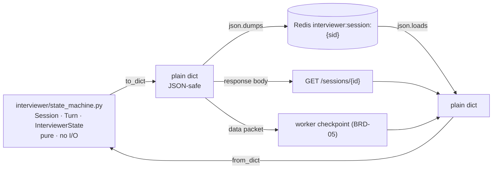

## US-005 — Session serialization

> **Epic:** Phase 1 — Stateless API tier · **Primary module:** MOD-01 (owns `state_machine.py`'s consumer) · **Depends on:** US-003 · **Blocks:** US-004, and the worker's per-hop checkpointing (BRD-05)

**Story statement:** As a developer, I want `Session.to_dict()` and `Session.from_dict()` on the dialogue FSM so that a session can be persisted and restored without the store having to know the FSM's internal types.

**Business value.** `state_machine.py`'s own docstring promises session state "is serialized to Redis by the caller" — but no serializer exists, so the promise has never been kept. `RedisSessionStore.save` calls `json.dumps(summary)` and raises `TypeError` the moment it is handed a real `Session` (an `InterviewerState` enum plus a list of `Turn` dataclasses). That single missing method is why `RedisSessionStore` is dead code on the serving path, why `GET /sessions/{id}` is currently a 404 for half the replicas, and (later) why a worker death takes the whole interview with it. Two methods and a round-trip test are the entire fix, and the docstring already states the intent (`REC-04`, `DG-02`).

## Acceptance Criteria

### Scenario 1 — A session survives a JSON round trip
**Given** a `Session` in `ASK_QUESTION` with three `Turn`s and two score dicts
**When** `json.loads(json.dumps(session.to_dict()))` is passed to `Session.from_dict(...)`
**Then** the restored session `==` the original (dataclass equality)
**And** `session_id`, `tenant_id`, `domain`, `state`, `current_question_id`, `turns`, `scores` all match

### Scenario 2 — `json.dumps` no longer raises
**Given** a real `Session` as constructed by `POST /sessions`
**When** `json.dumps(session.to_dict())` is called
**Then** it returns a `str`
**And** `RedisSessionStore.save(sid, session.to_dict())` completes without `TypeError` — the defect this story exists to remove

### Scenario 3 — The state is the enum's value, not its repr
**Given** a session whose state is `InterviewerState.WRAP`
**When** `to_dict()` is called
**Then** `payload["state"] == "wrap"` (a plain string)
**And** `from_dict(payload).state is InterviewerState.WRAP`
**And** an unrecognised state string raises `ValueError` naming the offending value rather than a bare `KeyError`

### Scenario 4 — Loading is tolerant of additive fields
**Given** a payload written by a newer pod that added a key this pod does not know
**When** `from_dict` reads it
**Then** the unknown key is ignored and the session loads
**And** a payload missing `current_question_id`, `turns`, or `scores` loads with the dataclass defaults
**And** this tolerance is what makes a rolling deploy between two versions safe

### Scenario 5 — A malformed payload is rejected, never half-loaded
**Given** `{"session_id": "abc"}` (missing `tenant_id`/`domain`)
**When** `from_dict` is called
**Then** `ValueError` is raised naming the missing field
**And** no partially populated `Session` is returned
**Given** a payload whose `turns` contain a non-object element
**Then** `ValueError` is raised naming the index

### Scenario 6 — The FSM keeps working after a restore
**Given** a session restored from storage in `LISTEN`
**When** `transition(InterviewerEvent.ANSWER_RECEIVED)` is called
**Then** it moves to `EVALUATE` exactly as an un-serialized session would
**And** an illegal event after a restore still raises `InvalidTransition` — serialization must not widen the transition table

### Scenario 7 — Serialization never mutates the session
**Given** a session with nested `turns` and `scores`
**When** `to_dict()` is called and the caller mutates the returned dict (append to `turns`, edit a `scores` entry)
**Then** the original `Session` is unchanged
**And** the mutation cannot leak into the store, because `to_dict` returns fresh containers

### Scenario 8 — Empty and large sessions
**Given** a brand-new `Session` (no turns, no scores, `current_question_id is None`)
**When** it round-trips
**Then** it is restored identically
**Given** a worst-case 900 s interview (≈60 turns, ≈9 score dicts, 2000-character answers)
**Then** the serialized payload is well under 100 KB and round-trips without truncation
**And** non-ASCII text (candidate answers in other scripts) survives intact

### Scenario 9 — The FSM module stays pure
**Given** `interviewer/state_machine.py`
**When** its imports are inspected
**Then** it imports only the standard library — no `httpx`, no `redis`, no `json` even, since `to_dict` returns a mapping rather than a string
**And** it performs no I/O
**And** this is asserted by a test (`docs/CLAUDE.md`: "keep it fully unit-tested and free of I/O")

## HLD

The serializer is the boundary between the pure FSM and every store, checkpoint, and wire format that will ever carry a session.



**Why the mapping lives on `Session` and not in the store.** `SessionStore` is a generic `dict[str, Any]` protocol — that is exactly why it is reusable (`REC-01`). Teaching it the FSM's types would couple MOD-09 to MOD-03 and make the store's protocol non-generic. The knowledge of how a `Session` becomes JSON belongs to the class that owns the fields, and the docstring that already claims this responsibility is in that same file.

**One canonical shape.** `to_dict()` is the payload written to Redis *and* the body returned by `GET /sessions/{id}` (US-004's `_session_payload` emits the same key set). If the two drifted, a session could be readable after a restart but not before one — the worst kind of bug to diagnose. One shape, one place.

**Additive tolerance is a deployment property, not politeness.** Kubernetes rolls pods one at a time, so during every deploy the old code reads keys the new code wrote. Ignoring unknown keys and defaulting missing optional ones is what makes that safe; strict validation would turn each rollout into a window of intermittent 404s. The `"schema": 1` field is written today and ignored on read, purely so a future breaking change has a marker to branch on.

## LLD

**Files changed**

| Path | Change |
|---|---|
| `interviewer/state_machine.py` | Add `Session.to_dict()`, `Session.from_dict()`; update the module docstring (the promise is now kept) |
| `tests/test_state_machine.py` | Extend with the round-trip and rejection cases |
| `tests/test_session_serialization.py` (new) | The fuller matrix, kept separate from the FSM's own transition tests |

**Signatures and shape**

```python
@dataclass
class Session:
    ...
    SCHEMA_VERSION = 1

    def to_dict(self) -> dict[str, Any]:
        """JSON-safe snapshot: enum → value, Turns → mappings, fresh
        containers so a caller cannot mutate the live session through the
        result. This is the payload Redis stores and GET /sessions returns."""

    @classmethod
    def from_dict(cls, data: dict[str, Any]) -> "Session":
        """Rebuild from to_dict() output. Tolerant of unknown keys (rolling
        deploys); raises ValueError naming the field when a required key is
        missing or an enum value is unrecognised."""
```

Payload:

```json
{
  "schema": 1,
  "session_id": "9f3a1c2b7e40",
  "tenant_id": "default",
  "domain": "system-design",
  "state": "ask_question",
  "current_question_id": "q-003",
  "turns": [
    {"role": "interviewer", "text": "Tell me about …", "at_ms": 412},
    {"role": "candidate", "text": "In my last project …"}
  ],
  "scores": [
    {"question_id": "q-001", "correctness": 4, "depth": 3,
     "communication": 4, "verdict": "solid"}
  ]
}
```

`at_ms` on `Turn` is optional and additive: if the `Turn` dataclass does not gain it in this story it is simply absent from the payload, and `from_dict` tolerates its absence — the tolerance that Scenario 4 requires is what makes this a non-breaking question. `Turn.to_dict` must therefore be built from `dataclasses.asdict`-style field enumeration rather than a hand-written literal, so an added field cannot desynchronize the two directions.

**Edge cases.** `scores` entries are produced by `scoring.py` and are open-shaped dicts — `to_dict` must deep-copy them rather than shallow-reference, or a caller could mutate stored history. `state` must be written as `.value` and read through `InterviewerState(value)` so an unknown string produces a clear `ValueError`. `from_dict` must not accept a `Session` instance by accident (`isinstance` guard raising `ValueError`) — a store that round-trips through `json` never produces one, but a test double might, and silently accepting it would mask a missing `to_dict()` call. `current_question_id` stays `None`-able: `NEXT → WRAP` leaves it pointing at the last question, and that must survive.

**Test scenarios**

| # | Scenario | Check | Where |
|---|---|---|---|
| 1 | Round trip | `from_dict(to_dict()) == original` | `tests/test_state_machine.py` |
| 2 | `json.dumps` legal | no `TypeError`; `RedisSessionStore.save` accepts the payload | `tests/test_session_serialization.py` |
| 3 | Enum encoding | `"wrap"` in JSON; `InterviewerState.WRAP` after load | `tests/test_session_serialization.py` |
| 4 | Unknown key ignored | extra key present → loads | `tests/test_session_serialization.py` |
| 5 | Missing optionals default | `turns`/`scores`/`current_question_id` absent → loads | `tests/test_session_serialization.py` |
| 6 | Malformed rejected | missing required field; bad `turns` element → `ValueError` | `tests/test_session_serialization.py` |
| 7 | FSM works after restore | transition legal; illegal still raises | `tests/test_state_machine.py` |
| 8 | No mutation | mutate the returned dict → session unchanged | `tests/test_session_serialization.py` |
| 9 | Empty session | new session round-trips | `tests/test_session_serialization.py` |
| 10 | Worst-case size | ≈60 turns → < 100 KB | `tests/test_session_serialization.py` |
| 11 | Purity | module's imports are stdlib only | `tests/test_session_serialization.py` |
| 12 | Store integration | `InMemorySessionStore` save/load of a real `Session.to_dict()` | `tests/test_session_store.py` |

## Traceability

| Upstream | Reference | How this story serves it |
|---|---|---|
| Module | MOD-01 (Management API) | Its `GET /sessions/{id}` and `POST /sessions` paths are the serializer's first consumers |
| Module | MOD-03 (Dialogue Brain) | The FSM is the product; this adds a boundary without touching transitions, per the preserve rule |
| Module | MOD-09 (Session Store) | Supplies the missing half of the store's contract without changing the protocol |
| Requirement | BRD-01 — stateless management API tier | Serialization is the mechanical prerequisite; without it the store cannot be used at all |
| Requirement | BRD-05 — durable voice sessions | The worker's per-hop checkpoints and terminal summary use this same payload |
| Requirement | BRD-16 — interrupted interviews reported, not lost | An `interrupted` snapshot can only be written if a session is writable |
| Reconciliation | REC-04 — a serialization promise the code makes but does not keep | The exact disposition: **Extend.** The intent exists in the docstring; only the method was missing |
| Decision | DG-02 — reuse the store, add the serializer | The plan's chosen option, implemented here |
| Reconciliation | REC-08 — preserve `brain.py` structure | No change to the brain; the checkpoint callback is a later story |

**Test files:** `tests/test_state_machine.py` (existing, extended), `tests/test_session_serialization.py` (new), `tests/test_session_store.py` (existing, extended).
