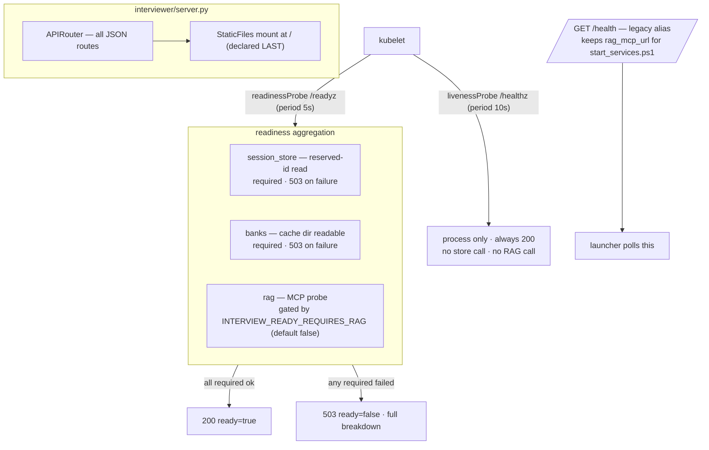

## US-006 — Liveness, readiness and route extraction

> **Epic:** Phase 1 — Stateless API tier · **Primary module:** MOD-01 · **Depends on:** US-004, US-005, US-003 · **Blocks:** US-007, US-018 (the worker's own readiness/autoscaling)

**Story statement:** As a platform operator, I want a liveness probe that depends on nothing and a readiness probe that reports each dependency separately, so that a Redis or RAG blip neither restarts healthy API pods nor routes traffic to pods that cannot serve.

**Business value.** `/health` returns a hardcoded `{"status":"ok"}` and checks nothing (`server.py:61-67`), so Kubernetes would read a totally broken pod as healthy and an operator would learn about an outage from a candidate. Worse, the naive fix — one endpoint that pings everything — makes the *reverse* failure: a RAG outage would fail readiness on every replica, removing `/voice/token` and the static UI along with it, even though the app is explicitly built to survive a RAG outage (`/skills` never 500s). Two probes with different contracts are the whole point. This story also makes the route-ordering footgun structural: the `StaticFiles` catch-all at `/` shadows anything declared after it, and this codebase has already lost time to a comparable shadowing bug.

## Acceptance Criteria

### Scenario 1 — Liveness depends on nothing
**Given** a running API with Redis unreachable and RAG unreachable
**When** `GET /healthz` is called
**Then** 200 and `{"status": "ok"}`
**And** no session store, bank store, or RAG call is made on that path — a dependency blip must never restart API pods

### Scenario 2 — Readiness reports each dependency separately
**Given** a healthy API
**When** `GET /readyz` is called
**Then** 200 with `ready: true` and a `checks` object containing `session_store`, `banks`, and `rag`
**And** each entry carries `ok`, and where applicable `latency_ms` and `detail`
**And** the body is the same shape whether the status code is 200 or 503

### Scenario 3 — A required dependency failing flips the code
**Given** `INTERVIEW_SESSION_STORE=redis` and Redis stopped
**When** `GET /readyz` is called
**Then** 503 with `ready: false` and `checks.session_store.ok: false`
**And** `checks.banks` and `checks.rag` are still reported — a failure must not blank the rest of the report

### Scenario 4 — RAG is reported but not required by default
**Given** RAG unreachable and `INTERVIEW_READY_REQUIRES_RAG` unset
**When** `GET /readyz` is called
**Then** 200 with `ready: true`
**And** `checks.rag == {"ok": false, "skipped": true, "reason": "INTERVIEW_READY_REQUIRES_RAG is false"}`
**And** the same request with `INTERVIEW_READY_REQUIRES_RAG=true` returns 503 — the requirement is a configuration decision, not a hardcoded one

### Scenario 5 — The legacy endpoint keeps the launcher working
**Given** `start_services.ps1` polls `http://127.0.0.1:<port>/health` and asserts the body matches `$RAGMCPUrl` (lines 636-643)
**When** `GET /health` is called
**Then** it still returns `status`, `rag_mcp_url`, and `rag_auth`
**And** `rag_mcp_url` still contains the configured `RAG_MCP_URL`
**And** a test asserts this exact contract, because breaking it breaks the Windows dev flow (`AS-05`)

### Scenario 6 — Probes are not shadowed by the static mount
**Given** the app is built with `web/` present
**When** `GET /healthz` and `GET /readyz` are called through `TestClient`
**Then** both return JSON with `Content-Type: application/json`, not `index.html`
**And** `GET /` still serves `index.html` (the mount is intact)
**And** this is a named regression test — the plan's whole reason for extracting the router

### Scenario 7 — Route order is structure, not convention
**Given** `interviewer/server.py` after this story
**When** the app's route table is inspected
**Then** the router's routes appear **before** the `StaticFiles` mount in `app.routes`
**And** a test walks `app.routes` and fails if any JSON route is declared after the mount
**And** the comment that previously enforced this by convention is replaced by that test

### Scenario 8 — A hanging dependency cannot hang the probe
**Given** a dependency whose check takes longer than the readiness budget
**When** `GET /readyz` is called
**Then** it responds within the configured probe timeout (default 2 s) with that dependency marked not ok
**And** the check is cancellable — one slow dependency must not serialize behind another

### Scenario 9 — Empty and first-boot states are honest
**Given** a freshly started pod with an empty bank cache directory
**When** `GET /readyz` is called
**Then** `checks.banks.ok` reflects a directory that exists and is readable (0 banks is a valid state, not an error)
**Given** the bank cache directory is absent or unreadable
**Then** `checks.banks.ok` is false — and readiness fails only if banks are required for serving, which the report makes visible either way

### Scenario 10 — The router extraction does not break the test seams
**Given** tests that do `monkeypatch.setattr(server_mod, "_rag", stub)` and `_store`
**When** they run against the extracted router
**Then** the handlers still observe the patched objects
**And** `import interviewer.api.routes` works standalone, before `interviewer.server`, with no circular-import error

## HLD

Two probes, two contracts, one route table that cannot be reordered by accident.



**Why RAG is optional by default.** Readiness must reflect *what the pod can serve*. The system is designed to survive a RAG outage: `/skills` returns 200 with `rag_ok=false`, the interview proceeds on the last-known rubric, and the static UI and `/voice/token` have no RAG dependency at all. Making RAG mandatory would convert a retrieval degradation into a total outage — the opposite of the designed failure mode. The flag exists so an operator who *wants* the strict behaviour can have it, and it defaults to the behaviour the code was built for (`BRD-02`).

**Why the store probe is a read, not a new `ping()`.** `SessionStore` should not grow a method just for health. `await store.load("__readyz__")` returning `None` proves connectivity end to end, has no side effects, and costs one Redis round trip. The reserved id cannot collide: API session ids are `uuid4().hex[:12]` and worker ids are `interview-<domain>-<sid>` — neither can be `__readyz__`.

**Why the router extraction is in this story.** `server.py:317-319` mounts a catch-all at `/`, and FastAPI matches in declaration order, so *every* route must be declared above it. That is currently enforced by a comment. Extracting routes into an `APIRouter` and including it before the mount converts a convention into a structure, and the accompanying regression test is what stops the probes from silently becoming 404s (or worse, `index.html` with a 200) the next time someone appends a route at the bottom of the file.

## LLD

**Files changed**

| Path | Change |
|---|---|
| `interviewer/api/__init__.py` (new) | Package marker |
| `interviewer/api/routes.py` (new) | `router = APIRouter()`; all JSON routes moved here, including `/health`, `/healthz`, `/readyz`, sessions, `/voice/token`, `/skills*` |
| `interviewer/api/readiness.py` (new) | `async def check_readiness(store, rag, config) -> tuple[bool, dict]` — pure aggregation, no FastAPI types, unit-testable without a client |
| `interviewer/server.py` | Keeps `app`, `config`, `_rag`, `_store` (the test seams); `app.include_router(router)` **before** the static mount; CORS unchanged |
| `interviewer/config.py` | Add `ready_requires_rag: bool = False`, `ready_check_timeout_s: float = 2.0` |
| `tests/test_config_defaults.py` | Add the two new keys to `EXPECTED_DEFAULTS` (US-003) |
| `tests/test_probes.py` (new) | Scenarios 1-9 |
| `tests/test_routes_order.py` (new) | Scenarios 6-7, 10 |

**Signatures and shapes**

```python
# interviewer/api/readiness.py
async def check_readiness(store, rag, config) -> tuple[bool, dict[str, Any]]:
    """(ready, report). Never raises: every failure becomes a check entry."""

async def _check_store(store, timeout: float) -> dict[str, Any]:
    """await store.load(_READY_ID) — None means reachable, an exception means not."""

async def _check_banks(config) -> dict[str, Any]:
    """The bank cache directory exists and is readable (US-009/US-010 extend
    this to the object store without changing the check's name or shape)."""

async def _check_rag(rag, config, timeout: float) -> dict[str, Any]:
    """Skipped unless INTERVIEW_READY_REQUIRES_RAG; otherwise probe an absent
    doc id so the check is deterministic and side-effect free."""
```

`GET /readyz` body (200 and 503 identical in shape):

```json
{
  "ready": false,
  "checks": {
    "session_store": {"ok": true, "latency_ms": 1.4},
    "banks": {"ok": true, "detail": "/app/question_banks", "banks": 9},
    "rag": {"ok": false, "latency_ms": 2001.0,
            "detail": "MCP tool interview_bank failed: ConnectError"}
  },
  "version": "0.1.0"
}
```

Deployment contract (consumed by the MOD-13 manifests):

| Probe | Path | periodSeconds | timeoutSeconds | failureThreshold |
|---|---|---|---|---|
| liveness | `/healthz` | 10 | 2 | 3 |
| readiness | `/readyz` | 5 | 2 | 2 |

**Implementation note — the circular import.** `routes.py` needs the module-level seams that live in `server.py`, and `server.py` must import `routes.py` to include the router. `routes.py` therefore does `from interviewer import server as _srv` and reads `_srv._store`, `_srv._rag`, `_srv.config` **inside request handlers** — never at import time. That resolves to the partially initialised module object during the cycle and to the real attributes at request time, which is also exactly what keeps `monkeypatch.setattr(server_mod, "_rag", stub)` working. A test imports `interviewer.api.routes` first, standalone, to prove the order does not matter.

**Edge cases.** `/readyz` must never raise — a check that throws is a `{"ok": false}` entry, not a 500, because a readiness probe returning 500 and one returning 503 are equally "not ready" but only one of them is diagnosable. Per-check timeouts must be enforced with `asyncio.wait_for` and the checks must run concurrently (`asyncio.gather`) so three 2 s checks cannot produce a 6 s probe. `/health` must not be reimplemented from the readiness report — the launcher greps its body for the RAG URL, so it keeps the legacy fields byte-for-byte. `rag_auth` derives from `bool(config.rag_mcp_token)`. The probe endpoints must not be cached: send `Cache-Control: no-store`.

**Test scenarios**

| # | Scenario | Check | Where |
|---|---|---|---|
| 1 | Liveness with deps down | `/healthz` 200, no store/rag call recorded | `tests/test_probes.py` |
| 2 | Healthy readiness | 200, `ready: true`, three checks present | `tests/test_probes.py` |
| 3 | Store failure | 503, `checks.session_store.ok` false, others present | `tests/test_probes.py` |
| 4 | RAG optional | flag off → 200 and `skipped: true` | `tests/test_probes.py` |
| 5 | RAG required | flag on → 503 | `tests/test_probes.py` |
| 6 | Legacy `/health` | body contains `rag_mcp_url` matching config | `tests/test_probes.py` |
| 7 | No shadowing | `/healthz`, `/readyz` are JSON; `/` is HTML | `tests/test_routes_order.py` |
| 8 | Declaration order | every non-static route precedes the mount | `tests/test_routes_order.py` |
| 9 | Timeout bounded | slow check → 503 within the budget | `tests/test_probes.py` |
| 10 | Import order | `import interviewer.api.routes` first | `tests/test_routes_order.py` |
| 11 | Seams still patchable | patch `server._rag`/`_store` → handlers observe it | `tests/test_skills_api.py` (existing, unchanged) |
| 12 | Defaults pinned | two new keys in `EXPECTED_DEFAULTS` | `tests/test_config_defaults.py` |

## Traceability

| Upstream | Reference | How this story serves it |
|---|---|---|
| Module | MOD-01 (Management API) | Owns the probes, the route table, and the static mount |
| Requirement | BRD-02 — real liveness and readiness probes | Implemented as specified, including RAG gating defaulting to off |
| Use case | UC-05 — deploy or upgrade the platform | The readiness probe is what `maxUnavailable: 0` rollouts and `progressDeadlineSeconds` depend on; the "Degraded dependency" row is this design |
| Use case | UC-10 — diagnose a worker that never registered | Readiness is the signal that a scaled pod is not serving, rather than a black hole; the per-dependency breakdown is the diagnosis |
| Reconciliation | REC-07 — route ordering by convention | Refactored: `APIRouter` included before the mount, plus the regression test the note asks for |
| Assumption | AS-05 — the Windows dev flow keeps working | `/health` is preserved as an alias so `start_services.ps1`'s assertion keeps passing |
| Requirement | BRD-01 — stateless API tier | The store check is only meaningful once US-004 has wired the store |

**Test files:** `tests/test_probes.py` (new), `tests/test_routes_order.py` (new), `tests/test_skills_api.py` (existing, must pass unmodified), `tests/test_config_defaults.py` (extended).
