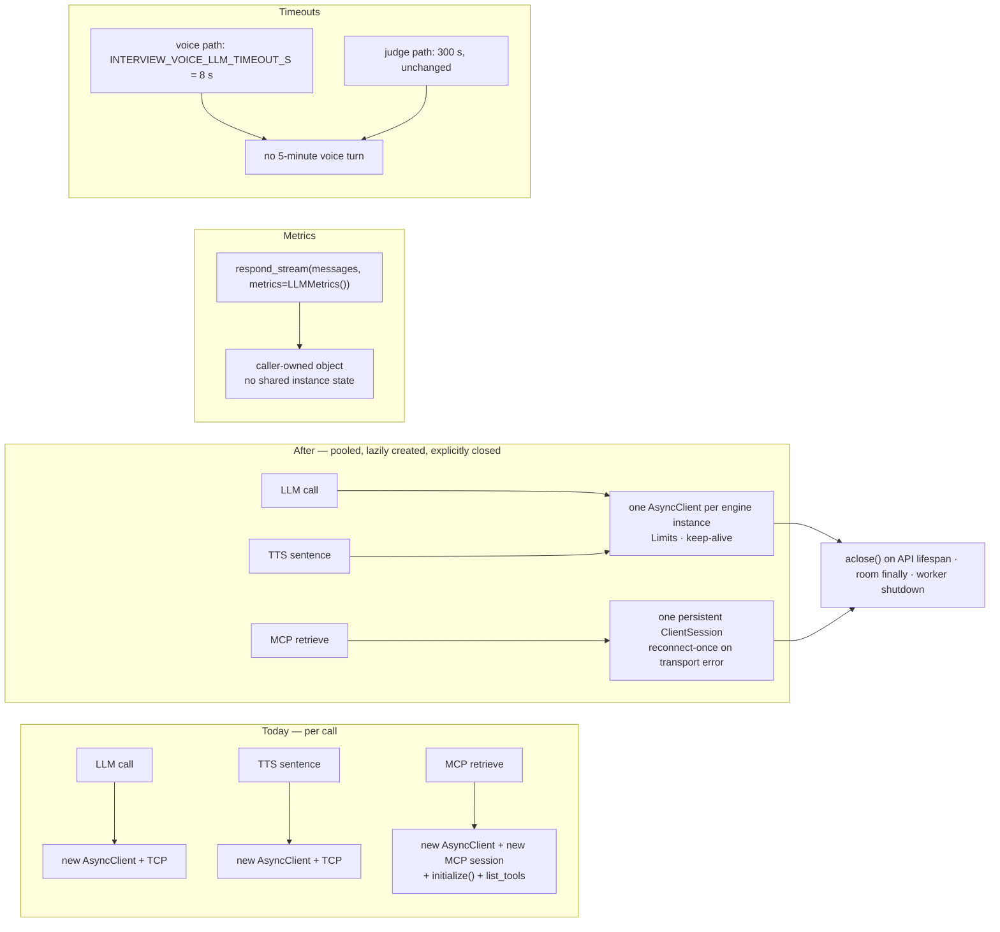

## US-008 — Connection pooling, voice timeout, RAG session reuse and metric isolation

> **Epic:** Phase 1 — Latency · **Primary module:** MOD-03 (with MOD-04's client) · **Depends on:** US-003 · **Blocks:** US-011 (remote engine adapters), US-014 (worker drain)

**Story statement:** As a candidate, I want each voice turn to reuse its connections and fail fast when an engine stalls so that a slow dependency costs me seconds rather than minutes.

**Business value.** This is the highest-ROI change in the plan and it needs no GPU. Four defects compound on the hot path: every LLM, TTS, STT and MCP call opens a fresh `httpx.AsyncClient` (a new TCP connection, and on TLS a new handshake, per stage of every turn); the voice LLM inherits `LLMConfig.timeout = 300.0`, so a stalled vLLM hangs a *voice* turn for five minutes (`llm.py:27`); every retrieval re-runs the full MCP `initialize()` handshake, which is a large slice of the measured 200-360 ms against a 150 ms stage budget (`rag_client.py:86-92`); and `LLMMetrics` mutates instance state (`llm.py:31-33, 87, 115`), so concurrent calls silently corrupt the very numbers the SLO is computed from. The last one is also a hard prerequisite for per-process engines: without it, `llm_first_token_ms` attributes to the wrong hop and the latency dashboard lies.

## Acceptance Criteria

### Scenario 1 — One client per engine instance, reused for every call
**Given** an `OpenAICompatibleLLM`, a `KokoroTTS`, a `WhisperSTT` and a `RagClient`
**When** five calls are made on each
**Then** exactly one `httpx.AsyncClient` is constructed per instance (five fewer objects than today's one-per-call)
**And** it is constructed lazily inside the first async call, never at import or in `__init__`, so no client is bound to a loop that does not exist yet
**And** explicit `httpx.Limits(max_connections=…, max_keepalive_connections=…, keepalive_expiry=…)` are set rather than httpx's defaults

### Scenario 2 — The `transport` test seam is preserved
**Given** the existing tests that pass `transport=httpx.MockTransport(handler)`
**When** the pooled client is created
**Then** the supplied transport is used for every call
**And** `tests/test_llm.py` and `tests/test_voice_pipeline.py` pass **unmodified**

### Scenario 3 — Clients are closed, visibly
**Given** the FastAPI app
**When** it shuts down
**Then** the lifespan hook awaits `aclose()` on the RAG client (and any other long-lived client) before the process exits
**Given** a voice room ends
**Then** the per-room engines built by `run_agent` are closed in a `finally`, on the loop that created them
**And** the test suite runs with `PYTHONASYNCIODEBUG=1` and a `ResourceWarning` assertion, so an unclosed client fails the suite instead of printing a warning nobody reads
**And** `aclose()` is idempotent — calling it twice, or on a never-used client, raises nothing

### Scenario 4 — A stalled voice LLM fails in seconds
**Given** `INTERVIEW_VOICE_LLM_TIMEOUT_S=8` (the default)
**When** a voice turn's LLM never sends a first token
**Then** the call raises `httpx.ReadTimeout` in ≈8 s, not 300 s
**And** the turn degrades along the existing no-hang path (typed notice; the interview continues or ends with a reason)
**And** `INTERVIEW_VOICE_LLM_TIMEOUT_S=2` bounds the same turn in ≈2 s

### Scenario 5 — The judge keeps its long budget
**Given** the judge/evaluation LLM, which is off the hot path
**When** a scoring call runs against a slow shared model
**Then** its timeout is still `LLMConfig.timeout = 300.0`
**And** the two timeouts are separate fields, so tuning the voice path cannot silently break scoring
**And** connect and pool timeouts are short (≈2 s) on both paths, so dialing a dead pod cannot consume the whole budget

### Scenario 6 — Retrieval reuses one MCP session
**Given** a `RagClient`
**When** five retrievals are made
**Then** the MCP `initialize()` handshake runs **once**, not five times
**And** the underlying `streamable_http_client` context is entered once and unwound by `aclose()`

### Scenario 7 — The session reconnects once, safely
**Given** a live session that the server or an idle ingress timeout has dropped
**When** the next tool call fails with a transport error
**Then** the client discards the dead session, establishes a new one, and retries the call **exactly once**
**And** a second consecutive failure propagates to the caller
**And** the retry is safe because every tool on this client is idempotent (`retrieve_context`, `interview_bank`, `interview_question`, `execute_agent_context`, `register_bank` with `force=False`)
**And** each reconnect is logged and counted, so a flapping session is visible rather than merely slow

### Scenario 8 — Concurrent calls do not corrupt the session
**Given** several concurrent `RagClient` calls in one process
**When** they run
**Then** they are serialized behind one lock, so no two coroutines write to the transport at once and no response is delivered to the wrong caller
**And** each still receives its own correct payload

### Scenario 9 — Metrics stop mutating instance state
**Given** `respond_stream(..., metrics=LLMMetrics())` and `respond(..., metrics=LLMMetrics())`
**When** the call completes
**Then** the pass/fail-recorded `first_token_ms` and `total_ms` land in **the supplied object**
**And** two concurrent calls with two different `metrics` objects each hold their own numbers — no cross-contamination
**And** `metrics=None` (the default) still populates `self.metrics`, so every existing call site and test keeps working

### Scenario 10 — Degenerate and empty responses
**Given** a stream that yields no content deltas
**When** it is exhausted
**Then** `first_token_ms` stays `None` and `total_ms` is still recorded — an absent first token must be distinguishable from a fast one
**Given** a non-streaming response with an empty `choices` list
**Then** `respond` returns `""` and records `total_ms`

## HLD

Four changes, one theme: the hot path stops paying for setup it does not need, and stops lying about what it measured.



**Why pooling matters more than it looks.** The voice turn is roughly one LLM streaming call, one TTS call per spoken sentence, one STT call per answer, and one to two MCP retrievals — call it eight to twelve connection establishments per question. On a same-host dev box that cost is small; across a cluster with TLS-terminating ingress it is a handshake each time, and it lands inside a 1500 ms budget already missed by 4-6×. This is a pure win with no dependency change.

**Why the RAG session is the biggest single slice.** `RagClient._call` opens an `httpx.AsyncClient`, a `streamable_http_client`, and a `ClientSession`, then `await session.initialize()` — *per tool call*. Retrieval is measured at 200-360 ms against a 150 ms stage budget, and the handshake is a fixed cost inside every one of those calls. Holding the session for the client's lifetime removes it. Reconnect-on-error, rather than a longer-lived blind cache, is required because an idle stream can legitimately be closed by the RAG service or by an ingress idle timeout — so the design assumes the session *will* die and handles it, at the cost of one retry on an idempotent tool.

**Why the timeout split is a correctness fix, not tuning.** `LLMConfig.timeout = 300.0` exists for good reason — a shared 14B model can take minutes to answer a judge prompt. But the same `LLMConfig` shape is used on the voice path, where a five-minute hang means a candidate sits in silence for five minutes and the interview is effectively dead. Two fields, one per path, removes the coupling. This is the difference between "slow" and "broken" for the product's core experience.

**Why metric isolation blocks US-011.** `respond_stream` assigns `self.metrics = LLMMetrics()` and then mutates it. With one engine instance per *process* (the per-process engine design in US-011), two rooms' turns interleave on one instance and the later write wins, so `llm_first_token_ms` is attributed to whichever call finished last. That corrupts exactly the series the burn-rate alert is computed from — the plan's SLO would be measuring noise. Passing the metrics object in makes attribution explicit and is a prerequisite, not an optimization.

**Request-scoped vs process-scoped lifetime.** All four clients must be created on the loop that will use them and closed on that same loop: `httpx.AsyncClient`'s pool and the MCP session's `AsyncExitStack` are not portable across loops. That is why `aclose()` is wired into the FastAPI lifespan (server loop), the room `finally` (worker loop), and the worker shutdown hook — and why the long-standing convention "one `asyncio.run` per Redis client instance" applies equally here.

## LLD

**Files changed**

| Path | Change |
|---|---|
| `interviewer/llm.py` | Lazy shared client + `httpx.Limits`; `metrics: LLMMetrics | None = None` on `respond_stream` and `respond`; `aclose()`; per-call `httpx.Timeout(connect=2, read=cfg.timeout, write=5, pool=2)` |
| `interviewer/rag_client.py` | Persistent `ClientSession` via a held `AsyncExitStack`; one lock; reconnect-once; per-call budget preserved; `aclose()` |
| `interviewer/voice/tts.py` | Shared client + `Limits`; `aclose()`. The sync download client at line 134 is left alone — it fetches model weights once, not per turn |
| `interviewer/voice/stt.py` | Shared client + `Limits`; `aclose()` |
| `interviewer/voice/interviewer.py` | Voice engine built with `LLMConfig(timeout=config.voice_llm_timeout_s)`; judge keeps the 300 s field |
| `interviewer/config.py` | `voice_llm_timeout_s: float = 8.0` (`INTERVIEW_VOICE_LLM_TIMEOUT_S`), plus `llm_pool_max_connections`, `llm_pool_keepalive` if the pool needs tuning in the cluster |
| `interviewer/server.py` | `lifespan` on `create_app` awaiting `aclose()` on the RAG client |
| `interviewer/voice/worker.py` | Shutdown hook closes process-level clients (wired with US-014's drain) |
| `interviewer/voice/agent.py` | `run_agent` closes its per-room engines in a `finally` |
| `tests/test_config_defaults.py` | New keys added to `EXPECTED_DEFAULTS` (US-003) |
| `tests/test_pooling.py` (new) | Scenarios 1-3, 6-8 |
| `tests/test_llm.py` | Extended for scenarios 4, 5, 9, 10 |

**Signatures**

```python
# llm.py
def _client(self) -> httpx.AsyncClient:
    """Lazily created, per-instance, reused. Never constructed in __init__."""

async def aclose(self) -> None:
    """Idempotent; no-op if the client was never created."""

async def respond_stream(self, messages: list[dict], *,
                         temperature: float = 0.2, max_tokens: int = 256,
                         metrics: LLMMetrics | None = None) -> AsyncIterator[str]:
    """Deltas are yielded as before. Metrics land in `metrics` when supplied,
    otherwise on self.metrics (back-compatible)."""

# rag_client.py
async def _get_session(self) -> ClientSession: ...      # lazy, cached, lock-guarded
async def _reset(self) -> None: ...                     # unwind + drop; called on error
async def _call(self, tool: str, args: dict, *, timeout_s: float = 30.0) -> str:
    """One reconnect retry on transport failure, then raise."""
async def aclose(self) -> None: ...
```

**Test-seam note.** `tests/test_rag_client.py` monkeypatches the module-level names `interviewer.rag_client.streamable_http_client` and `interviewer.rag_client.ClientSession`, and records tool calls through them. The persistent-session implementation must keep resolving those names at call time so those tests keep working; each test builds a fresh `RagClient`, so caching the session per instance changes no assertion. If any test asserts a per-call HTTP timeout, preserve the observable budget — a per-call `asyncio.wait_for` or the SDK's per-request timeout knob, whichever the installed MCP SDK exposes — and update the mechanism, not the asserted budget, in the same commit.

**Edge cases.** `aclose()` after a room ends must not close an engine another room shares — which is why US-011's process-scoped engines need a *process*-scoped close (the worker shutdown hook) and rooms must only close what they built. A reconnect must not lose the per-call budget: the retry runs inside the same `timeout_s`. A concurrent `aclose()` during an in-flight call must not raise `RuntimeError` out of the caller; the call fails with a transport error, which the reconnect path already handles. The voice LLM timeout must not be so tight that a legitimate cold vLLM start (model load on first request) is truncated — 8 s is a starting point recorded in the config tripwire and tuned from the metrics this story makes trustworthy. `httpx` `Limits` must be explicit in the manifests' env so the API tier's connection count to Redis, RAG, and LiveKit is bounded per replica and can be multiplied by replica count during capacity planning.

**Test scenarios**

| # | Scenario | Check | Where |
|---|---|---|---|
| 1 | One client per engine | counting transport wrapper: 1 construction, 5 calls | `tests/test_pooling.py` |
| 2 | Lazy creation | never in `__init__`; no client before the first call | `tests/test_pooling.py` |
| 3 | Limits set | `max_connections`/`keepalive_expiry` are non-default | `tests/test_pooling.py` |
| 4 | Transport seam | existing mock-transport tests pass unmodified | `tests/test_llm.py`, `tests/test_voice_pipeline.py` |
| 5 | `aclose` idempotent | twice, and on an unused instance | `tests/test_pooling.py` |
| 6 | Lifespan closes | no unclosed-client warning under async debug | `tests/test_pooling.py` |
| 7 | Voice timeout | stalled stream → `ReadTimeout` ≈ 8 s | `tests/test_llm.py` |
| 8 | Judge timeout | non-voice path keeps 300 s | `tests/test_llm.py` |
| 9 | MCP initialize once | 5 retrievals → 1 `initialize()` | `tests/test_pooling.py` |
| 10 | Reconnect once | fail-then-succeed transport → one retry, success | `tests/test_pooling.py` |
| 11 | Second failure raises | persistent transport error → caller sees it | `tests/test_pooling.py` |
| 12 | Concurrent RAG calls | N concurrent calls, all correct payloads | `tests/test_pooling.py` |
| 13 | Metrics isolation | two concurrent streams, distinct objects, no bleeding | `tests/test_llm.py` |
| 14 | Back-compat metrics | `metrics=None` still fills `self.metrics` | `tests/test_llm.py` |
| 15 | Empty stream | `first_token_ms is None`, `total_ms > 0` | `tests/test_llm.py` |
| 16 | Defaults pinned | `voice_llm_timeout_s` etc. in `EXPECTED_DEFAULTS` | `tests/test_config_defaults.py` |

## Traceability

| Upstream | Reference | How this story serves it |
|---|---|---|
| Module | MOD-03 (Dialogue Brain) | Owns every hot-path hop; the brain's structure is untouched (REC-08) |
| Module | MOD-04 (RAG Service) | The MCP client's handshake cost is inside the 150 ms retrieval budget |
| Requirement | BRD-09 — measurable voice latency against the budget | Metrics attribution is corrected here; the export lands with MOD-12 |
| Requirement | BRD-13 — observability with the budget as an SLO | Isolated metrics are what make the burn-rate series meaningful rather than noise |
| Use case | UC-01 — take a voice interview | The "Retry" row (transient STT/LLM failure retried once with a bounded timeout) is exactly Scenarios 4, 7 |
| Use case | UC-09 — investigate a latency-breach breach | Attribution to the offending hop depends on per-call metrics being correct |
| Evidence | `LLMMetrics` mutates instance state (not concurrency-safe) | `llm.py:31-33, 87, 115` — the defect this story cites |
| Evidence | A new `httpx.AsyncClient` per LLM/TTS/STT/MCP call | `llm.py:88,116`, `tts.py:39,68`, `stt.py:36`, `rag_client.py:88` |
| Evidence | `LLMConfig.timeout = 300.0` on the voice path | `llm.py:27` — a stalled vLLM hangs a voice turn for five minutes |
| Reconciliation | REC-12 — instrumentation that exists but is not exported | Extend: the data becomes trustworthy here, exported in MOD-12 |

**Test files:** `tests/test_pooling.py` (new), `tests/test_llm.py` (extended), `tests/test_rag_client.py` (must pass; mechanism adapted only if the SDK requires it), `tests/test_config_defaults.py` (extended), `tests/test_voice_pipeline.py` (unmodified).
