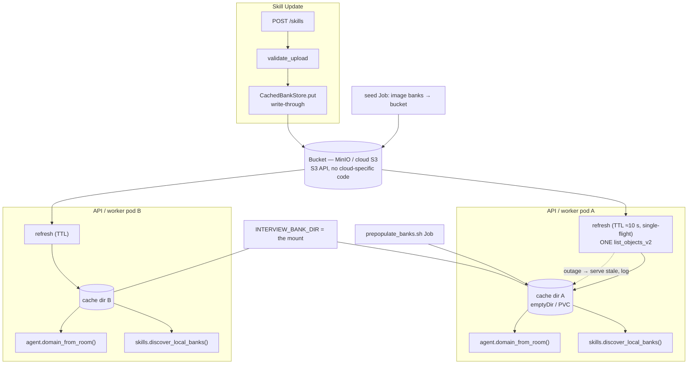

## US-010 — Object-storage bank backend with a materialized cache

> **Epic:** Phase 2 — Pluggable bank storage · **Primary module:** MOD-08 · **Depends on:** US-009, US-006, US-008 · **Blocks:** the prewarm Job and multi-replica skills

**Story statement:** As a skill author, I want an uploaded bank to be visible to every replica and every worker within seconds so that I can add a domain once and have it usable everywhere without a restart and without a shared disk.

**Business value.** `POST /skills` writes to one pod's local disk while every request re-globs that folder, so replica B never sees replica A's upload — with more than one API replica the Skill Update page becomes a lie that depends on which pod the load balancer picked. The portable fix (`DG-01`) is an S3-compatible object store: MinIO on-prem, any cloud store otherwise, no RWX PVC and no cloud-specific dependency in the base. The same change fixes a second defect nobody has measured: the bank folder is re-globbed and re-parsed on *every* request, including every room-name parse in the worker. A ~10 s materialized cache plus a refresh driven by one `list_objects_v2` bounds staleness while removing the per-request I/O entirely. This is the story where the three independent glob consumers must converge — `agent.py:56-66` explicitly promises a skill uploaded after boot is recognized **without a worker restart**, and all three readers must read through the same cache or that documented promise silently becomes a regression.

## Acceptance Criteria

### Scenario 1 — An upload is visible to every replica within the TTL
**Given** two API processes with separate cache directories and one shared bucket
**When** `POST /skills` succeeds on replica A
**Then** replica B's `GET /skills` lists the bank within `INTERVIEW_BANK_CACHE_TTL_S` (≈10 s)
**And** no restart of either process is required
**And** the bank is usable for an interview from either replica

### Scenario 2 — Three consumers, one cache
**Given** the shared bucket, the per-pod cache directory, and `INTERVIEW_BANK_DIR` pointing at it
**When** a bank is uploaded
**Then** all three readers observe it within the TTL:
`skills.discover_local_banks()` (the API and the reconcile path), `agent.domain_from_room` (a room named `interview-<newdomain>-<sid>` resolves to that domain), and `scripts/prepopulate_banks.sh` (which keeps globbing that directory)
**And** no consumer keeps its own listing, its own timestamp, or its own bucket call — there is exactly one refresh point
**And** the test that proves it is the one named for the `agent.py:56-66` promise

### Scenario 3 — The worker refreshes before it parses the room name
**Given** a worker that booted when the bucket held nine banks
**When** `run_agent` starts for a room whose domain is a tenth bank
**Then** the cache has been refreshed (TTL-gated) **before** `domain_from_room` runs, so the room resolves to the tenth domain rather than falling back to `system-design`
**And** the refresh is a timestamp comparison on the common path — no object-store call per room

### Scenario 4 — The glob-per-request cost is gone
**Given** a warm cache
**When** 50 `GET /skills` requests arrive within one TTL window
**Then** exactly **one** `list_objects_v2` call reaches the object store
**And** `discover_local_banks()` remains a pure synchronous glob of the cache directory — its signature and its lack of I/O are unchanged

### Scenario 5 — A TTL expiry does not stampede
**Given** the TTL has just expired and 20 requests arrive concurrently
**When** they all need a refresh
**Then** exactly **one** refresh runs; the others await it (single-flight) and then read the refreshed cache
**And** the object store sees one listing, not twenty

### Scenario 6 — An object-store outage degrades, it does not fail
**Given** a warm cache and the object store unreachable
**When** a refresh is attempted
**Then** the stale cache is served, the failure is logged with the bucket and endpoint, and `GET /skills` still returns 200
**And** the interview path is unaffected — a bank that was usable a moment ago is still usable
**And** once the store returns, the next refresh converges with no manual action

### Scenario 7 — Write-through, and the upload ordering is preserved
**Given** `POST /skills` on replica A
**When** it succeeds
**Then** `CachedBankStore.put` writes to the object store **and** materializes that bank locally, so replica A sees its own upload immediately with no TTL wait
**And** the order is: validate → `put` → `register_bank` over MCP (unchanged from WF-02)
**And** a RAG failure still returns 502 with the object present and unregistered, repairable by `POST /skills/reconcile`

### Scenario 8 — RAG failure after the write is repairable, idempotently
**Given** a bank stored in the bucket but not registered
**When** `POST /skills/reconcile` runs — on any replica, after the TTL
**Then** it lists the bank through the cache, probes RAG, and registers it
**And** a second run registers nothing (idempotent), and re-uploading the same bank replaces rather than duplicates

### Scenario 9 — Deletion converges too
**Given** a bank removed from the bucket out of band
**When** the TTL elapses and a refresh runs
**Then** the local cache file is removed and `GET /skills` no longer lists it
**And** `CachedBankStore.delete(name)` removes the object and the local copy in one call

### Scenario 10 — Concurrency between admins is defined, not accidental
**Given** two admins uploading different content for the same bank to two replicas
**When** both succeed
**Then** the object store resolves it last-write-wins and the cache converges to the winner within the TTL
**And** this is documented behaviour, not a race the implementer is unaware of (the UC-03 concurrency row)
**And** no partial object is ever visible — each `put_object` is atomic

### Scenario 11 — Cold start and empty states
**Given** a fresh pod with an empty cache directory and a populated bucket
**When** it starts
**Then** the first refresh materializes every bank before readiness reports banks healthy (`US-006`)
**And** `discover_local_banks()` never returns a partial set mid-materialization — files appear via atomic replace, never half-written
**Given** an empty bucket
**Then** the bank list is empty, `/readyz` reports 0 banks as healthy, and an interview for an unknown domain falls back to `system-design` as it does today

### Scenario 12 — The cache directory is a volume, not an image path
**Given** a pod running with `readOnlyRootFilesystem: true`
**When** the cache tries to write inside the image
**Then** the pod fails loudly at deploy time
**And** the deployment therefore mounts a writable `emptyDir` (worker/API) or PVC (the prewarm Job) at the cache path
**And** `INTERVIEW_BANK_DIR` names that mount, so nothing else needs to know about it

### Scenario 13 — Large buckets paginate, bad names are refused
**Given** more objects than one listing page
**When** the cache refreshes
**Then** continuation tokens are followed until the listing is exhausted
**Given** `put("Bad Name", …)` or `put("../evil", …)`
**Then** `ValueError` is raised before any object-store call — the guard inherited from US-009 applies to every backend

### Scenario 14 — Seeding an empty environment
**Given** an empty bucket and the nine banks shipped in the image
**When** the seed step runs (`scripts/seed_banks.py`, a one-shot Job)
**Then** all nine objects exist under the prefix, idempotently (re-running changes nothing)
**And** `scripts/prepopulate_banks.sh` then registers them into RAG through the same cache

## HLD

One bucket, one cache directory per pod, one refresh point per process, and a bounded staleness window that every reader inherits because they all resolve through `skills.bank_dir()`.



**Why a materialized cache and not direct object reads.** Every consumer is synchronous — `discover_local_banks()` returns `LocalBank` objects carrying a `Path`, and `domain_from_room` calls it on the room-name parse. Converting the whole read path to `async` would touch `skills.py`, `agent.py`, `server.py`, and their tests, and would put an object-store round trip on the interview's start-up path. Materializing to disk instead means **the filesystem API is kept and the authority is moved** (`DG-01`), which is what makes this story additive instead of a refactor of the interview path.

**Why the TTL is ~10 s.** The alternative — refresh on every read — is the glob-per-request cost with an object-store round trip attached. The alternative — never refresh — is the bug this story fixes. Ten seconds is short enough that an admin cannot tell, long enough that a fleet of replicas produces a handful of listings per minute. The window is a configuration value, not a constant, so the local overlay can set it to 0 for tests and a cloud overlay to 30 if listing costs matter.

**Why single-flight and stale-on-error are in the same story.** The plan's own scale table names the failure modes: "cache stampede at TTL expiry across replicas" and, for degradation, "serve the stale bank and log the refresh failure". Both are consequences of the cache design, so both are implemented with it rather than discovered later.

**Why the three consumers are a correctness requirement.** `agent.py:56-66` documents that a skill uploaded after boot must be recognized without a restart, and it achieves that today by globbing per call. Under a remote authority that promise survives *only* if the worker's glob reads the materialized cache. If the worker read the bucket directly, or kept its own listing, the promise would hold on the API and break in the interview — the hardest place to notice. The convergence test is therefore written to exercise the worker's path, not just the API's.

## LLD

**Files changed**

| Path | Change |
|---|---|
| `interviewer/bank_store.py` | Add `S3BankStore` and `CachedBankStore`; a `refresh_loop(store, interval_s)` helper for background driving |
| `interviewer/config.py` | `bank_store: str = "local"`, `bank_s3_endpoint/bucket/prefix/region`, `bank_cache_dir: str | None`, `bank_cache_ttl_s: float = 10.0` |
| `interviewer/server.py` | `_bank_store` composition (`CachedBankStore(S3BankStore(...))` when configured); lifespan starts the refresh loop and cancels it on shutdown; `/skills` awaits a TTL-gated refresh first |
| `interviewer/voice/agent.py` | `await bank_store.refresh()` at `run_agent` start, before `domain_from_room(...)`; the worker starts its own refresh loop |
| `pyproject.toml` | New `[bank-s3]` extra: `aioboto3>=13,<16` (lazy import, exactly like `redis`) |
| `scripts/seed_banks.py` (new) | Idempotent image-banks → bucket upload for the seed Job |
| `tests/test_bank_cache.py` (new) | Scenarios 1-7, 9-13 |
| `tests/test_bank_store.py` | Extended for the S3 implementation against a fake client |
| `tests/test_config_defaults.py` | New keys added (US-003) |

**Signatures**

```python
# bank_store.py
class S3BankStore:
    """S3 API over any endpoint (MinIO on-prem, any cloud object store).
    aioboto3 is imported lazily so the base install stays httpx-only."""
    def __init__(self, *, endpoint: str, bucket: str, prefix: str = "banks/",
                 region: str | None = None, access_key: str | None = None,
                 secret_key: str | None = None, client_factory=None) -> None: ...
    async def list(self) -> list[str]: ...        # list_objects_v2, paginated
    async def get(self, name: str) -> str | None: ...
    async def put(self, name: str, markdown: str) -> None: ...
    async def delete(self, name: str) -> None: ...

class CachedBankStore:
    """Materializes the backing store into a local directory at most once per
    TTL, then serves every read from disk. Single-flight; stale-on-error."""
    def __init__(self, inner: BankStore, cache_dir: Path, ttl_s: float = 10.0) -> None: ...
    async def refresh(self) -> None:
        """No-op if within the TTL. Coalesced: concurrent callers await one
        refresh. On failure, keeps the cache and logs."""
    async def list(self) -> list[str]: ...        # ensures freshness, then globs
    async def get(self, name: str) -> str | None: ...
    async def put(self, name: str, markdown: str) -> None:   # write-through
    async def delete(self, name: str) -> None: ...
```

Refresh algorithm (one listing, minimal transfers):

1. `objects = await inner.list()` → names + size + etag from a single `list_objects_v2` (paginated).
2. For each name missing locally or with a changed etag/size → `inner.get(name)` → atomic write into `cache_dir`.
3. Local `*.md` files whose names are absent from the listing → remove.
4. Record `_last_refresh`. On any exception: keep everything, log `bank cache refresh failed`, and leave `_last_refresh` untouched so the next call retries sooner rather than waiting a full TTL.

**Composition and deployment.**

```python
inner = (S3BankStore(endpoint=config.bank_s3_endpoint, bucket=config.bank_s3_bucket,
                     prefix=config.bank_s3_prefix, region=config.bank_s3_region)
         if config.bank_store == "s3" else LocalBankStore(skills.bank_dir()))
_bank_store = CachedBankStore(inner, Path(config.bank_cache_dir or skills.bank_dir()),
                              ttl_s=config.bank_cache_ttl_s)
```

`INTERVIEW_BANK_DIR` points at the cache directory in every process, which is the mechanism by which the three consumers converge. Credentials come from the environment and are injected from a secret store — never baked into an image or committed (`BRD-12`).

**Edge cases.** With `bank_store=local`, `CachedBankStore` wraps a store whose directory *is* the cache directory — the refresh must detect this and become a pass-through, or a local-mode refresh would try to delete files from the very directory it is reading. `aioboto3` sessions are loop-bound: create the client lazily inside the first async call and close it in `aclose()` (US-008's discipline), and start the refresh loop only from a running loop. The refresh loop must be cancelled and awaited on shutdown or the API's lifespan will hang on `CancelledError`. `run_agent`'s refresh must be TTL-gated so 20 concurrent rooms do not produce 20 listings — with single-flight they produce one, but the timestamp check keeps the common case free. A cache directory on a `readOnlyRootFilesystem` must fail visibly, which is why readiness reports it (US-006). Objects larger than the 1 MB upload cap are rejected at validation, before any store call. A bank whose object is unreadable (truncated, non-UTF-8) must not abort the whole refresh: skip it, log it, and let `unusable_bank_files()`/`parse_markdown_shape` surface it exactly as today.

**Test scenarios**

| # | Scenario | Check | Where |
|---|---|---|---|
| 1 | Cross-replica visibility | put on A → B sees it within the TTL | `tests/test_bank_cache.py` |
| 2 | Three consumers converge | API list, `domain_from_room`, prepopulate glob all see it | `tests/test_bank_cache.py` |
| 3 | No-restart promise | worker recognizes a new domain after a refresh | `tests/test_bank_cache.py`, `tests/test_voice.py` |
| 4 | One listing per TTL | 50 reads → 1 `list_objects_v2` (counting fake client) | `tests/test_bank_cache.py` |
| 5 | Single-flight | 20 concurrent refreshes → 1 store call | `tests/test_bank_cache.py` |
| 6 | Stale on error | store raises → stale served, failure logged, 200 | `tests/test_bank_cache.py` |
| 7 | Write-through | `put` visible locally with no TTL wait | `tests/test_bank_cache.py` |
| 8 | Upload ordering | `put` then register; RAG failure → 502, object present | `tests/test_skills_api.py` |
| 9 | Reconcile repairs | unregistered bank registered; second run is a no-op | `tests/test_skills_api.py` |
| 10 | Deletion converges | object removed → cache file removed after TTL | `tests/test_bank_cache.py` |
| 11 | Pagination | fake listing with 2 pages → all banks | `tests/test_bank_store.py` |
| 12 | Empty bucket | `[]`, readiness healthy with 0 banks | `tests/test_bank_cache.py` |
| 13 | Local mode pass-through | `CachedBankStore(LocalBankStore(dir), dir)` never deletes its own files | `tests/test_bank_cache.py` |
| 14 | Read-only cache dir | readiness fails; no partial state | `tests/test_bank_cache.py` |
| 15 | Seed Job idempotent | run twice → 9 objects, unchanged | `scripts/seed_banks.py` (CI) |
| 16 | Bad name refused | `put("../evil")` → `ValueError`, no client call | `tests/test_bank_store.py` |

## Traceability

| Upstream | Reference | How this story serves it |
|---|---|---|
| Module | MOD-08 (Bank / Skill Store) | The service-backed implementation and the short-TTL materialized cache the module is defined by |
| Module | MOD-01, MOD-02 | Both consume banks; this is where their read paths converge |
| Module | MOD-13 (Platform & Deployment) | The seed and prewarm Jobs, the cache volume, and the secret binding are deployment concerns this story creates |
| Requirement | BRD-04 — pluggable bank storage with identical semantics and a bounded staleness window | Object storage with the documented LWW semantics and a ~10 s window |
| Requirement | BRD-12 — no secrets in images or the repository | Credentials come from the environment, injected from a secret store |
| Use case | UC-03 — upload a new skill bank | All fourteen scenario rows: the last-write-wins concurrency row, the "visible to all replicas within the cache TTL" scale row, the 502 failure row, the idempotent re-upload row |
| Use case | UC-04 — reconcile unregistered banks | Reads through the converged cache, so the repair tool works on any replica |
| Decision | DG-01 — bank storage portability | The chosen option: S3-compatible store, local FS for single-node, no RWX PVC |
| Decision | DG-04 — model and artifact handling | The seed Job and the baked-vs-fetched split for small artifacts |
| Reconciliation | REC-10 — the prepopulate script is already portable | Reused verbatim as a Job payload, now reading the cache directory |
| Scale table | MOD-08 bottleneck | "Cache stampede at TTL expiry across replicas" is why single-flight exists; "serve the stale bank and log the refresh failure" is why stale-on-error does |

**Test files:** `tests/test_bank_cache.py` (new), `tests/test_bank_store.py` (extended), `tests/test_skills_api.py` (extended), `tests/test_voice.py` (extended), `tests/test_config_defaults.py` (extended).
