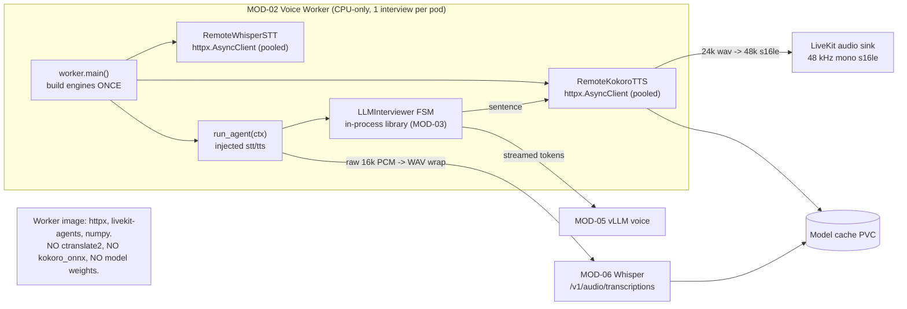

## US-011 — Remote STT/TTS adapters and per-process engine injection

| | |
|---|---|
| **Covers** | BRD-08 · UC-01 · UC-11 |
| **Modules** | MOD-02 (Voice Agent Worker), MOD-06 (STT Inference), MOD-07 (TTS Inference) |
| **Depends on** | US-008 (per-call LLM metrics) — see *Ordering* below |
| **Unblocks** | US-014 (drain), US-018 (queue-depth autoscaling) — both need a finite load threshold |
| **Status** | Not started |

### Story

**Story statement:** As a platform operator, I want the STT and TTS engines to be remote HTTP services that the worker builds once per process and injects into the dialogue brain, so that the voice worker becomes a small CPU-only process the SFU can dispatch to correctly across many replicas, and the measured 3.6 s CPU TTS plus 1.0 s CPU STT leave the critical path.

**Business value.** This is the pivotal change of the whole migration. It does three things at once: it removes ~4.6 s of the measured 6.5–8.4 s round-trip (the product's core quality claim, currently violated 4–6×), it shrinks the worker image to no `ctranslate2`, no `kokoro_onnx` and no model weights (sub-2 s cold start, which makes scale-up viable at all), and — the part that is easy to miss — **it makes the worker I/O-bound, which makes its CPU-load dispatch gate accurate again.** That last effect is what unblocks correct multi-replica dispatch: the crate-wide `load_threshold=float("inf")` workaround at `interviewer/voice/worker.py:62` existed *only* because TTS/STT ran in-process and saturated the CPU during bursts.

**Ordering.** US-008 must land first. `LLMMetrics` currently mutates instance state (`interviewer/llm.py:31-33, 87, 115`), so two rooms sharing one engine object would attribute each other's first-token latencies — silently corrupting the exact series the SLO is built on (`CV-02`).

## Acceptance Criteria

### AC-1 — Engines resolve from configuration and are built once per process

```gherkin
**Given** a worker process started with INTERVIEW_STT_PROVIDER=whisper-http and INTERVIEW_STT_URL=http://whisper:8000
**And** INTERVIEW_TTS_PROVIDER=kokoro-http and INTERVIEW_TTS_URL=http://kokoro:8880
**When** interviewer.voice.worker.main() starts
**Then** resolve_stt and resolve_tts are each called exactly once, before any room is accepted
**And** every room's brain receives that same engine pair by injection
**And** no engine is constructed inside run_agent, so no per-room HTTP connection pool or TCP handshake is created
```

### AC-2 — Raw 16 kHz PCM is WAV-wrapped for the transcription endpoint

```gherkin
**Given** the manual-capture buffer holds raw 16 kHz mono s16le PCM with no container
**When** RemoteWhisperSTT.transcribe(pcm) is called
**Then** the multipart part named "file" is a RIFF/WAVE byte string whose frames round-trip byte-for-byte through the stdlib wave module at 16 kHz mono 16-bit
**And** the JSON response's "text" field is returned
```

### AC-3 — Kokoro's 24 kHz output satisfies the 48 kHz TTSEngine contract

```gherkin
**Given** the Kokoro-FastAPI endpoint returns a 24 kHz mono wav for one sentence
**When** RemoteKokoroTTS.synthesize(sentence) returns
**Then** the returned bytes are 48 kHz mono s16le PCM
**And** the sample count is 2x the input sample count, because the conversion reuses the existing tested wav_to_s16le48k helper
```

### AC-4 — The natural-voice policy still holds

```gherkin
**Given** the allowlist NATURAL_VOICE_PROVIDERS in interviewer/voice/tts.py
**When** a provider string of "kokoro-http" is resolved
**Then** it is accepted, because it serves the same Kokoro model the app already ships
**And** a provider string of "espeak" is still rejected at resolve time with a message listing the permitted providers
```

### AC-5 — The worker refuses to start without a reachable remote engine

```gherkin
**Given** INTERVIEW_STT_PROVIDER=whisper-http and INTERVIEW_STT_URL unset
**When** the worker starts
**Then** it exits non-zero with a message naming the missing variable, before registering with the SFU
**And** it never falls back to faster-whisper, kokoro-onnx, or a stub inside a cluster
```

### AC-6 — Failure, timeout and empty results degrade the interview, never hang it

```gherkin
**Given** the transcription endpoint returns HTTP 503
**When** the candidate clicks Finish answer
**Then** the worker logs the exception, publishes a notice event, and keeps the room alive
**And** the brain's no-hang guarantee still drives the interview to wrap

**Given** the synthesis endpoint does not answer within the engine timeout
**When** the interviewer speaks a sentence
**Then** a bounded error is raised rather than an unbounded await
**And** no coroutine is left suspended forever

**Given** the transcription endpoint returns an empty transcript for a silent buffer
**When** the answer is processed
**Then** the worker publishes "No speech detected — click Start answer and try again."
**And** no turn is appended to the session
```

### AC-7 — Sharing one engine across concurrent rooms is safe

```gherkin
**Given** one worker process with three rooms in flight and one injected engine pair
**When** all three rooms transcribe simultaneously
**Then** each room receives its own transcript
**And** the engine's HTTP client is reused rather than re-created per call
**And** no metric observation is attributed to the wrong room's turn
```

### AC-8 — A finite load threshold restores correct dispatch

```gherkin
**Given** the worker is idle with no active room
**When** the SFU asks whether the worker is available
**Then** the worker reports available

**Given** the worker is running an interview
**When** the reported load exceeds the finite threshold of ~0.95
**Then** the worker reports unavailable and the SFU prefers another replica
**And** the refusal is logged with draining, devmode, load and threshold values
```

### AC-9 — The diagnostic monkey-patch cannot become an import-time crash

```gherkin
**Given** a future livekit-agents release renames the private server._is_available attribute
**When** the worker starts
**Then** the patch is skipped with a warning and the worker still registers
**And** livekit-agents is pinned to a minor version so the rename is a deliberate upgrade, not a silent one
```

## HLD

The worker stops being an inference host and becomes a thin, stateful session driver. Everything compute-heavy is a network call behind a contract that already exists (`REC-02`: `STTEngine.transcribe(bytes) -> str` and `TTSEngine.synthesize(text) -> bytes` were already network-shaped).



**Two format contracts, both handled by helpers that exist or belong beside them.** (a) `agent.py` buffers raw 16 kHz mono s16le PCM with no container, but the transcription endpoint wants a file — wrap it with the stdlib `wave` module into an in-memory `BytesIO`. (b) Kokoro's native rate is 24 kHz while the `TTSEngine` contract demands 48 kHz — request `response_format: "wav"` and reuse the existing, already-tested `wav_to_s16le48k`. 24k→48k is an exact 2x ratio, so a trivial 2-tap upsample would work later; **note it, do not build it.** And engine lifetime is the point: building an engine per room means a fresh connection pool and TCP handshake per interview, which defeats the pooling US-008 makes possible. Build once in `main()`, inject into every room.

## LLD

**`interviewer/voice/audio_format.py`** — add one helper; this module already owns format normalization.

```python
def s16le16k_to_wav(pcm: bytes, sample_rate: int = 16000,
                    channels: int = 1) -> bytes:
    """Raw mono s16le PCM -> in-memory RIFF/WAVE (stdlib only: the endpoint
    wants a file, the capture buffer is containerless)."""
    buf = io.BytesIO()
    with wave.open(buf, "wb") as w:
        w.setnchannels(channels); w.setsampwidth(2)     # 16-bit mono
        w.setframerate(sample_rate); w.writeframes(pcm)
    return buf.getvalue()
```

**`interviewer/voice/stt.py`** — add `RemoteWhisperSTT` inside this module (**not** a new module: `worker.py`'s fail-fast must keep one registry to reason about), then extend `resolve_stt`.

```python
class RemoteWhisperSTT:
    def __init__(self, base_url: str, *, model: str = "Systran/faster-whisper-base",
                 timeout: float = 30.0,
                 transport: httpx.AsyncBaseTransport | None = None) -> None: ...
    async def transcribe(self, audio_frame: bytes) -> str:
        # POST {base_url}/v1/audio/transcriptions
        #  files={"file": ("answer.wav", s16le16k_to_wav(audio_frame), "audio/wav")}
        #  data={"model": self._model, "language": "en", "response_format": "json"}
        #  -> resp.json()["text"].strip()   (one pooled client, reused per room)
```

The engine holds **one** lazily-created `httpx.AsyncClient` (created on first use so the module imports without a network) and reuses it across calls and rooms. `MAX_AUDIO_BYTES` clamping from `FasterWhisperSTT` is inherited by the caller's existing trim, so no extra clamp is needed here.

**`interviewer/voice/tts.py`** — add `RemoteKokoroTTS` beside `KokoroTTS`, extend `NATURAL_VOICE_PROVIDERS` with `"kokoro-http"`, and extend `resolve_tts`.

```python
class RemoteKokoroTTS:
    def __init__(self, base_url: str, voice: str = "af_heart", *,
                 model: str = "kokoro", timeout: float = 30.0,
                 transport: httpx.AsyncBaseTransport | None = None) -> None: ...
    async def synthesize(self, text: str) -> bytes:
        # POST {base_url}/v1/audio/speech
        #  json={"model": model, "input": text, "voice": voice,
        #        "response_format": "wav", "speed": 1.0}
        #  -> wav_to_s16le48k(resp.content)   # EXISTING, TESTED helper
```

**`interviewer/config.py`** — four new frozen fields with env wiring: `stt_url` (`INTERVIEW_STT_URL`), `tts_url` (`INTERVIEW_TTS_URL`), `whisper_http_model` (`INTERVIEW_WHISPER_HTTP_MODEL`), `kokoro_http_model` (`INTERVIEW_KOKORO_HTTP_MODEL`). `stt_provider` accepts `whisper-http`; `tts_provider` accepts `kokoro-http`.

**`interviewer/voice/interviewer.py`** — delete line 49 (`resolve_stt(...)` is resolved and discarded; `LLMInterviewer.__init__`, `brain.py:124-135`, has no `stt` parameter — verified dead code, `REC-03`), and accept injected engines:

```python
def build_voice_interviewer(config, rag, session, sink=None, on_event=None,
                            decider=None, *, stt=None, tts=None) -> LLMInterviewer:
    tts = tts if tts is not None else resolve_tts(config.tts_provider, config)
```

US-013 adds one more keyword (`on_checkpoint`) to this same signature — land these in that order to avoid a merge conflict in one line.

**`interviewer/voice/agent.py`** — replace the per-room resolutions:

| Line | Today | After |
|---|---|---|
| 94 | `config = InterviewerConfig.from_env()` per room (27 `os.environ.get` calls) | module-level `_config()` singleton — a frozen dataclass over env-only input, so this is safe |
| 97 | `Session(session_id=ctx.room.name, ...)` | resolved via the room→session map (US-012); unchanged for this story |
| 132 | `stt = resolve_stt(config.stt_provider, config)` per room | `stt, tts = engines()`, injected by `worker.main()` via `set_engines(stt, tts)`; raises `RuntimeError` if not injected |

**`interviewer/voice/worker.py`** — the payoff:

```python
def build_engines(config) -> tuple[STTEngine, TTSEngine]:
    """One pair per process — raises on missing config, never returns a stub."""

stt, tts = build_engines(config)    # in main(), before run_app()
agent.set_engines(stt, tts)         # injected into every room; agent.py raises if absent
...
load_threshold=0.95,                # was float("inf") — see the rewritten comment
```

The comment above `load_threshold` must be **rewritten**, not deleted: it should say the previous `float("inf")` existed *only* because TTS/STT ran in-process and the 0.7 CPU gate refused dispatch during bursts, and that the worker is now I/O-bound so the gate is accurate. Wrap the `server._is_available` patch in `try/except AttributeError` with a warning, and pin `livekit-agents` to a minor (`>=1,<2`) in `pyproject.toml`.

**Edge cases.** Kokoro returning `wav` for an empty string; an endpoint that answers 200 with a non-JSON body (transcription) — treat as an empty transcript and notice the candidate; a proxy that rewrites `Content-Type` on the multipart part; `base_url` set with a trailing slash (normalize once in `__init__`); stub providers must still be rejected by the worker's fail-fast so a misconfigured cluster never serves a silent room.

| # | Test scenario | File | Assertion |
|---|---|---|---|
| 1 | PCM wraps to a valid RIFF/WAVE at 16 kHz mono | `tests/test_voice_pipeline.py` | frames round-trip via `wave`; framerate 16000; sampwidth 2 |
| 2 | Transcription request shape and parse | `tests/test_voice_pipeline.py` | `httpx.MockTransport` sees a multipart `file` part; returns `{"text": "..."}` |
| 3 | Kokoro 24 kHz wav → 48 kHz s16le | `tests/test_voice_pipeline.py` | output length is exactly 2x input samples |
| 4 | Allowlist keeps the natural-voice policy | `tests/test_voice.py` | `kokoro-http` accepted; `espeak` still raises |
| 5 | Missing URL fails fast | `tests/test_voice_pipeline.py` | `resolve_stt("whisper-http", cfg)` raises naming `INTERVIEW_STT_URL` |
| 6 | Engines built once per process | `tests/test_voice_pipeline.py` | spy counts one construction across two rooms |
| 7 | Finite threshold and monkey-patch guard | `tests/test_voice_pipeline.py` | `load_threshold == 0.95`; a `server` without `_is_available` still starts |
| 8 | All-remote end-to-end interview | `scripts/e2e_voice_client.py` | `state=wrap`, scores present, `ended` received |

## Traceability

| ID | Requirement / decision | How this story satisfies it |
|---|---|---|
| BRD-08 | AI engines served as independent GPU services; worker becomes CPU-only | Both adapters live behind the existing protocols; the worker builds and injects them once per process |
| BRD-07 | Worker replicas follow interview queue depth, not CPU | Delivered by US-018, but only possible because this story makes the CPU gate meaningful |
| UC-01 | Take a voice interview | The main flow's STT and TTS hops become remote calls with unchanged external behaviour |
| UC-11 | Register and dispatch an agent into a room | Correct dispatch depends on the finite load threshold this story introduces |
| MOD-02 / MOD-06 / MOD-07 | Worker, STT inference, TTS inference | The worker consumes; the two GPU services are consumed through the adapters |
| REC-02 / REC-03 | Protocols already network-shaped; dead `resolve_stt` at `voice/interviewer.py:49` | Reuse the protocols additively; delete the dead call — zero-risk removal |
| REC-05 / REC-06 | `load_threshold=float("inf")`; monkey-patch on a private attribute | Refactor to ~0.95 with the reason rewritten; harden with `try/except` plus a minor-version pin |
| CV-02 / CV-05 | Metrics ordering; drain versus always-accept | US-008 lands first so shared engines cannot misattribute latency; extraction is what makes the finite gate correct, which is what the drain (US-014) depends on |
| Decision DG-04 | GPU weights on a PVC, offline once warm | The worker no longer downloads or holds any model |

**Test files covering this story:** `tests/test_voice_pipeline.py` (new adapter, injection and threshold cases), `tests/test_voice.py` (resolve policy), `tests/test_config.py` (new env fields), `scripts/e2e_voice_client.py` (all-remote acceptance).
