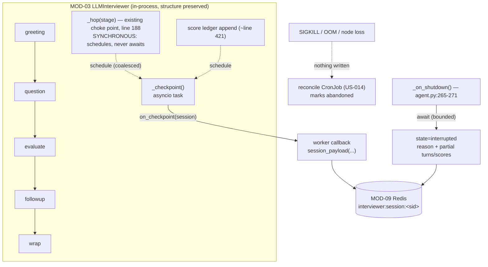

## US-013 — Per-hop checkpointing and interrupted snapshots

| | |
|---|---|
| **Covers** | BRD-05 · BRD-16 · UC-01 · UC-06 |
| **Modules** | MOD-02 (Voice Agent Worker), MOD-03 (Dialogue Brain — callback only), MOD-09 (Session Store) |
| **Depends on** | US-012 (the store, the shape, and the room→session mapping) |
| **Status** | Not started |

### Story

**Story statement:** As a candidate, I want a crashed or drained interview to be recorded with everything I had already completed, and reported honestly as interrupted, so that a worker death never costs me the questions I already answered, and I am never left staring at "Connected" over dead air.

**Business value.** Redis converts *silent loss* into a *reported state*. The distinction matters commercially: today a worker death produces a room that still looks healthy in the browser while nobody is listening, and a session that was never written anywhere — the worst possible pair. With a checkpoint per hop, a completed interview survives with the questions and scores that had already landed, and the operator can count interruptions by reason instead of guessing.

**What is NOT solvable, stated plainly.** If the worker *process* dies — OOM, node failure, SIGKILL past the grace period — that interview is gone. The candidate's microphone audio lives in an in-RAM `bytearray` (`agent.py:137-138`, `cap`, up to `MAX_ANSWER_SECONDS=120` × 16000 × 2 bytes ≈ **3.8 MB per room**), and the FSM is suspended mid-`await` across STT, LLM, RAG and TTS calls. Neither is serializable. The LiveKit room is a separate process, so the browser keeps showing "Connected" over dead air. **Redis does not buy resumption, and resumption is explicitly not built** — rewinding a candidate into a half-spoken question is worse UX than an honest failure. Blast radius is reduced by `limits.memory: 1Gi` (post-US-011 no model lives in the process, so OOM stops being plausible) and by the drain design in US-014.

## Acceptance Criteria

### AC-1 — The session is written at every hop boundary

```gherkin
**Given** a voice interview driven by a brain constructed with an on_checkpoint callback
**When** the FSM passes each stage boundary — greeting, question, evaluate, followup, wrap
**Then** the callback is invoked with the current Session
**And** the write contains every turn and score appended up to that boundary
**And** no checkpoint blocks the turn: the hop returns without waiting for the store
```

### AC-2 — A completed score is durable within one hop of being awarded

```gherkin
**Given** the judge has scored question 2 and the entry has been appended to the score ledger
**When** the next checkpoint runs
**Then** the persisted scores list contains that question's entry with its verdict and model answer
**And** a crash immediately afterwards loses at most the question still in flight
```

### AC-3 — Shutdown writes an interrupted snapshot

```gherkin
**Given** the worker receives a shutdown callback mid-interview (drain, SIGTERM, room closed)
**When** the callback runs
**Then** a snapshot is written with state "interrupted", a human-readable reason, and the partial transcript and scores
**And** the write is bounded so it cannot hang the framework's shutdown
**And** the candidate's browser receives the ended event with the same reason
```

### AC-4 — Checkpoint failure never breaks the interview

```gherkin
**Given** the session store raises or times out on a checkpoint
**When** the turn continues
**Then** the exception is swallowed and logged with the session id
**And** the FSM proceeds to the next stage unchanged
**And** the following checkpoint is still attempted
```

### AC-5 — Writes stay ordered and bounded under burst

```gherkin
**Given** several hops occur in quick succession (a follow-up round inside one question)
**When** the checkpoints are scheduled
**Then** at most one write is in flight at a time
**And** intermediate writes are coalesced rather than queued
**And** the final write carries a seq greater than every earlier write for that session
**And** the authoritative terminal write is awaited before the room is released
```

### AC-6 — The record is explicitly not resumable

```gherkin
**Given** an interrupted session record
**When** it is read back
**Then** it carries resumable=false and the reason for the interruption
**And** no code path in this story attempts to reconstruct a brain from it
**And** the UI path offers a fresh session instead (UC-07)
```

### AC-7 — SIGKILL leaves a detectable trace

```gherkin
**Given** a worker is killed with SIGKILL so no shutdown callback runs
**When** the reconcile job for stale in-progress sessions runs (US-014)
**Then** the session is marked "abandoned" with a reason, not left in-progress forever
**And** this story makes no claim to have written a snapshot in that case
```

### AC-8 — The brain is not refactored

```gherkin
**Given** the requirement to add checkpointing to interviewer/brain.py
**When** the change is reviewed
**Then** the diff adds a constructor keyword, a scheduling helper, one checkpoint call inside the existing _hop(), and one after the score append
**And** no FSM, prompting, RAG, scoring, TTS-orchestration, budget or event code is restructured
```

## HLD



**Why the callback and nothing else.** `brain.py` is ~500 lines owning the FSM, prompting, RAG calls, scoring, TTS orchestration, budget tracking and event emission. Adding a callback is additive; refactoring it for Kubernetes is the single most likely way to derail the schedule and buys the migration nothing (`REC-08`). The plan's position is explicit: **do not refactor `brain.py`.**

**Timing discipline.** `_hop()` is a synchronous method called at every stage boundary. Awaiting a Redis write there would put a network round-trip inside the turn the 1500 ms budget is measured on. The checkpoint is therefore scheduled, coalesced, and bounded — the correctness guarantee is "the store is at most one hop behind", not "the store write is synchronous".

## LLD

**`interviewer/brain.py`** — four small additions, no restructuring.

```python
# __init__ signature: append after decider
                 on_checkpoint: Callable[[Session], Awaitable[None]] | None = None):
    ...
    self._on_checkpoint = on_checkpoint
    self._checkpoint_task: asyncio.Task | None = None
    self._checkpoint_pending = False
    self._checkpoint_seq = 0

CHECKPOINT_TIMEOUT_S = 2.0

def _schedule_checkpoint(self) -> None:
    """Sync, non-blocking: called from _hop() and after each score append.
    Coalesces a burst into one follow-up write and never raises."""
    if self._on_checkpoint is None:
        return
    if self._checkpoint_task is not None and not self._checkpoint_task.done():
        self._checkpoint_pending = True          # collapse: one write follows
        return
    self._checkpoint_task = asyncio.create_task(self._checkpoint())

async def _checkpoint(self) -> None:
    self._checkpoint_pending = False
    self._checkpoint_seq += 1
    try:
        await asyncio.wait_for(self._on_checkpoint(self._session),
                               timeout=CHECKPOINT_TIMEOUT_S)
    except Exception:                            # telemetry never breaks a turn
        log.warning("checkpoint failed for %s", self._session.session_id,
                    exc_info=True)
    if self._checkpoint_pending:
        self._checkpoint_pending = False
        self._checkpoint_task = asyncio.create_task(self._checkpoint())
```

Call sites: one line inside the existing `_hop()` (line 188, after the budget record) and one line immediately after `s.scores.append({...})` (~line 421). `run()` awaits the final `_checkpoint()` once after building the summary, so the terminal state is durable before the return value is used.

**`interviewer/voice/interviewer.py`** — forward the new keyword through `build_voice_interviewer(..., *, stt=None, tts=None, on_checkpoint=None)` (US-011 adds the first two; land these in order so the same signature line is touched once).

**`interviewer/voice/agent.py`** — build the callback and the snapshot:

```python
store = RedisSessionStore(config.redis_url) if config.session_store == "redis" else None
seq = itertools.count(1)

async def _persist(s: Session) -> None:
    if store is None:
        return
    await store.save(s.session_id, session_payload(
        s, source="voice", doc_id=f"bank-{domain}", seq=next(seq)))
```

and in `_on_shutdown()` (line 265, today only `disconnected.set()`):

```python
async def _on_shutdown() -> None:
    disconnected.set()                       # unchanged: stops the job loop
    if store is not None:
        try:
            await asyncio.wait_for(store.save(session.session_id, session_payload(
                session, source="voice", state="interrupted",
                reason="worker shutting down (drain or termination)",
                seq=next(seq))), timeout=5.0)
        except Exception:
            log.exception("interrupted snapshot failed for %s", session.session_id)
```

The framework awaits the callback, so it must stay a coroutine and must be bounded — a 5 s cap keeps it well inside the 900 s grace period while never hanging shutdown.

**Snapshot shape (delta over US-012's payload).**

| Field | Value at interruption |
|---|---|
| `state` | `"interrupted"` |
| `reason` | `"worker shutting down (drain or termination)"` / `"interviewer error"` / `"empty bank"` |
| `resumable` | `false` — explicit, so no future reader assumes otherwise |
| `turns`, `scores` | whatever had landed at the last checkpoint |
| `stats` | only if the summary was ever built; otherwise absent |
| `seq` | strictly greater than the last checkpoint's |

**Edge cases.** Shutdown while a checkpoint is in flight (the snapshot's higher `seq` wins; a lower `seq` arriving later is ignored on read); store latency above 2 s (dropped checkpoint, logged, next hop retries); a room where `store` is `None` because the deployment is memory-backed (dev only — the worker logs once at startup that persistence is off); the summary being written twice (terminal write in `run_brain`'s finally is idempotent under the same key); `EmptyBankError` before any question (state is the FSM's actual state, never a fabricated `wrap`).

| # | Test scenario | File | Assertion |
|---|---|---|---|
| 1 | One checkpoint per hop boundary | `tests/test_brain.py` | fake callback invoked at greeting/question/evaluate/followup/wrap |
| 2 | Score durability | `tests/test_brain.py` | the checkpoint after the score append contains that ledger entry |
| 3 | Coalescing under burst | `tests/test_brain.py` | N rapid hops produce fewer writes, and the last write carries the highest `seq` |
| 4 | Store failure is swallowed | `tests/test_brain.py` | a raising callback still lets the interview reach `wrap` |
| 5 | No callback configured | `tests/test_brain.py` | text mode is byte-identical in behaviour; zero tasks scheduled |
| 6 | Interrupted snapshot on shutdown | `tests/test_voice_pipeline.py` | `_on_shutdown()` writes `state=interrupted`, `resumable=false`, with partial turns |
| 7 | Snapshot is bounded | `tests/test_voice_pipeline.py` | a hanging store does not hold the callback past the timeout |
| 8 | Existing suite unchanged | `tests/` (121 tests) | regression floor AS-04 stays green |

## Traceability

| ID | Requirement / decision | How this story satisfies it |
|---|---|---|
| BRD-16 | Interrupted interviews are reported, not lost | The shutdown snapshot records `interrupted` with a reason and partial results |
| BRD-05 | Durable voice sessions | Checkpoints make the transcript durable *during* the interview, not only at the end |
| BRD-06 | Scale-down drains, never kills | Drain (US-014) relies on the interrupted snapshot as its safety net when the grace period is exceeded |
| UC-01 | Take a voice interview — recovery scenario "reported as interrupted, fresh session offered, not resumed" | Implemented, with `resumable: false` making the non-goal explicit in data |
| UC-06 | Scale down without killing interviews — failure row "drain exceeds grace → kubelet kills; session recorded interrupted" | This is the mechanism that makes that row true |
| UC-07 | Resume after an interrupted interview — partial transcript and completed-question scores preserved | Preserved by the per-hop checkpoint |
| MOD-02 / MOD-03 / MOD-09 | Worker, brain (callback only), session store | Additive on all three; no structural change to the brain |
| See DAT-07 | Candidate audio buffer is process-local by nature | Documented as the root of the accepted gap; not externalized |
| Conflict CV-04 | Statelessness conflicts with the in-process audio buffer | Accepted gap; mitigated by drain + long grace + `maxUnavailable: 0` and made honest by BRD-16 |
| REC-08 | Preserve `brain.py` structure | The diff is a keyword, a helper, and two call sites |
| SM-01 / SM-02 | Interview FSM; worker lifecycle | Checkpoints follow the FSM's existing boundaries; interruption is a lifecycle event |

**Test files covering this story:** `tests/test_brain.py` (checkpoint scheduling, coalescing, failure tolerance), `tests/test_voice_pipeline.py` (shutdown snapshot, injection), `tests/test_session_store.py` (shape), `tests/` regression floor.
