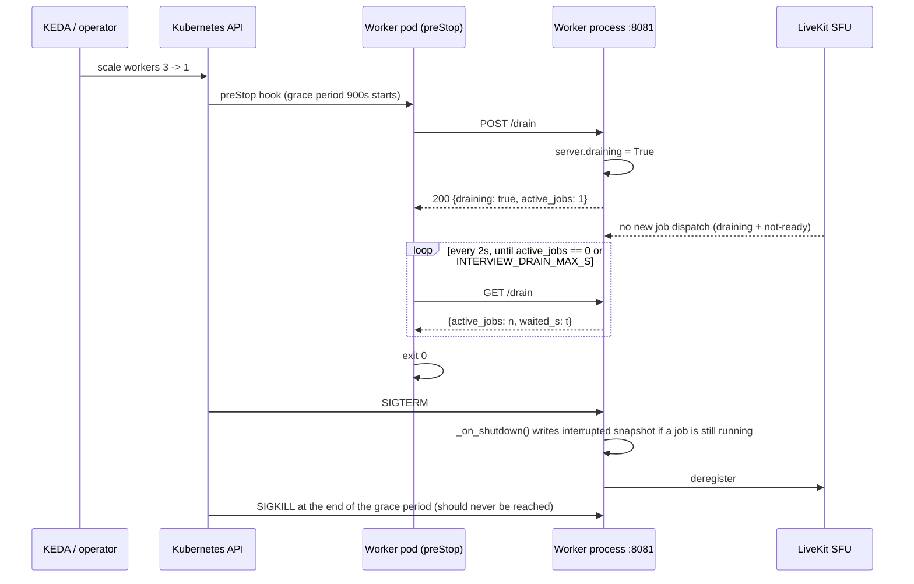

## US-014 — Graceful drain and session reconciliation

| | |
|---|---|
| **Covers** | BRD-06 · BRD-16 · UC-06 · UC-07 |
| **Modules** | MOD-02 (Voice Agent Worker), MOD-13 (Platform & Deployment) |
| **Depends on** | US-011 (finite load threshold), US-012/US-013 (the interrupted snapshot this design leans on) |
| **Status** | Not started |

### Story

**Story statement:** As a platform operator, I want scale-down to stop new dispatch to a worker and wait for its in-flight interviews to finish before the pod is terminated, so that an autoscaler reacts to falling traffic without cutting a candidate off mid-sentence.

**Business value.** A LiveKit interview is pinned to one worker process for its whole lifetime, so a naive scale-down does not degrade service — it destroys a live candidate session. With `load_threshold=float("inf")` (today's workaround, `worker.py:62`) every worker accepted every job, so *nothing* throttled dispatch and the drain is the only protection there is. This story is what makes elasticity safe to turn on (US-018).

## Acceptance Criteria

### AC-1 — Drain stops dispatch without killing the interview

```gherkin
**Given** a worker is running one interview
**When** POST /drain is called on its control port
**Then** server.draining is set so the framework refuses new job dispatch
**And** readiness flips to not-ready so the SFU and the scaler stop selecting it
**And** the in-flight interview continues to its natural end
**And** the process exits only after active jobs reach zero
```

### AC-2 — The wait is bounded and traceable

```gherkin
**Given** INTERVIEW_DRAIN_MAX_S is 900 and an interview outlives it
**When** the drain exceeds the bound
**Then** the preStop command exits anyway and the kubelet proceeds to SIGTERM
**And** the interview's interrupted snapshot (US-013) is the recorded outcome
**And** the log line names the session id and the reason "drain grace exceeded"
```

### AC-3 — Draining is idempotent and cheap

```gherkin
**Given** POST /drain has already been called
**When** it is called again
**Then** the second call is a no-op returning the same status
**And** a worker with zero active jobs exits immediately, in under two seconds
```

### AC-4 — Readiness reflects SFU registration, not process liveness

```gherkin
**Given** the worker process is alive but has not registered with the SFU
**When** GET /readyz is called on the control port
**Then** it answers 503 with the lifecycle state "registering"
**And** it answers 200 only in the "serving" state
**And** during "draining" it answers 503 while continuing to finish the interview
```

### AC-5 — Drain survives a degraded store

```gherkin
**Given** Redis is unreachable while a worker is draining
**When** the drain completes and the process exits
**Then** the drain still terminates the pod cleanly
**And** the persistence attempt is best-effort and logged, never a hang
```

### AC-6 — Stale sessions are reconciled, not left in progress

```gherkin
**Given** a worker was SIGKILLed so no shutdown callback ran and a session is still in progress
**When** the reconcile job runs
**Then** sessions whose last write is older than the stale threshold are marked "abandoned" with a reason
**And** already-terminal sessions are skipped untouched
**And** completed sessions are never modified
**And** running the job twice produces the same result
```

### AC-7 — The manifests encode the contract

```gherkin
**Given** the worker Deployment
**When** it is rendered
**Then** terminationGracePeriodSeconds is 900
**And** lifecycle.preStop runs the drain command with INTERVIEW_DRAIN_MAX_S available to it
**And** strategy is rollingUpdate with maxSurge 1 and maxUnavailable 0
**And** the ScaledObject's cooldownPeriod and scale-down stabilization window are both at least the grace period
```

### AC-8 — Known limitations are written down where they will be read

```gherkin
**Given** the manifests and the operator runbook
**When** a reader looks for how drain is protected
**Then** a comment in the ScaledObject and the PDB records that a PodDisruptionBudget does NOT protect against KEDA scale-down, because KEDA scales through the scale subresource, which deletes pods directly and bypasses the eviction API
**And** it records that minAvailable: 1 covers node drains and upgrades only
**And** that the real protection is preStop plus a long grace period
```

## HLD



**Sizing the grace period from the worst case.** 3 questions × (60 s answer timeout + speak + judge) + 90 s review gates per question + follow-ups ≈ **10 minutes**, hence 900 s. `INTERVIEW_DRAIN_MAX_S` is the operator's lever to trade live interviews for faster scale-down; it must be exposed as an env var rather than hardcoded because the right answer differs between staging and production.

**KEDA must not fight the grace period.** `cooldownPeriod` (default 300 s) and the HPA-like scale-down stabilization window must both be **≥** `terminationGracePeriodSeconds`; otherwise KEDA repeatedly deletes pods it just created, and each deletion risks a live interview.

**Two things that are widely misunderstood, stated as manifest comments:**

| Claim | Reality |
|---|---|
| "The PDB protects interviews from scale-down" | **No.** KEDA scales via the scale subresource, which deletes pods directly and bypasses the eviction API. `PodDisruptionBudget{minAvailable: 1}` covers node drains and cluster upgrades only. The protection is `preStop` + long grace (`minAvailable: 0` is honest here, and the PDB still protects node maintenance). |
| "maxUnavailable: 0 is enough" | It bounds a *deployment* rollout, not an autoscaler. Rolling updates route through this same preStop path, which is why `maxSurge: 1, maxUnavailable: 0` plus the drain command is the pair that matters. |

## LLD

**`interviewer/voice/control.py` (new)** — a tiny stdlib HTTP server so the worker image gains no dependency. Started from `worker.main()` on a daemon thread; the process's own event loop keeps serving the room.

```python
CONTROL_PORT = 8081

class WorkerState:
    """SM-02 lifecycle: starting | registering | serving | draining | failed | terminated."""
    state: str = "starting"
    active_jobs: int = 0
    def snapshot(self) -> dict[str, Any]: ...

def start_control_server(state: WorkerState, *, port: int = CONTROL_PORT,
                         on_drain: Callable[[], None] | None = None,
                         metrics_render: Callable[[], tuple[bytes, str]] | None = None
                         ) -> ThreadingHTTPServer:
    """Serves:
       GET  /healthz  -> 200 (process liveness only; never reflects SFU)
       GET  /readyz   -> 200 only when state == 'serving'; 503 otherwise
                         (reflects SFU registration, per SM-02)
       POST /drain    -> sets draining via on_drain(); idempotent
       GET  /drain    -> {draining, active_jobs, waited_s}
       GET  /metrics  -> prometheus_client.generate_latest() (US-015)
    """
```

`on_drain` sets `server.draining = True` on the LiveKit `AgentServer` — **framework support already exists**: `worker.py:73` already reads `server.draining` inside the patched `_is_available`. No new dispatch logic is required.

**`interviewer/voice/drain.py` (new)** — the preStop payload, deliberately a client of the control port so the wait happens where the grace period applies:

```python
"""python -m interviewer.voice.drain — preStop: ask the worker to drain,
poll until it has no jobs, then return so the kubelet can SIGTERM it."""
def main() -> int:
    # POST http://127.0.0.1:8081/drain
    # poll GET /drain every 2s up to INTERVIEW_DRAIN_MAX_S (default 900)
    # return 0 on drained, 0 on timeout (with a warning), never non-zero —
    # a failing preStop must not turn a scale-down into a stuck pod
```

**`interviewer/reconcile.py` (new)** — the case where no worker ever starts:

```python
async def reconcile_stale_sessions(store, *, stale_after_s: int = 3600,
                                   now: float | None = None) -> dict[str, int]:
    """-> {scanned, abandoned, skipped_terminal, errors}.
    Marks in-progress sessions whose persisted_at is older than the threshold
    with state='abandoned', reason='no worker — reconcile sweep'."""
```

This needs a bounded scan. Add to `RedisSessionStore` (US-012 file, additive): an index set `interviewer:active` — `SADD` on each checkpoint, `SREM` on a terminal or interrupted write — plus `async def list_active(self) -> list[str]`. A `SCAN` over the whole keyspace is rejected: it is O(keyspace) per sweep and the index is O(interviews in flight). The reconcile removes each id it abandons from the index so the sweep converges.

**`deploy/base/voice-worker/deployment.yaml`** — the contract:

```yaml
terminationGracePeriodSeconds: 900
strategy:
  type: RollingUpdate
  rollingUpdate: { maxSurge: 1, maxUnavailable: 0 }
lifecycle:
  preStop:
    exec:
      command: ["python", "-m", "interviewer.voice.drain"]
env:
  - name: INTERVIEW_DRAIN_MAX_S
    value: "900"
readinessProbe:  { httpGet: { path: /readyz,  port: 8081 }, periodSeconds: 5, failureThreshold: 3 }
```

**`deploy/base/data/reconcile-cronjob.yaml`** — `schedule: "*/10 * * * *"`, `concurrencyPolicy: Forbid`, `restartPolicy: OnFailure`, `activeDeadlineSeconds: 300`, running `python -m interviewer.reconcile`.

**`deploy/base/autoscaling/`** — `ScaledObject.spec.cooldownPeriod: 900` and `advanced.horizontalPodAutoscalerConfig.behavior.scaleDown.stabilizationWindowSeconds: 900`, each with a comment naming the coupling to `terminationGracePeriodSeconds`. A `PodDisruptionBudget{minAvailable: 1}` ships alongside with the comment from AC-8 explaining exactly what it does and does not cover.

**Edge cases.** Drain requested while a job is being accepted (the accept/refuse check runs under the same lock as `draining`); a candidate who stays silent for the full 60 s answer timeout during a drain (the bound is the answer to this); two drains racing (idempotent flag); the `preStop` command missing from the image (the kubelet would SIGTERM immediately — the image must ship `interviewer/voice/drain.py`, and the CI manifest job cannot catch this, so a smoke test asserts `python -m interviewer.voice.drain --help` inside the built worker image).

| # | Test scenario | File | Assertion |
|---|---|---|---|
| 1 | `/readyz` states | `tests/test_worker_control.py` (new) | 503 in starting/registering/draining; 200 only in serving |
| 2 | `/healthz` is liveness only | `tests/test_worker_control.py` | 200 even while registering |
| 3 | Drain is idempotent | `tests/test_worker_control.py` | two POSTs, one state change, same body |
| 4 | Drain sets the framework flag | `tests/test_worker_control.py` | `server.draining is True` after POST |
| 5 | Empty worker exits immediately | `tests/test_worker_control.py` | zero jobs → preStop returns in < 2 s |
| 6 | Bound is honoured | `tests/test_worker_control.py` | with a job that never ends, the CLI returns at `INTERVIEW_DRAIN_MAX_S` with a warning |
| 7 | Reconcile marks stale, skips terminal | `tests/test_session_store.py` | in-progress stale → `abandoned`; `wrap` untouched; idempotent second run |
| 8 | Index set converges | `tests/test_session_store.py` | abandoned ids leave `interviewer:active` |
| 9 | Manifests carry the contract | CI `manifest-validate` job | grace period, preStop, strategy and KEDA windows asserted via `kubeconform` + a `yq` assertion |
| 10 | Drain during a real interview | `scripts/e2e_voice_client.py` variant | a `POST /drain` mid-interview does not truncate it; `state=wrap` still reached |

## Traceability

| ID | Requirement / decision | How this story satisfies it |
|---|---|---|
| BRD-06 | Scale-down drains, never kills | preStop drain + 900 s grace + readiness flip + `maxUnavailable: 0` |
| BRD-16 | Interrupted interviews are reported, not lost | The bounded drain and the reconcile sweep both land on a reported state rather than silence |
| UC-06 | Scale down without killing interviews — full 14-row scenario table | Happy (drain completes), timeout (`INTERVIEW_DRAIN_MAX_S`), empty (no jobs), failure (grace exceeded), recovery (reconcile), idempotency (repeat drain), degraded dependency (Redis down), observability (draining gauge) |
| UC-07 | Resume after an interrupted interview | The reconcile sweep is what makes an interrupted session visible to the candidate |
| UC-10 | Diagnose a worker that never registered | `/readyz` on the control port reflects registration, so a never-dispatched pod is visibly non-serving |
| MOD-02 | Voice worker lifecycle | SM-02 states become observable on :8081 |
| MOD-13 | Platform & deployment | Grace period, preStop, strategy, KEDA windows, CronJob, PDB |
| REC-05 | Always-accept load threshold | The finite threshold (US-011) is what makes drain meaningful: without it every worker accepted everything and no drain could ever converge |
| Conflict CV-05 | Drain conflicts with `float("inf")` | Resolved by coupling: engine extraction first, finite threshold, then drain |
| State machine SM-02 | Worker lifecycle machine | `/readyz` and the drain path are its observable surface |

**Test files covering this story:** `tests/test_worker_control.py` (new), `tests/test_session_store.py` (index + reconcile), CI `manifest-validate` (the manifest contract), `scripts/e2e_voice_client.py` (drain-under-load acceptance).
