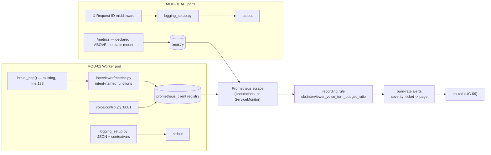

## US-015 — Latency metrics and the budget SLO

| | |
|---|---|
| **Covers** | BRD-09 · BRD-13 · UC-09 |
| **Modules** | MOD-12 (Observability), MOD-01 (Management API), MOD-02 (Voice Agent Worker) |
| **Depends on** | US-011 (remote engines), US-014 (the worker control port that exposes `/metrics`), US-008 (per-call metrics so attribution is correct) |
| **Status** | Not started |

### Story

**Story statement:** As an on-call engineer, I want every voice turn's per-hop latency exported as metrics, with an SLO on the 1500 ms budget and burn-rate alerting, so that I can name which engine broke the budget in one dashboard read, instead of grepping a log file for a `voice_budget_bar` string.

**Business value.** The product's core quality claim is currently unfalsifiable in production. **The data already exists** — `LatencyBudgetTracker` records per-hop stage timings, `LLMMetrics` records first-token and total milliseconds, `_hop()` runs at every stage boundary and already accepts `**extra`, and every summary already carries a five-stage bar. `REC-12` is explicit: this is **wiring, not measurement**. It is also the cheapest high-value change in the plan and it needs no GPU.

**Honesty about the target.** Measured today: round-trip **6.5–8.4 s** against a 1500 ms budget — violated 4–6×, with TTS first audio ~3.6 s and STT ~1.0 s on CPU. The SLO therefore ships at `severity: ticket` until the GPU engines land, then is promoted to `page`. **Never ship a paging alert against a target you know you are 5× away from** — the fastest route to muted alerts and a lost signal (`CV-03`, Discovery Challenge 12).

## Acceptance Criteria

### AC-1 — Per-stage turn latency is exported from the existing choke point

```gherkin
**Given** a voice interview in progress
**When** the FSM crosses a stage boundary
**Then** one observation is recorded for each stage value present in the hop record: stt_final, rag, llm_first_token, tts_first_audio, judge_wait
**And** the observation lands on interviewer_turn_duration_ms as a histogram labelled by stage
**And** no call site outside interviewer/metrics.py imports prometheus_client
```

### AC-2 — The budget ratio is countable

```gherkin
**Given** a turn whose recorded total is within BUDGET_MS
**When** the hop is observed
**Then** interviewer_turn_within_budget{within="true"} is incremented
**And** a turn over budget increments within="false"
**And** the two label values together are the denominator of the budget ratio
```

### AC-3 — Engine attribution is correct

```gherkin
**Given** a voice turn followed by a judge call in the same interview
**When** both complete
**Then** interviewer_llm_first_token_ms is observed with engine="voice" for the hot path and engine="judge" for the evaluator
**And** neither observation carries the other's value
**And** this is why US-008 must land first: instance-state metrics would attribute the judge's latency to the voice hop
```

### AC-4 — The SLO exists as a recording rule with burn-rate alerts

```gherkin
**Given** the metrics are scraped
**When** the recording rule evaluates
**Then** slo:interviewer_voice_turn_budget_ratio equals the 5-minute ratio of within-budget turns to all turns
**And** multi-window burn-rate alerts exist for the 5% error budget (1h/5m and 6h/30m windows)
**And** their severity is "ticket" while the measured round-trip is 6.5-8.4 s
**And** a comment records the promotion condition: GPU engines in place and the ratio sustained near target
```

### AC-5 — Stage budgets alert individually

```gherkin
**Given** a TTS regression pushes first audio above its 200 ms stage budget
**When** the alert evaluates over a 10 minute window
**Then** a stage-specific alert fires naming tts_first_audio
**And** equivalent alerts exist for stt_final above 300 ms and llm_first_token above 500 ms
**And** the alert annotations say which tier to scale or investigate
```

### AC-6 — /metrics is reachable on both planes

```gherkin
**Given** the API is serving
**When** GET /metrics is requested
**Then** it returns the exposition format with HTTP 200
**And** it is declared above the static mount, so the catch-all cannot shadow it
**And** a regression test asserts the route is not shadowed

**Given** the worker is serving an interview
**When** GET /metrics is requested on the control port
**Then** the turn histogram exposes observations from that interview
```

### AC-7 — A silently empty /metrics is treated as a defect

```gherkin
**Given** the worker runs its job processes in a forked executor
**When** a job completes
**Then** either the single-process executor is configured, matching one-job-per-pod
Or PROMETHEUS_MULTIPROC_DIR is set and the process is restarted between runs
**And** a test asserts a non-empty exposition after a completed job, because an empty /metrics is worse than no metrics at all — it looks like a working system with no traffic
```

### AC-8 — Structured logs carry correlation ids

```gherkin
**Given** LOG_FORMAT=json
**When** any log line is emitted during a turn
**Then** it is one JSON object on stdout carrying session_id, room and request_id from a contextvar
**And** with LOG_FORMAT=text (the default) the output is byte-identical to today's format, so Windows developer logs do not change
**And** every HTTP request through the API echoes or creates X-Request-ID and puts it in the contextvar
```

### AC-9 — Empty and degraded states are visible, not silent

```gherkin
**Given** no interviews have run since the process started
**When** a dashboard queries the turn histogram
**Then** the series is absent and the panel shows "no data" rather than a false zero

**Given** the metrics pipeline is down
**When** a latency breach occurs
**Then** the fallback signal is the voice_budget_bar line already present in every session summary
```

### AC-10 — Scrape configuration is portable by default

```gherkin
**Given** a cluster without the Prometheus Operator
**When** the base is applied
**Then** prometheus.io/scrape, prometheus.io/port and prometheus.io/path annotations are present on the API and worker pods
**Given** a cluster with the Operator
**When** the observability overlay is applied
**Then** a ServiceMonitor is added as well
**And** neither is required for the other to work
```

## HLD



**The measurement is already done; only the export is missing.** `_hop()` computes `stt_final_ms`, `rag_total_ms`, `llm_first_token_ms`, `tts_first_audio_ms` and `judge_wait_ms`, and `LatencyBudgetTracker.record()` already derives `within_budget` from `BUDGET_MS = 1500.0`. `prometheus-client` is chosen over OTel for the first pass — ~200 KB, pure Python, no exporter sidecar — with every metric behind an intent-named function so the backend stays swappable without touching a call site.

**Cardinality discipline.** No per-session or per-room label anywhere: `MOD-12`'s stated 10× bottleneck is exactly that. Session ids belong in logs and in the Redis payload, not in metric labels.

## LLD

**`interviewer/metrics.py` (new)** — the only module that imports `prometheus_client`.

```python
TURN_BUCKETS = (50, 100, 150, 200, 300, 500, 750, 1000, 1500, 3000, 5000, 10000)

def observe_hop(stage: str, *, stt_ms: float, rag_ms: float,
                llm_first_token_ms: float, tts_first_audio_ms: float,
                judge_wait_ms: float, total_ms: float, within: bool) -> None: ...
def observe_llm_first_token(engine: str, ms: float) -> None: ...   # engine: voice | judge
def observe_rag_cache(hit: bool) -> None: ...
def inc_session(state: str) -> None: ...                          # wrap | interrupted | abandoned | failed
def set_active_interviews(n: int) -> None: ...
def set_worker_draining(draining: bool) -> None: ...
def set_worker_registered(registered: bool) -> None: ...
def render() -> tuple[bytes, str]: ...                            # body, content-type
```

| Series | Type | Labels | Why |
|---|---|---|---|
| `interviewer_turn_duration_ms` | Histogram | `stage` ∈ stt_final/rag/llm_first_token/tts_first_audio/judge_wait | The five-stage breakdown the dashboard reads; buckets tuned to the stage budgets |
| `interviewer_turn_within_budget` | Counter | `within` ∈ true/false | The SLO's numerator and denominator |
| `interviewer_llm_first_token_ms` | Histogram | `engine` ∈ voice/judge | Separates the hot path from the evaluator, which have different SLOs |
| `interviewer_rag_cache_hits_total` | Counter | `result` ∈ hit/miss | The Phase-1 cache gate metric, currently only in a summary |
| `interviewer_sessions_total` | Counter | `state` | Interruption rate by reason |
| `interviewer_active_interviews` / `interviewer_worker_draining` | Gauge | — | Same source as `/readyz` and the scaler endpoint (US-018); drain observability for UC-06 |
| `livekit_worker_registered` | Gauge | — | The primary signal for UC-10 and open item P2 |

**`interviewer/brain.py`** — one call, inside the existing `_hop()` (line 188), guarded so telemetry can never break a turn:

```python
if self._budget is not None and stage in ("greeting", "question", "followup", "wrap"):
    turn = self._budget.record({...})          # existing
    metrics.observe_hop(stage, stt_ms=self._last_stt_ms, rag_ms=self._last_rag_ms, ...,
                        total_ms=turn.total_ms, within=turn.within_budget)
```

plus `metrics.observe_llm_first_token("voice" | "judge", ms)` where `_speak` and `_judge` already know which engine they used. Nothing else in `brain.py` changes.

**`interviewer/server.py`** — three additions: the `/metrics` route **above** the static mount (the mount at line 317-319 is a catch-all and this codebase has already been bitten by route shadowing); the `X-Request-ID` middleware (cheapest distributed-tracing substitute: generate when absent, echo when present, bind to the contextvar); and `configure_logging()` at import.

**`interviewer/logging_setup.py` (new)** — the FastAPI app currently has **no logging configuration at all**.

```python
_request_id, _session_id, _room: ContextVar[str | None]   # bound per turn

def bind_context(**kw) -> contextmanager[None]: ...
def configure_logging(fmt: str | None = None) -> None:
    """fmt = LOG_FORMAT env: 'text' (default, byte-identical to today) | 'json'."""
class JsonFormatter(logging.Formatter): ...   # ts, level, logger, msg, session_id, room, request_id, exc_info
```

**`deploy/base/observability/`** — the SLO, as code:

```promql
slo:interviewer_voice_turn_budget_ratio =
  sum(rate(interviewer_turn_within_budget_total{within="true"}[5m]))
  / sum(rate(interviewer_turn_within_budget_total[5m]))

# burn rate (5% error budget): 1h/5m and 6h/30m window pairs, thresholds 14.4 and 6
# severity: ticket <- promote to page once GPU engines land and the ratio holds

# stage alert example — names the tier that needs GPU, not just "slow"
histogram_quantile(0.95,
  sum(rate(interviewer_turn_duration_ms_bucket{stage="tts_first_audio"}[5m])) by (le)) > 200
```

Ship `prometheusrule.yaml`, `servicemonitor.yaml`, and the port/path annotations on both Deployments (annotations are the **portable default** — the Operator is not installed everywhere; the ServiceMonitor is the opt-in overlay for clusters that have it). **Edge cases.** A turn where the budget tracker exists but no stage values were recorded (observe zeros only for the stages actually present — never fabricate a zero that would drag a percentile down); `judge_wait` is off the hot path and must not be counted in the turn's within-budget decision (the brain's existing `_hop` already restricts budget recording to greeting/question/followup/wrap — preserve that); a forked job process writing to a shared multiproc directory needs the directory cleared on process start; `/metrics` on the API must not be cached by an ingress (no `proxy_cache`, and `Cache-Control: no-store`).

| # | Test scenario | File | Assertion |
|---|---|---|---|
| 1 | Hop observation shape | `tests/test_metrics.py` (new) | one sample per present stage; `within` matches `TurnLatency.within_budget` |
| 2 | Engine attribution | `tests/test_metrics.py` | voice and judge first-token samples are distinguishable |
| 3 | Session counter by state | `tests/test_metrics.py` | `wrap` and `interrupted` increment separate series |
| 4 | Intent-named boundary | `tests/test_metrics.py` | no module outside `metrics.py` imports `prometheus_client` (source scan) |
| 5 | `/metrics` not shadowed; non-empty after a job | `tests/test_skills_api.py`, `tests/test_voice_pipeline.py` | GET `/metrics` returns 200 `text/plain`; the worker exposition carries a turn sample after a completed interview |
| 7 | JSON log shape | `tests/test_logging.py` (new) | one JSON object per line, with `session_id` filled from the contextvar |
| 8 | Text format unchanged | `tests/test_logging.py` | `LOG_FORMAT=text` output matches the current format string byte-for-byte |
| 9 | X-Request-ID | `tests/test_skills_api.py` | supplied id is echoed; absent id is generated; both appear in the log line |
| 10 | Recording rule evaluates | CI / staging | the rule is valid PromQL and produces a ratio in (0, 1] |
| 11 | Alerts are ticket severity | CI / staging | burn-rate rules carry `severity: ticket` and the promotion comment |

## Traceability

| ID | Requirement / decision | How this story satisfies it |
|---|---|---|
| BRD-09 | Every voice turn records per-hop latency and reports it against the budget | The existing hop ledger is exported; the budget ratio becomes a time series |
| BRD-13 | Metrics, structured logs to stdout, and an SLO with burn-rate alerting | All three delivered: series, JSON logs with correlation ids, recording rule plus alerts |
| UC-09 | Investigate a latency-breach — "the offending hop is identified in one dashboard read" | The five-stage histogram with stage-labelled buckets is that read |
| UC-10 | Diagnose a worker that never registered | `livekit_worker_registered` is the primary signal, exported here |
| MOD-12 | Observability as a cross-cutting library | Metrics behind intent-named functions; backend swappable; cardinality bounded |
| REC-12 | Instrumentation exists but is not exported | Extend — one `observe` call at the existing choke point |
| Conflict CV-02 | Per-call metrics must precede per-process engines | The `engine` label is only trustworthy once US-008 lands |
| Conflict CV-03 | Budget is violated 4–6× today | SLO ships at ticket severity, with a written promotion condition |
| WF-03 | Incident response for a latency breach | The stage alerts are the entry point of that workflow |

**Test files covering this story:** `tests/test_metrics.py` (new), `tests/test_logging.py` (new), `tests/test_skills_api.py` (route ordering, request id), `tests/test_voice_pipeline.py` (worker exposition), `tests/test_budget.py` (budget semantics), CI `manifest-validate` and the staging recording rule.
