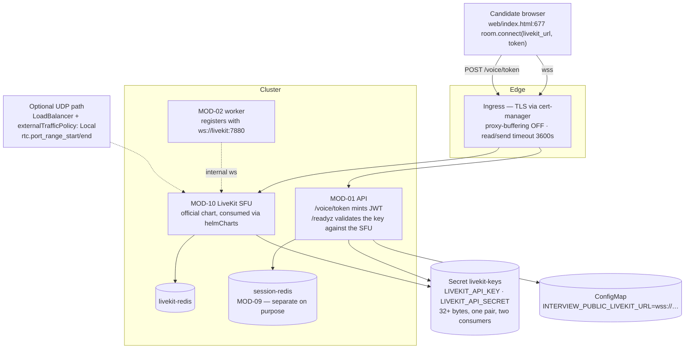

## US-016 — Production LiveKit keys, TLS and secrets

| | |
|---|---|
| **Covers** | BRD-11 · BRD-12 · UC-01 · UC-08 |
| **Modules** | MOD-10 (Realtime Transport), MOD-13 (Platform & Deployment), MOD-01 (Management API) |
| **Depends on** | US-019 (the Kustomize base this plugs into) |
| **Closes** | Open item **P5** — production LiveKit, HTTPS/WSS, real keys |
| **Status** | Not started |

### Story

**Story statement:** As a platform operator, I want LiveKit deployed from its official chart with real credentials, a browser-reachable `wss://` URL and no secrets in git or in an image, so that a candidate anywhere can take an interview without a tunnel whose hostname changes on every start.

**Business value.** `livekit-server --dev` with `devkey`/`secret` and a `127.0.0.1` URL cannot serve a remote candidate, and the launcher currently works around it by **restarting the management plane after tunneling** — because the URL returned by `/voice/token` is origin-sensitive and `web/index.html:677` connects with `room.connect(body.livekit_url, token)`. In-cluster that URL becomes a ConfigMap value, the restart dance disappears, and the whole class of "it worked on my machine" transport failures goes with it. Buying the SFU (MOD-10) and gluing it with Kustomize's helm inflator is also what makes `kubectl apply -k` cover the entire system in one command (US-019).

## Acceptance Criteria

### AC-1 — The SFU is deployed and reproducible from the repo

```gherkin
**Given** a conformant cluster
**When** kubectl apply -k deploy/overlays/<env> is run
**Then** the LiveKit SFU is deployed from the committed rendered manifests, with no network access to a Helm repository required at apply time
**And** a documented make target re-renders the chart through Kustomize's helmCharts inflator and diffs the result against the committed output
**And** CI fails when the committed render differs from a fresh render of the pinned chart version
```

### AC-2 — One credential pair, two consumers, verified agreement

```gherkin
**Given** a key and secret pair of at least 32 bytes
**When** the API mints a token and the SFU validates it
**Then** both read the same Secret keys, so the JWT grants validate against the key the SFU checks
**And** a mismatch cannot present as an opaque browser "invalid token", because a startup assertion and the /readyz dependency check catch it first
**And** the check calls the LiveKit server API, which validates the key against the running SFU rather than merely checking that the variable is non-empty
```

### AC-3 — The browser receives a reachable URL

```gherkin
**Given** the API runs inside the cluster
**When** POST /voice/token responds
**Then** livekit_url is the public wss:// URL from configuration
**And** the worker separately registers against the in-cluster ws:// service URL
**And** no API restart is required after a transport or ingress change beyond the normal rollout
```

### AC-4 — A realtime WebSocket survives the ingress

```gherkin
**Given** the ingress in front of the SFU
**When** a candidate joins a room over wss and speaks for several minutes
**Then** response buffering is disabled
**And** the read and send timeouts are 3600 seconds
**And** the session is not dropped by an idle or buffering proxy
```

### AC-5 — Media path options are explicit

```gherkin
**Given** the base deployment
**When** media transport is configured
**Then** the default is TCP-only over wss:// through the ingress, which needs no cloud-specific networking
**And** UDP is available as a documented upgrade: a LoadBalancer Service with externalTrafficPolicy Local and the chart's rtc.port_range_start/rtc.port_range_end, with cloud-specific annotations confined to the overlay
```

### AC-6 — LiveKit gets its own Redis

```gherkin
**Given** the session store and the SFU both need Redis
**When** the base is applied
**Then** two independent single-replica Redis Deployments exist
**And** a FLUSHALL on the session store leaves LiveKit room state intact
**And** the cost is stated: roughly 10 MB per instance, which is cheaper than one incident class
```

### AC-7 — No secret is in the repository or an image

```gherkin
**Given** a fresh clone
**When** a secret scanner runs over the repository and the built images
**Then** no credential, token or key is found
**And** secret.example.yaml documents every required key with placeholder values
**And** the base uses a plain Secret for the scaffold while cloud overlays add External Secrets Operator (AWS, GCP, Azure, Vault, or the fake/kubernetes provider for local)
**And** sealed-secrets is documented as the alternative where no cloud KMS is available
```

### AC-8 — Rotation is safe and observable

```gherkin
**Given** the operator writes a new key pair to the secret store
**When** the SFU and API deployments restart
**Then** a fresh interview connects with the new credentials
**And** rooms that are already established are unaffected until they close
**And** an absent or placeholder secret makes the pod fail fast rather than falling back to devkey in a cluster
```

## HLD



**Why the chart, bought rather than built (MOD-10).** The SFU's configuration surface — RTC port ranges, TURN, node-IP advertisement, multi-node Redis, key format — changes between versions and is a maintenance liability to hand-roll. Consuming it through Kustomize's `helmCharts:` inflator keeps one deployment command and one reviewable build, while committing the rendered output removes a build-time network dependency and makes the applied state reproducible.

**The ingress lines that are almost always missed.** An ingress that buffers frames destroys a realtime SFU session, and the failure looks like random call drops rather than a proxy problem. Buffering off and 3600-second read/send timeouts are **mandatory**, not tuning (`Discovery Challenge 8`). The requirement is transport-agnostic; the annotation names below are nginx-ingress specific, and other controllers (Traefik, cloud L7) express the same three requirements in their own vocabulary — an overlay may translate them but may not drop them.

## LLD

**`deploy/base/third-party/livekit/`** — two directories, deliberately:

```
deploy/third-party/livekit/
  kustomization.yaml        # plain `resources:` list — applies with no network, no helm binary
  rendered.yaml             # the COMMITTED chart output (reproducibility + air-gapped apply)
  values.yaml               # the values that produced rendered.yaml
  helm/kustomization.yaml   # `helmCharts:` inflator — build-time only, needs --enable-helm
  helm/values.yaml
scripts/render-livekit.sh   # kustomize build --enable-helm deploy/third-party/livekit/helm > rendered.yaml
```

`kustomize build --enable-helm` is required for `helmCharts:` in Kustomize v5. The chart version is pinned exactly, and CI re-renders and diffs — a floating chart version is the same failure mode `REC-06` fixes for `livekit-agents`.

**Secret (base)** — `deploy/base/secrets/secret.example.yaml` is committed; the real Secret is created per environment.

| Key | Consumer | Note |
|---|---|---|
| `LIVEKIT_API_KEY` | SFU + API | ≥ 32 bytes; generated, never derived from a hostname or a date |
| `LIVEKIT_API_SECRET` | SFU + API | ≥ 32 bytes |
| `INTERVIEW_PUBLIC_LIVEKIT_URL` | API (ConfigMap, not a secret) | `wss://…` — browser-reachable |

**Chart caveat, stated honestly:** the exact mechanism for feeding the key pair into the SFU without committing it to a values file depends on the pinned chart version (either an existing-Secret reference, or rendering the chart's keys file from the mounted Secret at container start). Whichever is used, the CI manifest job must assert that the SFU and the API reference **the same Secret name and the same key names** — that assertion is the real requirement, because a mismatch is invisible until a candidate's browser says "invalid token".

**`interviewer/config.py`** — add `public_livekit_url` (`INTERVIEW_PUBLIC_LIVEKIT_URL`). `/voice/token` returns `config.public_livekit_url or config.livekit_url`; the worker keeps using `config.livekit_url` rewritten `http→ws` for registration (`worker.py:58`). One environment variable pair, two audiences — which is exactly what removes the launcher's restart-after-tunnel workaround.

**`interviewer/server.py` `/readyz`** — the dependency check for LiveKit performs a real server API call (`livekit-api`'s room service client, e.g. list rooms) so a key mismatch or an unreachable SFU surfaces as not-ready with a named dependency, rather than as a browser-side opaque failure. It must be non-fatal for the API's overall readiness behind a config flag (the same pattern as the RAG dependency in `BRD-02`): a LiveKit outage should not take down the static UI.

**`deploy/base/third-party/livekit/ingress.yaml`** — the required settings, annotated with *why*:

| Setting | Value | Consequence if missed |
|---|---|---|
| Response buffering | off | Frames are held; the realtime session dies |
| Read timeout | 3600 s | Long interviews are cut by a proxy idle timer |
| Send timeout | 3600 s | Same, in the other direction |
| HTTP version | 1.1 | WebSocket upgrade is refused by some proxies |
| TLS | cert-manager issuer annotation | No `wss://`, so no browser media at all |

**Edge cases.** A candidate behind a proxy that blocks UDP (TCP-only path must work, which is why it is the default); TLS certificate renewal mid-interview (existing connections survive; new joins reconnect); the SFU chart's own service type left as `ClusterIP` when UDP is enabled (the LoadBalancer must be the media service, not the API service); two Redis instances accidentally pointed at the same Service name (a manifest assertion compares the two `redis_url` values are different); dev overlays that legitimately need `devkey`/`secret` — those live in `deploy/overlays/local`, never in the base.

| # | Test scenario | File | Assertion |
|---|---|---|---|
| 1 | Token URL is the public one | `tests/test_voice_pipeline.py` | `/voice/token` returns `wss://…` when `INTERVIEW_PUBLIC_LIVEKIT_URL` is set |
| 2 | Key agreement asserted | `tests/test_voice_pipeline.py` | a populated key/secret pair that the SFU rejects surfaces as not-ready |
| 3 | Placeholder credentials rejected in-cluster | `tests/test_voice_pipeline.py` | `devkey`/`secret` fail fast when not in the dev environment |
| 4 | Rendered chart is current | CI `manifest-validate` | committed render == fresh render of the pinned chart version |
| 5 | Ingress settings present | CI `manifest-validate` | buffering off, both timeouts 3600, HTTP 1.1 asserted with `yq` |
| 6 | Same secret on both consumers | CI `manifest-validate` | SFU and API reference identical Secret name and keys |
| 7 | Two Redis instances | CI `manifest-validate` | LiveKit and session-store Redis URLs differ |
| 8 | No secrets committed | CI secret scan | clean on a fresh clone and on the built images |
| 9 | Browser interview over wss | `scripts/e2e_voice_client.py` against staging | `state=wrap` over TLS with real credentials |
| 10 | Rotation | manual runbook (UC-08) | new keys live; a fresh interview connects; existing rooms unaffected |

## Traceability

| ID | Requirement / decision | How this story satisfies it |
|---|---|---|
| BRD-11 | Production LiveKit: real credentials, TLS-terminated wss reachability, multi-node support | Official chart via the helm inflator, one real key pair, cert-manager TLS, chart-managed multi-node Redis |
| BRD-12 | No secrets in images or the repository | Secret-per-environment, committed example file, ESO in overlays, sealed-secrets documented, CI scan |
| UC-01 | Take a voice interview — precondition "LiveKit reachable over wss://" | The precondition becomes true for a remote candidate, not only for localhost |
| UC-08 | Rotate LiveKit keys or secrets — the full 14-row scenario table | Shared secret, startup assertion, readiness check, fail-fast on absence, rotation without disturbing live rooms |
| MOD-10 | Realtime transport — buy, don't build | Official Helm chart, consumed through Kustomize `helmCharts:` |
| MOD-13 | Platform & deployment | Overlays, secrets, ingress, separate Redis |
| Open item P5 | Production LiveKit + HTTPS/WSS | Closed by this story; the OIDC half remains with the auth decision (`BRD-17`) |
| Discovery Challenge 8 | "What if the ingress buffers WebSocket frames?" | The buffering and timeout settings are mandatory and are called out with their failure modes |

**Test files covering this story:** `tests/test_voice_pipeline.py` (token URL, key assertions), CI `manifest-validate` and the secret scan, `scripts/e2e_voice_client.py` (staging acceptance over `wss://`).
