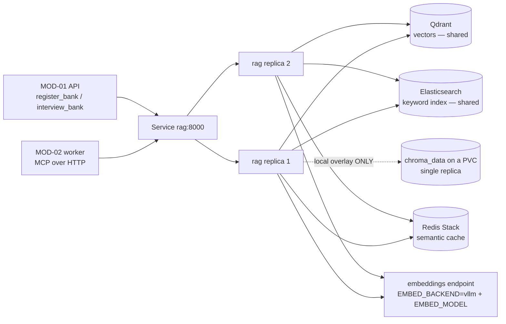

## US-017 — Multi-replica RAG on shared backends

| | |
|---|---|
| **Covers** | BRD-10 · UC-01 · UC-03 · UC-04 |
| **Modules** | MOD-04 (RAG Service) |
| **Depends on** | US-019 (base + overlays), US-017's own data tier manifests |
| **Status** | Not started |

### Story

**Story statement:** As a skill author, I want a question bank I register to be immediately available from every RAG replica, so that retrieval does not depend on which replica answered a request, and a new domain is usable without a restart.

**Business value.** The RAG service is consumed over MCP by the worker on the interview hot path. Today it cannot run at more than one replica: the BM25 index lives **in process memory** (`adapters/bm25_memory.py:27-31`) and is warmed only at boot (`cli.py:74-81`), while Chroma persists to **local disk** (`config.py:171-173`, `chromadb.PersistentClient(path=self.chroma_path or _REPO_ROOT/"chroma_data")`). A bank registered on replica A is invisible to replica B, and each new replica pays a full re-index. Every blocker is a configuration value rather than code: the Qdrant, Elasticsearch and RedisVL adapters already exist.

## Acceptance Criteria

### AC-1 — Registration is visible on every replica without a restart

```gherkin
**Given** two RAG replicas behind one Service
**When** a bank is uploaded through POST /skills
**Then** a retrieval against either replica returns chunks from that bank
**And** no replica is restarted
**And** a second upload of the same bank replaces rather than duplicates on both
```

### AC-2 — The keyword leg is shared

```gherkin
**Given** RAG_CORE_KEYWORD_BACKEND=elasticsearch and a reachable Elasticsearch
**When** a keyword-only query is issued to either replica
**Then** both return the same matches, because the index is a shared cluster rather than process memory
**And** no warm-up pass is required at boot
```

### AC-3 — Vectors survive a pod

```gherkin
**Given** RAG_CORE_VECTOR_BACKEND=qdrant and a reachable Qdrant
**When** a RAG pod is deleted and replaced
**Then** the new replica serves existing vectors with no re-ingestion
**And** Chroma's local-disk path is not used in the cluster
```

### AC-4 — The semantic cache is shared and measurable

```gherkin
**Given** RAG_CORE_CACHE_BACKEND=redisvl and a Redis Stack instance (RediSearch and RedisJSON, not plain Redis)
**When** the same rubric query is issued to replica A and then replica B
**Then** the second request is a cache hit
**And** cache_hit_rate reported in the interview summary is non-zero
```

### AC-5 — The service actually listens on a routable address

```gherkin
**Given** the RAG Deployment
**When** the container starts
**Then** the command passes --host 0.0.0.0, because the CLI default is 127.0.0.1
**And** a pod that omits it never becomes ready, because the readiness probe cannot reach it
**And** the port is the CLI's --port value, matching the Service targetPort
```

### AC-6 — Embeddings are configured, not assumed

```gherkin
**Given** a RAG pod on a CPU node
**When** the process builds its stack
**Then** EMBED_BACKEND is set explicitly rather than left to auto-detection, which would resolve to ollama at localhost:11434 inside the pod
**And** the embedding base URL points at an in-cluster endpoint
**And** EMBED_MODEL is set, because the mlx/vllm/openai backends require it
**And** a retrieval succeeds end to end from a fresh pod
```

### AC-7 — Readiness reflects the MCP surface

```gherkin
**Given** a RAG pod is starting
**When** the readiness probe runs
**Then** it performs an MCP initialize request against POST /mcp and accepts only a 200
**And** the probe has a generous startupProbe budget, because stack construction connects to three backends
**And** a pod whose backends are unreachable stays not-ready rather than accepting retrieval it cannot serve
```

### AC-8 — The local overlay keeps the light path

```gherkin
**Given** deploy/overlays/local
**When** it is applied to a kind cluster
**Then** the RAG service runs a single replica with bm25 and chroma on a PVC
**And** it is documented that this path is not multi-replica-correct by design
**And** the base ships the Elasticsearch and Qdrant path, which is the production truth
```

### AC-9 — Degradation, not failure, when the keyword leg is down

```gherkin
**Given** Elasticsearch becomes unavailable
**When** a hybrid query arrives
**Then** the vector leg still returns results and the request does not 500
**And** the degradation is visible in logs and metrics rather than silent
```

### AC-10 — The unauthenticated MCP endpoint is recorded as a real gap

```gherkin
**Given** RAG_CORE_AUTH_MODE defaults to none
**When** the platform is deployed
**Then** the RAG Service is ClusterIP-only and a NetworkPolicy admits ingress only from the API and worker pods
**And** the residual risk is recorded explicitly: any workload in the namespace can call an unauthenticated tool surface that writes banks
**And** the OIDC path is named as the follow-up, including the fact that its resource server URL defaults to a loopback address that must be overridden
```

## HLD



**Everything needed already exists; this is manifests plus two configuration values.** The adapters are present and selectable by environment variable, so no service code changes. The honest caveat, in the interest of not overclaiming: **no test in `enterprise-rag-core` instantiates `QdrantVectorStore` or `ElasticsearchKeywordStore` against a live server.** `tests/test_qdrant_filters.py` exercises the filter builder against an in-memory client, `tests/test_adapters.py` covers memory/bm25/none/chroma, and `tests/test_smoke.py` asserts import paths and client signatures. The acceptance criteria above therefore include a live in-cluster verification, because "the adapter exists and imports" is not the same claim as "multi-replica retrieval works".

**Be honest about Elasticsearch for a 26 KB corpus.** Nine banks totalling 26,710 bytes do not need a search cluster. The base still ships the ES + Qdrant path because it is production-truthful and the adapters exist; the local overlay keeps `bm25` + `chroma` on a PVC so a developer needs no search cluster at all. That is the honest split rather than pretending one shape fits both.

**`RAG_CORE_WARM_KEYWORD` becomes irrelevant in-cluster.** Its whole purpose is to rebuild the in-RAM BM25 index at boot; once the keyword leg is Elasticsearch there is no in-RAM index to warm, and a replica that still runs the warm-up pays a full `get_all` re-index per tenant before it can serve. Setting it to `0` in the cluster is a startup-time saving, not a tuning knob — nobody should spend time tuning it.

## LLD

**`deploy/base/rag/deployment.yaml`** — the container command is the trap:

```yaml
command: ["enterprise-rag-core", "serve", "--host", "0.0.0.0", "--port", "8000"]
# cli.py:163-166 defines exactly two serve flags: --host (default 127.0.0.1) and
# --port (default 8000). uvicorn.run(app, host, port) at cli.py:90 uses them
# verbatim, so omitting --host binds loopback and the pod is unreachable
# cluster-wide while looking perfectly healthy from inside.
```

Environment (all names verified against `enterprise_rag/config.py` and `cli.py`):

| Variable | Cluster value | Why |
|---|---|---|
| `RAG_CORE_VECTOR_BACKEND` | `qdrant` | Vectors leave local disk; default is `chroma` |
| `RAG_CORE_QDRANT_URL` | in-cluster Qdrant | Required when the backend is qdrant — a missing URL raises |
| `RAG_CORE_KEYWORD_BACKEND` | `elasticsearch` | The keyword leg becomes shared; default is `bm25` (in-RAM) |
| `RAG_CORE_ES_URL` | in-cluster Elasticsearch | Required when the backend is elasticsearch |
| `RAG_CORE_INDEX` | `rag-chunks` | The ES index name |
| `RAG_CORE_CACHE_BACKEND` | `redisvl` | Makes `cache_hit_rate` non-zero; default is `none` |
| `RAG_CORE_REDIS_URL` | in-cluster Redis **Stack** | RedisVL needs RediSearch + RedisJSON; plain Redis cannot run it |
| `RAG_CORE_WARM_KEYWORD` | `0` | No in-RAM keyword index exists to warm |
| `RAG_CORE_AUTH_MODE` | `none` (flag as a gap) | Default; ClusterIP + NetworkPolicy is the mitigation, not a fix |
| `RAG_CORE_EMBED_BACKEND` | `vllm` (explicit) | `auto` probes for a GPU and otherwise assumes Ollama on localhost |
| `EMBED_MODEL` | the served embedding model | Required by the mlx/vllm/openai backends |
| `RAG_CORE_EMBED_BASE_URL` | the embeddings endpoint | Points off `127.0.0.1` |
| `RAG_CORE_DEFAULT_TENANT` / `RAG_CORE_DEFAULT_CLEARANCE` | `default` / `0` | In `none` auth mode every replica serves one fixed tenant/clearance |

**Probes** — the launcher already contains a working readiness check worth reusing verbatim in spirit (`start_services.ps1:391-412`): an MCP `initialize` JSON-RPC POST to `/mcp` expecting HTTP 200, protocol version `2025-06-18`. The app is produced by `MCPServer.streamable_http_app(streamable_http_path="/mcp")`, so `/mcp` is the only endpoint that matters.

```yaml
startupProbe:   { httpGet: { path: /mcp, port: 8000 }, failureThreshold: 30, periodSeconds: 5 }   # stack construction touches 3 backends
readinessProbe: { httpGet: { path: /mcp, port: 8000 }, periodSeconds: 10 }
livenessProbe:  { httpGet: { path: /mcp, port: 8000 }, periodSeconds: 30, failureThreshold: 6 }
```

**Image** — built from `enterprise-rag-core`'s own pyproject: the MCP extra plus the HTTP server, since `uvicorn` and `mcp` are **not** core dependencies. `pip install -e '.[mcp,chroma,qdrant,elasticsearch,redisvl]'` plus `uvicorn[standard]` and `h2`. The small reranker ONNX (`models/reranker/minilm-int8.onnx`, fetched by the `download-model` subcommand) is **baked at build time** — it is the documented exception to the PVC rule for small artifacts, and it is optional at runtime because `build_stack` falls back to a no-op reranker if absent (which means a missing model degrades ranking quality silently, so baking it is the point).

**`deploy/base/data/`** — `elasticsearch-statefulset.yaml` (single node, `-Xms2g -Xmx2g` equal, security disabled for the scaffold and flagged), `qdrant-statefulset.yaml`, `redis-stack-statefulset.yaml` (separate from both the session Redis and the LiveKit Redis — three Redis instances in total, each with a stated reason). Cloud overlays replace these with managed services by patching only the URL variables.

**`deploy/base/rag/networkpolicy.yaml`** — default-deny with ingress to port 8000 from the API and worker pod selectors only, plus egress to the three backends and the embeddings endpoint. Note the standing caveat: NetworkPolicy requires an enforcing CNI, and kind's default does not enforce it.

**Edge cases.** A bank registered while a replica is mid-restart (ES/Qdrant are the source of truth, so it converges); the MCP session lifecycle across replicas (the streamable HTTP transport is stateless per request in this app — verify with the live test, since a sticky-session assumption would break round-robin immediately); Redis Stack eviction dropping cache entries under memory pressure (a miss, never an error); an ES index that does not exist yet on a fresh cluster (the first registration creates it; the readiness probe must not depend on it); Qdrant collection creation on first write vs. a pre-created collection with a mismatched vector size — a live test must catch the dimension mismatch, because it fails at write time, not at boot.

| # | Test scenario | File | Assertion |
|---|---|---|---|
| 1 | Registration visible on both replicas | in-cluster smoke (staging) | upload once, query both pods, identical hits |
| 2 | Keyword leg shared | in-cluster smoke | keyword-only query succeeds on a replica that never saw the write |
| 3 | Vectors survive a pod | in-cluster smoke | delete the pod, re-query, chunks still returned |
| 4 | Cache hit across replicas | in-cluster smoke | second identical rubric query reports a cache hit; `cache_hit_rate` > 0 |
| 5 | `--host 0.0.0.0` present | CI `manifest-validate` | command assertion; a probe can reach the pod |
| 6 | Embeddings configured explicitly | CI `manifest-validate` | `EMBED_BACKEND` is not `auto`; `EMBED_MODEL` and the base URL are set |
| 7 | Warm-up disabled | CI `manifest-validate` | `RAG_CORE_WARM_KEYWORD=0` in cluster overlays |
| 8 | Readiness is MCP-aware | in-cluster smoke | `kubectl wait --for=condition=Ready` succeeds only after `/mcp` answers |
| 9 | Keyword leg down degrades | in-cluster smoke | stop ES; retrieval still returns vector results; no 500 |
| 10 | Local overlay stays light | `kustomize build deploy/overlays/local` | single replica, `bm25` + `chroma` + PVC, no ES or Qdrant objects |
| 11 | NetworkPolicy scoping | CI `manifest-validate` | only API and worker selectors admitted to port 8000 |

## Traceability

| ID | Requirement / decision | How this story satisfies it |
|---|---|---|
| BRD-10 | The RAG service runs at more than one replica, requiring BM25 off process memory and vectors off local disk | Elasticsearch and Qdrant replace the in-RAM index and the local Chroma directory |
| UC-01 | Take a voice interview — RAG retrieval is on the turn path | Retrieval becomes replica-independent, which is what allows the RAG tier to scale |
| UC-03 | Upload a new skill bank — "immediately usable by every replica and every worker without a restart" | Shared backends make registration globally visible |
| UC-04 | Reconcile unregistered banks | Probing is now replica-consistent, so reconcile is deterministic |
| MOD-04 | RAG Service — stateless once vectors and the keyword index are externalized | Achieved by configuration; the service code is unchanged |
| DAT-04 / DAT-05 | RAG chunks and vectors; BM25 keyword index | Qdrant and Elasticsearch become their authorities |
| Decision DG-03 | "Qdrant + Elasticsearch in base; Chroma + BM25 in the local overlay" | Implemented exactly, including the honest split rationale |
| Decision DG-04 | GPU weights on a PVC, small artifacts baked | The reranker is baked; no other model is needed at runtime |
| BRD-17 | Multi-tenancy and authentication model — deferred | The unauthenticated MCP surface is recorded as a residual gap with a ClusterIP + NetworkPolicy mitigation, not quietly accepted |

**Test files covering this story:** in-cluster staging smoke tests (the honest replacement for unit coverage that does not exist for the live Qdrant and Elasticsearch adapters), CI `manifest-validate`, and `kustomize build deploy/overlays/local` for the light path.
