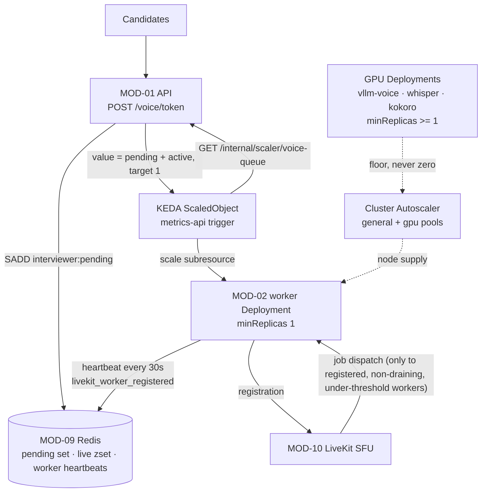

## US-018 — Worker autoscaling on interview queue depth

| | |
|---|---|
| **Covers** | BRD-07 · BRD-06 · UC-06 · UC-10 · UC-11 |
| **Modules** | MOD-02 (Voice Agent Worker), MOD-13 (Platform & Deployment) |
| **Depends on** | US-011 (I/O-bound worker), US-014 (drain and the 900 s grace period) |
| **Status** | Not started |

### Story

**Story statement:** As a platform operator, I want worker replicas to follow pending-plus-active interviews rather than CPU, so that capacity tracks the real work unit and a burst of candidates is absorbed without me waking up.

**Business value.** A voice interview is pinned to one worker process for its whole lifetime — one interview equals one pod — so the replica count *is* the concurrency limit. CPU is the wrong signal: after US-011 the worker is I/O-bound, so CPU would climb on VAD and JSON handling and would ignore the interviews themselves, which is the wrong work unit in both directions (it over-provisions during audio bursts and under-provisions when many quiet interviews run). LiveKit ships no first-party KEDA scaler for pending agent jobs, and `livekit_room_total` is a crude proxy — a room can exist with no agent ever dispatched to it (`UC-11`'s failure row). So the scaler reads a number the platform computes itself.

## Acceptance Criteria

### AC-1 — The scaling signal is the interview queue

```gherkin
**Given** the management API is serving
**When** GET /internal/scaler/voice-queue is called
**Then** it returns {"value": pending + active, "pending": n, "active": n, "registered_workers": n}
**And** "value" is the number KEDA reads, with a target of 1 — one replica per pending interview
**And** the endpoint is reachable cluster-internally only, never through the ingress
```

### AC-2 — One implementation, three consumers

```gherkin
**Given** the queue snapshot function
**When** the scaler endpoint, the readiness of the serving set, and the interviewer_active_interviews gauge are evaluated
**Then** all three derive from the same function and the same Redis keys
**And** a test asserts the three agree for the same input, because three independent implementations of one number is three ways to disagree
```

### AC-3 — Empty, single and burst traffic

```gherkin
**Given** zero interviews in flight
**When** the scaler evaluates
**Then** value is 0, desired replicas compute to 0, and this is clamped to minReplicaCount 1
**And** the floor is deliberate: scale-from-zero makes the first candidate wait 10-30 s for a pod to boot and register with the SFU, which is dead air on a live call

**Given** three rooms are created within a minute
**When** the scaler evaluates
**Then** it requests at least three replicas
**And** each new replica registers with the SFU and becomes ready before the room's dispatch window closes
```

### AC-4 — Stale work is not counted forever

```gherkin
**Given** a room was created but its worker died before claiming it
**When** the snapshot is computed after the heartbeat TTL
**Then** the room is no longer counted as pending or active
**And** the count never includes an entry whose heartbeat has expired
```

### AC-5 — Scale-down uses the drain path, and KEDA does not fight it

```gherkin
**Given** a scale-down
**When** KEDA reduces replicas
**Then** the pod goes through the US-014 preStop drain, not an eviction
**And** the ScaledObject's cooldownPeriod and scale-down stabilization window are both at least terminationGracePeriodSeconds
**And** there is exactly one ScaledObject for the worker Deployment
**And** a second plain HorizontalPodAutoscaler is NOT added for the same Deployment, because two controllers writing one scale subresource is a conflict rather than redundancy
```

### AC-6 — "Scaled but never registered" is visible

```gherkin
**Given** KEDA created a worker pod
**When** the pod is alive but has not registered with the SFU
**Then** livekit_worker_registered is 0 and readiness is false
**And** the operator can distinguish "scaled but not registered" from "not scaled"
**And** this is open item P2 resurfacing: the dev server drops an idle worker after roughly 20 seconds and it does not reliably re-register, so in-cluster it will present as a pod that exists and serves nothing
**And** the worker supervisor is therefore required, not optional
```

### AC-7 — GPU tiers hold a floor

```gherkin
**Given** the GPU node pool and the GPU Deployments
**When** the cluster is idle
**Then** minReplicas is at least 1 on every GPU Deployment
**And** the pool does not churn, because Cluster Autoscaler is configured with --scale-down-unneeded-time=10m and --scale-down-utilization-threshold=0.3
**And** the two-stage delay is documented: 2-6 minutes to provision a GPU node, then 1-5 minutes to load weights, so roughly 10 minutes worst case to serve the first request
**And** the design conclusion is stated plainly: for GPU, elasticity means "grow beyond the floor", not "zero to N"
```

### AC-8 — Node pools and priority

```gherkin
**Given** two node pools, general and gpu
**When** workloads are scheduled
**Then** the gpu pool carries the taint nvidia.com/gpu=present:NoSchedule
**And** only GPU Deployments carry the matching toleration
**And** voice-critical pods run under a higher priorityClassName so Cluster Autoscaler preempts for them
**And** the judge runs under a lower class that yields under pressure, which is acceptable because judging is off the hot path
**And** Cluster Autoscaler is used rather than Karpenter, to preserve the cloud-agnostic requirement
```

### AC-9 — If KEDA is refused

```gherkin
**Given** the platform owner declines KEDA as a cluster dependency
**When** the fallback is applied
**Then** the worker scales on HPA with CPU
**And** the fallback is recorded as materially worse, not equivalent: post-extraction the worker is I/O-bound, so CPU scales on VAD bursts rather than interviews
```

## HLD



**Why a custom endpoint rather than a LiveKit metric.** It encodes the actual work unit (an interview), it is an ordinary HTTP endpoint that can be unit-tested without a cluster, it is cloud-agnostic, and the registered-worker half of the computation is the same source as `/readyz` and the `interviewer_active_interviews` gauge. Gap 6 in the risk list — "LiveKit's pending-agent-dispatch metric availability" — is mitigated by design rather than by hoping the SFU exposes one.

**The central capacity risk, stated plainly.** A GPU scale-up is a **two-stage compounding delay**: the Cluster Autoscaler provisions a GPU node (2–6 minutes), then the pod loads model weights (1–5 minutes) — roughly **10 minutes worst case to serve the first request**. For a product whose entire claim is a sub-1.5 s turn, that is fatal. `minReplicas >= 1` on every GPU Deployment is therefore a requirement, not a tuning preference, and the autoscaler's scale-down settings exist to stop the pool from churning and re-paying that cost.

## LLD

**`interviewer/scaler.py` (new)** — the single definition of "how much work is pending":

```python
HEARTBEAT_TTL_S = 120          # a worker or session unheard-from for 2 min is not live
PENDING_KEY  = "interviewer:pending"    # SET  of rooms awaiting a worker
LIVE_KEY     = "interviewer:live"       # ZSET session_id -> heartbeat epoch
WORKERS_KEY  = "interviewer:workers"    # ZSET worker_id  -> heartbeat epoch

@dataclass(frozen=True)
class QueueSnapshot:
    pending: int
    active: int
    registered_workers: int
    @property
    def value(self) -> int: return self.pending + self.active

async def voice_queue_snapshot(store) -> QueueSnapshot:
    """Prunes expired members, then counts. Never raises: on a store error it
    returns zeros and logs, so a Redis blip cannot scale the fleet to nothing."""
```

| Store method (additive on `RedisSessionStore`) | Called by | Effect |
|---|---|---|
| `mark_pending(room)` | `POST /voice/token` | `SADD pending room` — the interview is queued |
| `claim_room(room, session_id)` | worker, on job accept | `SREM pending` + `ZADD live` — the interview is running |
| `heartbeat_session(session_id)` | worker, each checkpoint | `ZADD live` — refresh liveness |
| `heartbeat_worker(worker_id)` | worker, every 30 s | `ZADD workers` — the registered-worker count |
| `clear_session(session_id)` | worker, on terminal write | `ZREM live` — the interview is over |

**`interviewer/server.py`** — `GET /internal/scaler/voice-queue` returns the snapshot as JSON, declared **above** the static mount (the same route-ordering rule as the probes and `/metrics`), and never exposed by the ingress — NetworkPolicy admits only the KEDA namespace to the API port.

**`deploy/base/autoscaling/voice-worker-scaledobject.yaml`**

```yaml
apiVersion: keda.sh/v1alpha1
kind: ScaledObject
metadata: { name: voice-worker }
spec:
  scaleTargetRef: { name: voice-worker }
  minReplicaCount: 1          # never 0: scale-from-zero is dead air on a live call
  maxReplicaCount: 50
  pollingInterval: 15
  cooldownPeriod: 900         # MUST be >= terminationGracePeriodSeconds (US-014)
  advanced:
    horizontalPodAutoscalerConfig:
      behavior:
        scaleUp:   { stabilizationWindowSeconds: 0 }   # react to arrivals immediately
        scaleDown: { stabilizationWindowSeconds: 900 } # MUST be >= the grace period
  triggers:
    - type: metrics-api
      metadata:
        url: "http://api:8010/internal/scaler/voice-queue"
        format: "json"
        valueLocation: "value"
        targetValue: "1"        # one replica per pending interview
        activationValue: "0"
```

With `targetValue: 1`, a value of 0 computes to 0 desired replicas and is clamped to `minReplicaCount: 1` — that clamp is the floor described in AC-3. CPU may be added as an **additional trigger inside this same ScaledObject** if the platform owner wants a second opinion; a separate HPA object is a conflict.

**Node pools (MOD-13)** — `general` (api, worker, rag, data) and `gpu` (vllm-voice, vllm-judge, whisper, kokoro), the latter tainted `nvidia.com/gpu=present:NoSchedule` with tolerations only on GPU Deployments. Cluster Autoscaler flags: `--scale-down-unneeded-time=10m --scale-down-utilization-threshold=0.3`. `priorityClassName: voice-critical` on the voice path and `judge-batch` (preemptible, lower priority) on the judge, so a GPU shortage degrades evaluation latency rather than speech.

**Edge cases.** A candidate who opens the page but never joins the room (pending must expire via the heartbeat TTL, or the fleet scales up for an empty room); a worker that claims a room and dies (its `live` entry expires after 120 s; the reconcile sweep from US-014 marks the session `abandoned`); a Redis outage (snapshot returns zeros → KEDA holds at `minReplicas: 1`, which degrades to "serve one interview at a time" rather than "serve none"); two API replicas answering the scaler in the same polling interval (identical computation from shared keys, so the answer is the same); a max-replica cap reached while rooms queue (the room waits in LiveKit; candidates see an honest wait state rather than a dropped call).

| # | Test scenario | File | Assertion |
|---|---|---|---|
| 1 | Snapshot arithmetic | `tests/test_scaler.py` (new) | pending + active == value; expired members excluded |
| 2 | Three consumers agree | `tests/test_scaler.py` | endpoint, readiness view and gauge derive from one call |
| 3 | Store failure holds the floor | `tests/test_scaler.py` | a raising store yields zeros, not an exception or a negative count |
| 4 | Claim moves pending → live | `tests/test_scaler.py` | `claim_room` removes from pending and adds to live |
| 5 | Heartbeat expiry | `tests/test_scaler.py` | an entry older than the TTL stops counting |
| 6 | Endpoint not shadowed | `tests/test_skills_api.py` | `/internal/scaler/voice-queue` returns 200 with the expected keys |
| 7 | ScaledObject invariants | CI `manifest-validate` | one ScaledObject for the worker; no HPA on the same Deployment; windows ≥ grace period; `minReplicaCount: 1` |
| 8 | GPU floors | CI `manifest-validate` | every GPU Deployment has `minReplicas >= 1`, the taint toleration, and a priorityClass |
| 9 | Taint discipline | CI `manifest-validate` | no non-GPU Deployment carries the GPU toleration |
| 10 | Scale-out under load | staging scenario | create N rooms; unscaled replicas appear and register; `livekit_worker_registered` reaches N |
| 11 | Scaled but never registered | staging scenario | with the supervisor stopped, the pod shows ready=false and the gauge stays 0 |

## Traceability

| ID | Requirement / decision | How this story satisfies it |
|---|---|---|
| BRD-07 | Worker replica count tracks pending-plus-active interviews, not CPU | The `metrics-api` trigger reads a purpose-built queue-depth endpoint |
| BRD-06 | Scale-down drains, never kills | KEDA's windows are coupled to the grace period so a scale-down always routes through the US-014 drain |
| UC-06 | Scale down without killing interviews | Scale-down scenario row is satisfied end to end with US-014 |
| UC-10 | Diagnose a worker that never registered | `livekit_worker_registered` plus readiness distinguishes "scaled but not registered" from "not scaled" |
| UC-11 | Register and dispatch an agent into a room | Dispatch requires a registered worker with capacity under a finite load threshold |
| MOD-02 / MOD-13 | Worker; platform and deployment | Scaling signal and the node-pool/autoscaler configuration |
| Conflict CV-01 | KEDA may be refused as a cluster dependency | Fallback documented and labelled materially worse; the dependency stays open with the platform owner |
| Conflict CV-05 | Drain conflicts with `load_threshold=float("inf")` | Resolved by US-011; the finite threshold is what makes multi-replica dispatch correct in the first place |
| REC-05 | Always-accept load threshold | Replaced by a finite threshold that this autoscaler depends on |
| State machine SM-02 | Worker lifecycle | `REGISTERING → SERVING` is the transition readiness and the gauge report |
| Assumption AS-02 | KEDA acceptable as a cluster dependency | Load-bearing assumption, explicitly carried as an open item rather than assumed settled |
| Gap 7 (open item P2) | LiveKit worker re-registration reliability | Made observable; the supervisor is required, and the same failure will present in-cluster as "KEDA scaled a pod the SFU never saw" |

**Test files covering this story:** `tests/test_scaler.py` (new), `tests/test_skills_api.py` (endpoint routing), CI `manifest-validate` (ScaledObject, pools, tolerations, GPU floors), staging scale-out and scaled-but-not-registered scenarios.
