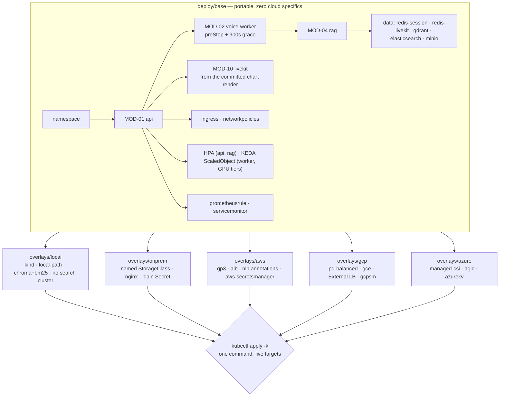

## US-019 — Kustomize base plus thin cloud overlays

| | |
|---|---|
| **Covers** | BRD-14 · UC-05 · MOD-13 |
| **Modules** | MOD-13 (Platform & Deployment) |
| **Depends on** | US-014 (drain contract), US-016 (LiveKit chart), US-017 (data tier), US-018 (autoscalers) |
| **Status** | Not started |

### Story

**Story statement:** As a platform operator, I want one portable manifest base with cloud-specific concerns confined to thin overlays, so that the same commit deploys to a cloud cluster, an on-prem cluster and a developer laptop without forking into two systems.

**Business value.** MOD-13 replaces a 966-line `start_services.ps1`, a specific laptop, and tunnel hostnames that re-randomise on every start. The correctness criterion for the whole module is one sentence: **the same base deploys to a cloud cluster and to an on-prem cluster, and the differences between them are visible in one small overlay.** The temptation — and the standard way this fails — is to fork a "cloud" base and an "on-prem" base early; a year later they are two divergent systems. `BRD-14` is a user constraint, and it is also what forced the object-storage decision over an RWX PVC in `DG-01`: shared filesystems are not portable across clouds, object storage is.

### Acceptance Criteria

### AC-1 — The base is pure, and purity is enforced by a machine

```gherkin
**Given** the committed base
**When** a purity check greps it for storageClassName, ingressClassName, ClusterSecretStore, and cloud load-balancer annotation prefixes
**Then** there are zero matches
**And** the base contains no Service of type LoadBalancer, because the media path's exposure is a cloud-specific concern
**And** a match fails the pull request rather than being reviewed away, because a fat base is the symptom this rule exists to prevent
```

### AC-2 — One command applies to any conformant cluster

```gherkin
**Given** a cluster, a populated Secret and published images
**When** kubectl apply -k deploy/overlays/<env> runs
**Then** the full platform is created: API, worker, RAG, engines, data tier, SFU, ingress, autoscalers, network policies
**And** no tool other than kubectl and a kustomize-enabled kubectl is required at apply time
**And** the LiveKit chart is consumed from the committed render, so no Helm repository access is needed
```

### AC-3 — Overlays are thin, bounded and reviewed as a diff

```gherkin
**Given** any overlay
**When** it is inspected
**Then** it patches only the four documented categories: StorageClass, ingress class, load-balancer annotations, SecretStore binding
**And** the whole overlay directory is under a documented line budget, so it is readable in one sitting
**And** the check rejects a patch that touches a container image, a probe, a resource request or limit, or an env var other than a cloud endpoint URL
**And** the rejection is a CI failure with the offending path named
```

### AC-4 — On-prem needs no manifest edits, and says its own StorageClass

```gherkin
**Given** a bare-metal or kind cluster with no default StorageClass
**When** the on-prem or local overlay is applied
**Then** every volume names its StorageClass explicitly
**And** nothing in the base is edited to make it work
**And** the kind path is documented as not evidence for the bare-metal path, because kind ships a default StorageClass and most bare-metal clusters do not
```

### AC-5 — The three targets differ in values, not in shape

```gherkin
**Given** builds of the local, on-prem and cloud overlays
**When** the rendered resource identities (kind plus name) are compared
**Then** the sets are identical apart from the allow-listed additions each overlay makes
**And** a resource that exists in one environment and not another is either the documented local data-tier swap or a defect
**And** this check is what makes "same base, different values" falsifiable rather than aspirational
```

### AC-6 — Removing a base resource is allowed once, for a stated reason

```gherkin
**Given** the local overlay
**When** it renders
**Then** Elasticsearch and Qdrant are absent and the RAG service runs bm25 plus chroma on a PVC
**And** this is the only sanctioned removal, because it implements DG-03
**And** no other overlay is permitted a delete patch without a comment naming the decision it implements
```

### AC-7 — Deploy, upgrade, roll back, repeat

```gherkin
**Given** a running platform
**When** kubectl apply -k is run a second time with no change
**Then** it reports no changes and restarts nothing
**And** when a change is applied, the API and worker roll with maxUnavailable 0
**And** progressDeadlineSeconds bounds a stuck rollout so it halts instead of hanging
**And** kubectl rollout undo restores the previous ReplicaSet
**And** the worker's rollout routes through the preStop drain, so no interview is cut
```

### AC-8 — Empty, first install and cleanup

```gherkin
**Given** an empty namespace on a fresh cluster
**When** the overlay is applied
**Then** it succeeds without any pre-existing object, and the base creates its own namespace
**And** on delete the operator is told, in the runbook, that StatefulSet volume claims are retained rather than garbage-collected, with the explicit command to remove them
**And** retention is the deliberate default: deleting a cluster should not silently delete interview state
```

### AC-9 — Ingress differences are translated, never dropped

```gherkin
**Given** a cloud overlay whose ingress class is a cloud L7 controller
**When** the LiveKit route is rendered
**Then** proxy buffering is still disabled and read and send timeouts are still 3600 seconds, expressed in that controller's own vocabulary
**And** where a controller genuinely cannot express one of the three settings, the overlay installs a small nginx ingress for that route rather than silently serving a buffering proxy
**And** the CI assertion runs against the rendered output per overlay, not only against the base
```

### AC-10 — Validated in CI, deployed by a human

```gherkin
**Given** the pipeline
**When** a change to deploy/ merges
**Then** the base and every overlay are rendered and schema-validated, and a failure blocks the merge
**And** the pipeline does not apply anything to any cluster
**And** that boundary is recorded as open item 6 in the module's risk list: deployment automation is a deliberate next step, not an oversight
```

## HLD



**Why Kustomize and not our own Helm chart.** Helm's templating would put conditional cloud logic *inside* the base — the opposite of the requirement. Kustomize keeps the base pure and makes each overlay a reviewable diff, and it is in-cluster-native (`kubectl apply -k`) with nothing to install. Helm is used for exactly one thing: consuming LiveKit's official chart (US-016), whose render is committed for the same reason the base stays boring.

**Why one base and not two.** Two bases are how this requirement dies — not with a decision, but with a series of small exceptions that each looked reasonable. The rule that keeps it alive is stated in the module doc and repeated here because it is the thing a reviewer needs: **if something lives in an overlay that is not cloud-specific, the base is wrong** — fix the base, do not widen the overlay.

## LLD

**Layout:**

```
deploy/
  base/
    kustomization.yaml            # resources: only; no cloud keys anywhere
    namespace.yaml
    api/{deployment,service,ingress,hpa}.yaml
    voice-worker/{deployment,service,pdb}.yaml
    rag/{deployment,service,networkpolicy}.yaml
    engines/{vllm-voice,vllm-judge,whisper,kokoro}.yaml
    data/{redis-session,redis-livekit,qdrant,elasticsearch,minio}.yaml
    autoscaling/voice-worker-scaledobject.yaml
    third-party/livekit/{kustomization.yaml,rendered.yaml}
    secrets/secret.example.yaml
    observability/{prometheusrule,servicemonitor}.yaml
  overlays/{local,onprem,aws,gcp,azure}/kustomization.yaml + *.patch.yaml
```

**An overlay is four patches and a resources line** — the AWS one, in full, because the shape is the requirement:

```yaml
apiVersion: kustomize.config.k8s.io/v1beta1
kind: Kustomization
resources: [../../base]
patches:
  - path: storageclass.patch.yaml    # StorageClass: gp3 on every PVC and volumeClaimTemplate
  - path: ingress-class.patch.yaml   # ingressClassName: alb, plus that controller's buffering/timeout equivalents
  - path: lb-annotations.patch.yaml  # the LiveKit media Service only
  - path: secretstore.patch.yaml     # ExternalSecret -> ClusterSecretStore aws-secretsmanager
```

The four knobs, and nothing else, per target:

| Concern | local (kind) | on-prem | AWS | GCP | Azure |
|---|---|---|---|---|---|
| StorageClass | `standard` | named explicitly (`ceph-rbd`, `nfs-client`, …) | `gp3` | `pd-balanced` | `managed-csi` |
| Ingress class | `nginx` | `nginx` | `alb` | `gce` | `webapprouting.kubernetes.azure.com` |
| LB annotations | none, or MetalLB's address pool where present | `metallb.universe.tf/address-pool` | `service.beta.kubernetes.io/aws-load-balancer-type: nlb` | `cloud.google.com/load-balancer-type: External` | `service.beta.kubernetes.io/azure-load-balancer-health-probe-request-path: /healthz` |
| Secret store | ESO `fake` provider, or the plain Secret | the plain Secret from the operator's own source of truth | `aws-secretsmanager` | `gcpsm` | `azurekv` |

**A fifth knob was deliberately refused.** Image tags do not live in overlays: adding them would blur "thin" immediately, and today the same version is promoted to every environment. Version skew, if it is ever needed, gets its own overlay layer above these rather than a new key inside them. Recording the refusal matters more than the refusal itself, because it is the exact kind of exception that kills AC-3 quietly.

**The checks, as commands** (`scripts/check-deploy.sh`, run by US-020's manifests job):

```bash
# 1. purity — the base must contain zero cloud-specific keys
! grep -rE 'storageClassName|ingressClassName|ClusterSecretStore|service\.beta\.kubernetes\.io|cloud\.google\.com|azure-load-balancer' deploy/base/

# 2. render — every target builds, and the chart inflator is not needed at apply time
for o in deploy/overlays/*; do kustomize build "$o" > "/tmp/$(basename "$o").yaml"; done

# 3. validation — with CRD schemas for the kinds the default schema store cannot know
kubeconform -strict -summary -schema-location default \
  -schema-location 'https://raw.githubusercontent.com/datreeio/CRDs-catalog/main/{{.Group}}/{{.ResourceKind}}_{{.ResourceAPIVersion}}.json' /tmp/*.yaml

# 4. thinness — line budget and patch-target allow-list per overlay
python scripts/check_overlay_thinness.py deploy/overlays   # fails on image/probe/env/resource patches, >120 lines

# 5. shape equality — resource identities identical across targets apart from allow-listed additions
python scripts/compare_renders.py /tmp/local.yaml /tmp/onprem.yaml /tmp/aws.yaml /tmp/gcp.yaml /tmp/azure.yaml
```

**Hardening asserted on the rendered output, not on the templates** (it is easy to write a compliant base and patch it away in an overlay): `readOnlyRootFilesystem: true`, `runAsNonRoot: true`, `automountServiceAccountToken: false` on every application pod, no CPU limit on the worker (`NFR-5` — CFS throttling on a realtime audio path appears as latency jitter that is very hard to attribute), the GPU taint toleration present on GPU workloads only (`NFR-3`), and `minReplicas >= 1` on the GPU deployments (`NFR-4`).

**configMapGenerator keeps its name suffix.** The default hash suffix is wanted: a configuration change then rolls the Deployment instead of leaving pods running with stale env. Kustomize rewrites `configMapRef`/`secretRef` names automatically when both objects are in the same kustomization, so the suffix costs nothing. `disableNameSuffixHash: true` is reserved for names referenced from outside Kustomize's graph.

**Edge cases.** A bare-metal cluster with no default StorageClass (an unnamed claim stays `Pending` forever — which is why the on-prem overlay names it, and why "it worked on kind" is not evidence); GKE installs GPU drivers and applies its own node taint itself while an on-prem cluster needs the NVIDIA device plugin DaemonSet in the overlay — one of the few places where the overlay legitimately adds a *workload*, justified as a cloud-specific concern rather than a config value; kind does not enforce NetworkPolicy by default, so the local overlay cannot prove a policy (the honest test is a CI cluster with an enforcing CNI, US-017's caveat); `kubectl delete -k` retains StatefulSet volume claims, so a reinstall resumes with data — intentional, and documented with the explicit removal command; an overlay that patches a readiness probe would silently undo `BRD-02`, which is exactly what the thinness check refuses.

| # | Test scenario | File | Assertion |
|---|---|---|---|
| 1 | Base purity | CI `manifests` job | the purity grep finds nothing in `deploy/base/` |
| 2 | Every target renders | CI `manifests` job | `kustomize build` succeeds for base and all five overlays |
| 3 | Rendered manifests are valid | CI `manifests` job | `kubeconform -strict` passes with CRD schemas for KEDA, Prometheus Operator and ESO |
| 4 | Overlay thinness | `scripts/check_overlay_thinness.py` | only the four categories patched; under the line budget |
| 5 | Shape equality | `scripts/compare_renders.py` | identical resource identity sets apart from allow-listed additions |
| 6 | Only sanctioned removal | `scripts/compare_renders.py` | ES and Qdrant absent in `local` only |
| 7 | Hardening survives the overlay | CI `manifests` job | the five hardening assertions hold on rendered output, per target |
| 8 | Apply, re-apply, roll back | kind + `kubectl apply -k deploy/overlays/local` | second apply is a no-op; `rollout undo` restores the previous ReplicaSet |
| 9 | Deploy during a live interview | kind with the e2e client | a rollout does not truncate the interview; `state=wrap` still reached |
| 10 | First install from empty | fresh namespace on kind | apply succeeds with no pre-existing objects |

## Traceability

| ID | Requirement / decision | How this story satisfies it |
|---|---|---|
| BRD-14 | Cloud-agnostic and on-prem deployable from one base, cloud specifics in thin overlays | One base, five overlays, each carrying only the four documented knobs, with a machine-checked purity rule |
| UC-05 | Deploy or upgrade the platform — the full 14-row scenario table | Happy (apply), partial (documented defaults), failure (failed rollout halts), recovery (`rollout undo`), concurrency (deploy during live interviews drains), timeout (`progressDeadlineSeconds` and probes), empty (first install), permission (RBAC scoped, no API access for app pods), scale, degraded dependency (RAG briefly down), retry (re-apply), idempotency (declarative apply), observability (rollout status), cleanup (retained ReplicaSets and retained claims) |
| MOD-13 | Platform & Deployment as configuration | This story is that module's base and overlay composition |
| TRD-08 / NFR-1 | Overlay thinness: cloud-specific keys only | The four-knob table plus the CI thinness check, and an explicit refusal of a fifth knob |
| TRD-08 / NFR-13 | Manifests validated in CI | The five checks above run on every change to `deploy/` (executed by US-020) |
| TRD-08 / NFR-17 | Two Redis instances | Present in the base; no overlay merges them |
| Decision DG-01 | Object storage rather than an RWX PVC | The reason the base is portable at all: a shared-filesystem claim is not portable across clouds |
| Decision DG-03 | Qdrant plus Elasticsearch in base; Chroma plus BM25 in the local overlay | The one sanctioned removal, implemented in `overlays/local` |
| BAC-1 / BAC-2 (MOD-13) | `kustomize build` succeeds for the base and at least two cloud overlays; on-prem deploys with no manifest edits | Five overlays render in CI; the on-prem and local targets are applied on a kind cluster in test rows 8-10 |
| Open item 6 (MOD-13) | Cloud overlays are validated in CI but not deployed from CI | Stated in AC-10 as a deliberate boundary rather than an omission |

**Test files covering this story:** `scripts/check-deploy.sh` and `scripts/check_overlay_thinness.py` (new), `scripts/compare_renders.py` (new), the CI `manifests` job (US-020), and a kind-based apply/rollback/rollout scenario reusing `scripts/e2e_voice_client.py`.
