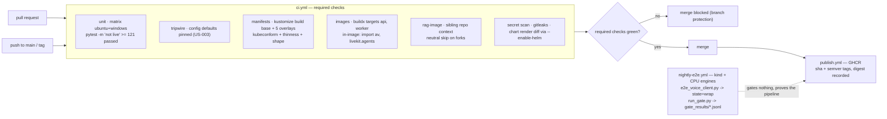

## US-020 — Continuous integration pipeline

| | |
|---|---|
| **Covers** | BRD-15 · UC-05 · MOD-13 |
| **Modules** | MOD-13 (Platform & Deployment); produces the MOD-01 and MOD-02 images |
| **Depends on** | US-001 (multi-target Dockerfile), US-019 (the base and overlays this validates), US-003 (the config tripwire it runs) |
| **Closes** | MOD-13 open item 4 — "`BRD-15` CI does not exist yet; it is the first artifact this module needs" |
| **Status** | Not started |

### Story

**Story statement:** As a reviewer, I want every change built, tested, and its manifests validated before it can merge, so that a bad import or a broken manifest fails a pull request instead of a cluster.

**Business value.** This repository has **no CI at all** — no pipeline, no image, no registry, no automated gate. Today the only thing that proves a change is safe is that it ran on one Windows laptop, and `start_services.ps1` is the only thing that proves the system starts. Every other story in this plan relies on this one: their test tables point at a `manifest-validate` job, at a `kustomize build` check, at a secret scan, at an in-image import check. Until this story exists those rows are prose. It is also the cheapest way to make the plan's central claim — "a broken manifest fails the build, not the cluster" — true rather than aspirational.

### Acceptance Criteria

### AC-1 — Green on a clean checkout

```gherkin
**Given** a fresh clone on a machine with no prior state
**When** the pipeline runs
**Then** the suite passes without a `.env`, without a running Redis, RAG service, LLM or LiveKit
**And** no test depends on an environment variable that only the developer's shell sets
**And** this is enforced by the config-defaults tripwire (US-003), which is a CI job rather than a habit
```

### AC-2 — The regression floor cannot be lowered by deleting tests

```gherkin
**Given** the suite as it stands — 121 passing non-live tests (AS-04)
**When** the unit job finishes
**Then** it asserts at least 121 passed, zero failed, and zero skipped among the selected tests
**And** the floor is raised deliberately in the same commit that adds tests, never silently
**And** the zero-skip clause is not pedantry: tests that self-skip when a port is closed look identical to passes in the summary line, so "121 passed" can hide a suite that quietly stopped running
**And** a test that depends on a port being reachable must be marked live, and this assertion is what enforces that rule
```

### AC-3 — Both operating systems, because the workaround is Windows-shaped

```gherkin
**Given** the matrix os: [ubuntu-latest, windows-latest]
**When** the unit job runs
**Then** it runs on both, because the development machine is Windows and a Linux-only pipeline would never exercise the av==12.3.0 pin
**And** the pin becomes platform-conditional under REC-09, so Linux installs a current PyAV and Windows keeps 12.3.0
**And** the Windows leg is the only place that pin is tested, which is exactly why it stays in the matrix
```

### AC-4 — Every manifest is rendered and validated before merge

```gherkin
**Given** a change under deploy/
**When** the manifests job runs
**Then** kustomize build succeeds for the base and for every overlay
**And** the rendered output is validated with kubeconform -strict, with CRD schemas supplied for the kinds the default schema store cannot know: KEDA's ScaledObject, the Prometheus Operator's PrometheusRule and ServiceMonitor, and External Secrets' ClusterSecretStore
**And** hardening is asserted on the rendered output — readOnlyRootFilesystem, runAsNonRoot, automountServiceAccountToken false, no CPU limit on the worker, the GPU toleration on GPU workloads only, minReplicas at least 1 on GPU deployments
**And** the overlay thinness and render-shape checks from US-019 run here
**And** a failure names the offending file rather than dumping the whole stream
```

### AC-5 — Images build, and their imports are verified inside the image

```gherkin
**Given** the multi-target Dockerfile
**When** the images job runs
**Then** the api and worker targets each build
**And** the built image is executed once to prove the one genuine containerization unknown: python -c "import av, livekit.agents" succeeds inside the Linux image
**And** that check runs against the image, not against the runner's environment, because the av pin exists for a Windows policy that says nothing about whether the Linux wheel loads
```

### AC-6 — The RAG image needs a sibling repository, and says so

```gherkin
**Given** docker build --target rag --build-context rag=../enterprise-rag-core
**When** the pipeline runs on a branch in this repository
**Then** the sibling repository is checked out and the rag image builds
**And** when the pipeline runs on a pull request from a fork, where the sibling repository is unavailable
**Then** the job is skipped with a visible neutral status rather than reported as passed
**And** the workflow records the honest consequence: the rag image is only provably buildable on branches with access, and a fork PR cannot change that
```

### AC-7 — A credential in a commit is caught

```gherkin
**Given** a change that adds a key, token or password to a tracked file
**When** the secret scan job runs
**Then** the pipeline fails and names the file and line
**And** the committed LiveKit chart render is allow-listed by path, with a comment explaining that chart-generated placeholder keys are not credentials — an unexplained allow-list trains people to ignore the scan
```

### AC-8 — The rendered chart cannot silently drift

```gherkin
**Given** the committed LiveKit render (US-016)
**When** CI re-renders the pinned chart version through kustomize with --enable-helm
**Then** the result is byte-identical to the committed file
**And** the chart version is pinned exactly, so a floating version cannot turn a review into a surprise
```

### AC-9 — Publishing is least-privilege and traceable

```gherkin
**Given** a push to main or a version tag
**When** the publish workflow runs
**Then** images are pushed to GHCR authenticated by the workflow's own GITHUB_TOKEN with packages: write, never a long-lived personal access token
**And** every action is pinned by commit SHA
**And** the default token permissions are contents: read, with write granted per job only where needed
**And** a tag push produces a semver tag and a commit-SHA tag, and the resulting digest is recorded so a deployment can pin what CI proved rather than what a tag happens to point at today
**And** the build cache is scoped by ref, so a pull request cannot poison main's cache
```

### AC-10 — What CI deliberately does not gate is written down

```gherkin
**Given** the live path — the browser e2e and the gate runner
**When** a reader asks why they are not required checks
**Then** the answer is in the workflow name and the README: hosted runners have no GPU and no SFU, so the live suite is a scheduled job on a kind cluster with the CPU engine images
**And** that job runs scripts/e2e_voice_client.py to state=wrap and scripts/run_gate.py for the aggregate, and uploads gate_results/phase2-<date>.jsonl as an artifact
**And** the nightly job is allowed to be slower and flakier without weakening the required checks
```

### AC-11 — A red check blocks the merge

```gherkin
**Given** a pull request
**When** the unit job, the manifests job or the secret scan fails
**Then** the merge is blocked by branch protection, not by a convention
**And** "required check" is a repository setting recorded in the runbook, because a check that is merely present is a suggestion
```

## HLD



**The floor is a number, and the number is the point.** `pytest tests/ -m "not live"` must stay at **121 passed** — that is the plan's standing regression gate, and it is the one measurement that says "the extraction did not change behaviour". A CI that runs tests but does not pin a count lets a suite shrink one deletion at a time while staying green. Raising the floor is a deliberate act performed in the same commit that adds the test.

**Why the live suite is scheduled, not required.** GitHub-hosted runners have no GPU, no LiveKit SFU and no vLLM, so a required live check would either be permanently skipped (a green lie) or permanently flaky (a muted alarm — the same failure mode `CV-03` warns about for the SLO). The honest split is a fast hermetic gate on every pull request and a slower end-to-end proof on a schedule.

## LLD

**`.github/workflows/ci.yml`** — triggers, concurrency and permissions first, because getting these wrong is how a CI leaks or stampedes:

```yaml
name: ci
on: { pull_request: {}, push: { branches: [main] } }
concurrency: { group: "ci-${{ github.ref }}", cancel-in-progress: true }
permissions: { contents: read }        # jobs elevate individually and only where needed
defaults: { run: { shell: bash } }
```

| Job | Runner | What it runs | Gate |
|---|---|---|---|
| `unit` | `ubuntu-latest`, `windows-latest` | `pip install -e ".[api,dev,voice]"`; `pytest tests/ -m "not live" -q` | ≥ 121 passed, 0 failed, 0 skipped |
| `tripwire` | ubuntu | `pytest tests/test_config.py -q` (US-003) | every default pinned |
| `manifests` | ubuntu | `scripts/check-deploy.sh` (US-019): build, kubeconform, hardening, thinness, shape | renders valid in all six targets |
| `images` | ubuntu | `docker buildx build --target api` / `--target worker`, then `docker run --rm <image> python -c "import av, livekit.agents"` | builds, and the imports load in Linux |
| `rag-image` | ubuntu | `docker buildx build --target rag --build-context rag=../enterprise-rag-core` (sibling checked out, PR branches only) | builds, or a visible neutral skip on forks |
| `secret-scan` / `render-check` | ubuntu | `gitleaks detect --redact` with a path allow-list for the chart render; `kustomize build --enable-helm .../helm \| diff - rendered.yaml` | no credential; no chart drift |

**The floor check** (in the `unit` job, after pytest):

```bash
pytest tests/ -m "not live" -q --junitxml=unit.xml
python scripts/check_test_floor.py unit.xml --floor 121   # -> fails on any failure, any skip, or count < floor
```

**kustomize and helm versions are pinned and asserted**, because a version skew between the reviewer's laptop and CI changes rendering:

```yaml
- uses: actions/setup-python@<sha>
- run: |
    curl -sSLo k.tar.gz ".../kustomize/releases/download/kustomize%2Fv${KUSTOMIZE_VERSION}/kustomize_v${KUSTOMIZE_VERSION}_linux_amd64.tar.gz"
    tar xzf k.tar.gz && sudo mv kustomize /usr/local/bin/
- run: kustomize version | grep -q "$KUSTOMIZE_VERSION"   # drift fails, rather than surprising a reviewer
```

The pinned versions live in one place (`.github/versions.env`, sourced by the workflows and echoed by `scripts/check-deploy.sh` locally), so the same numbers are used by a developer running the check by hand.

**Image matrix:**

| Target | Context | Registry tag | Purpose |
|---|---|---|---|
| `api` | `.` | `ghcr.io/<org>/mock-interviewer-api:<sha>` | MOD-01; served behind the ingress |
| `worker` | `.` | `ghcr.io/<org>/mock-interviewer-worker:<sha>` | MOD-02; carries no model weights |
| `rag` | `.` + `--build-context rag=../enterprise-rag-core` | `ghcr.io/<org>/mock-interviewer-rag:<sha>` | MOD-04; the MCP extra plus uvicorn |
| CPU engine images | upstream | upstream tags | Nightly and local only — vLLM, Speaches, Kokoro-FastAPI are bought, not built (NFR-14) |

`linux/amd64` only. A multi-arch build roughly doubles the job for a target nobody deploys; ARM is a deliberate later decision, not an accident of `--platform`.

**`.github/workflows/publish.yml`** — on `push: tags: ['v*']` and `push: branches: [main]`, `permissions: { contents: read, packages: write }`, `docker/login-action` with `${{ github.token }}`, and `docker/metadata-action` producing `sha-<short>`, `latest` (main only) and the semver tag. The job prints the resolved digests into the summary; the deployment step (manual today — US-019's open item 6) pins a digest, not a tag.

**`.github/workflows/nightly-e2e.yml`** — schedule plus `workflow_dispatch`:

```bash
kind create cluster --name interviewer
kustomize build deploy/overlays/local | kubectl apply -f -
kubectl wait --for=condition=Ready pod -l app=api --timeout=300s
python scripts/e2e_voice_client.py   # asserts state == wrap, frames, scores, voice_budget_bar, ended
python scripts/run_gate.py --sessions 10 --questions 2   # appends gate_results/phase2-<date>.jsonl
```

Both artifacts (the JSONL and the JUnit XML) are uploaded: a nightly failure with no captured evidence is a failure nobody investigates.

**Edge cases.** A test that self-skips on a closed port (silently green — the zero-skip assertion is the mitigation, and any port-dependent test must carry the live marker); the `live`-marked suite is excluded by marker rather than deleted, so `pytest tests/ -m live` remains runnable by hand against a running stack; a fork PR cannot check out a private sibling repository (neutral skip, never a false green); `av` resolving to a different wheel on the two matrix legs (that is the point of AC-3 — a failure here means the platform-conditional pin is wrong); the committed chart render tripping the secret scanner on chart-generated placeholders (path allow-list with a written reason); a cache scoped by ref so a pull request cannot poison main's cache; a `windows-latest` runner unable to build Linux container images (only the `unit` and `tripwire` jobs run there — image jobs are ubuntu-only, stated in the workflow rather than left to fail confusingly); a pinned action SHA that disappears upstream (renovate-style bumps, reviewed like code); and `--enable-helm` requiring a Helm binary that CI installs explicitly, since a kustomize build without it fails on the chart inflator with a confusing message.

| # | Test scenario | File | Assertion |
|---|---|---|---|
| 1 | Clean-checkout green | CI `unit` on both OS legs | ≥ 121 passed, 0 failed, 0 skipped, with no ambient env |
| 2 | Floor cannot be gamed | `scripts/check_test_floor.py` (new) | deleting a test drops the count below the floor and fails |
| 3 | A self-skipping test is caught | `scripts/check_test_floor.py` | one skip among the selected tests fails the job |
| 4 | Manifests valid and hardened, per target | CI `manifests` | kubeconform `-strict` passes for base plus five overlays; the six hardening assertions hold (US-019) |
| 6 | In-image imports | CI `images` | `import av, livekit.agents` succeeds inside the built Linux image |
| 7 | Fork PR does not fake a pass | CI `rag-image` on a fork PR | the job reports a neutral skip, not success |
| 8 | Credential caught, chart render current | CI `secret-scan`, `render-check` | a planted credential fails the job, the chart render does not; committed render == fresh render |
| 9 | Published images are traceable | CI `publish` | digest recorded, tag matches the commit SHA, no PAT used |
| 10 | Nightly reaches wrap | CI `nightly-e2e` | `e2e_voice_client.py` asserts `state=wrap`; the gate JSONL is uploaded |

## Traceability

| ID | Requirement / decision | How this story satisfies it |
|---|---|---|
| BRD-15 | Every change is built, tested, and its manifests validated before merge | The six required jobs, with branch protection making them blocking |
| UC-05 | Deploy or upgrade the platform — "render manifests" and its failure rows | Rendering and validation move to the pull request; a broken manifest fails before the cluster ever sees it |
| MOD-13 | Platform & Deployment as configuration | Producer of every artifact this module applies: images, rendered manifests, published digests |
| MOD-13 / BAC-6, NFR-13 | "Green on a clean checkout, and a broken manifest fails the build rather than the cluster"; manifests validated in CI | AC-1, AC-4 and AC-11, delivered by the `manifests` job |
| MOD-13 open items 4 and 6 | CI does not exist and is the first artifact this module needs; overlays validated in CI but not deployed from CI | Closed by this story, with the deploy boundary preserved deliberately — the pipeline publishes digests and stops there |
| Assumption AS-04 | 121 passing tests are the regression floor | AC-2, enforced by a count rather than a convention |
| REC-09 | The `av==12.3.0` pin is a Windows workaround | The two-OS matrix keeps it exercised on the platform it exists for, while Linux stops inheriting it |
| BRD-12 / US-001 | No secrets in the repository or an image; the containerization unknown is tested at build time | The secret scan with a written allow-list reason; AC-5 runs the import check inside the built image, which is where that unknown lives |
| US-016 / CV-01 | The LiveKit chart is consumed from a committed render; KEDA may be refused as a cluster dependency | The `render-check` job keeps "committed" honest; the manifests job validates the ScaledObject schema either way, so CI neither requires nor prevents the platform owner's decision |

**Test files covering this story:** `.github/workflows/{ci,publish,nightly-e2e}.yml` (new), `scripts/check_test_floor.py` (new), `scripts/check-deploy.sh` and `scripts/compare_renders.py` (shared with US-019), and the existing `scripts/e2e_voice_client.py` and `scripts/run_gate.py` promoted from manual runs to the nightly job.
